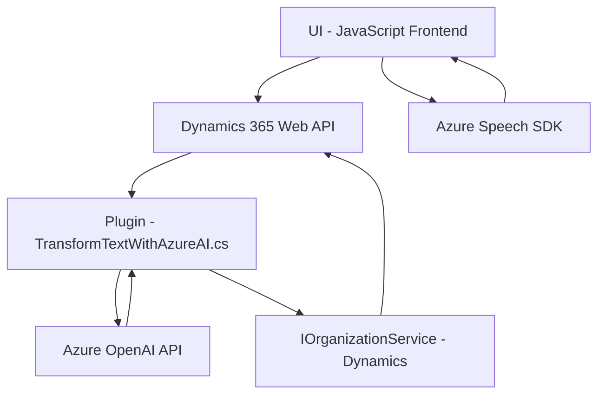

### Breve Resumen Técnico

Este repertorio de archivos forma parte de una solución **con integración entre Dynamics 365 CRM, procesamiento de voz con Azure Speech SDK, y transformación de texto con Azure OpenAI**. Está diseñado para facilitar la interacción por voz con formularios de Dynamics y aprovechar inteligencia artificial para procesar y transformar los datos ingresados. 

Las tres capas principales (JS en frontend, Plugins con lógica de negocio en Dynamics CRM y API externa como Azure OpenAI) sugieren una arquitectura que combina dinámica de varias capas con principios de integración en sistemas distribuidos.

---

### Descripción de Arquitectura

La solución implementa una arquitectura **híbrida**, combinando patrones **n capas** y **hexagonal**:
1. **Capa de UI/Frontend**: Implementada en archivos JavaScript como un módulo de procesamiento de voz que interactúa directamente con los formularios de Dynamics 365.
2. **Capa de Servicio/Negocio**: Plugin `TransformTextWithAzureAI.cs` para aplicar transformaciones sobre texto con inteligencia artificial (API de Azure OpenAI).
3. **Dependencias externas**:
   - Procesamiento de voz (Azure Speech SDK).
   - Transformación de texto (Azure OpenAI API).
   - Interacción con Dynamics CRM a través de `Web API` y entidades relacionadas.
  
Esta arquitectura facilita la separación de responsabilidades (frontend, lógica de negocio, lógica externa), promoviendo modularidad y escalabilidad.

---

### Tecnologías Usadas

- **Frontend**:
  - JavaScript (formato ES6).
  - Azure Speech SDK como dependencia externa para reconocimiento y síntesis de voz.
  - Microsoft Dynamics Web API (JavaScript SDK).

- **Backend/Plugins**:
  - **Lenguaje**: C#.
  - Dependencias:
    - **Dynamics SDK** (`Microsoft.Xrm.Sdk`, `IOrganizationService`).
    - **Azure OpenAI API** como servicio externo para transformación de texto.
    - **Newtonsoft.Json.Linq** para manejo de datos JSON en backend.

- **Patrones arquitectónicos frecuentes**:
  - **N-capas** para división de lógica entre UI, negocio y datos.
  - **Hexagonal** (separación de lógica central y dependencias externas para API).
  - **Event-driven architecture** en funciones de frontend para manejar eventos relacionados con voz.

---

### Diagrama Mermaid

---

### Conclusión Final

La solución presentada actúa como una extensión modular de Dynamics 365 CRM para habilitar interacción por voz y transformación de texto con inteligencia artificial. Su enfoque arquitectónico híbrido combina patrones clásicos como **n-capas** con principios de **hexagonal** para integrarse eficientemente con Azure Speech SDK y Azure OpenAI API. La elección de tecnologías como JavaScript para frontend y C# para backend facilita la compatibilidad con el ecosistema Dynamics y garantiza una infraestructura capaz de manejar escalabilidad y adaptabilidad.