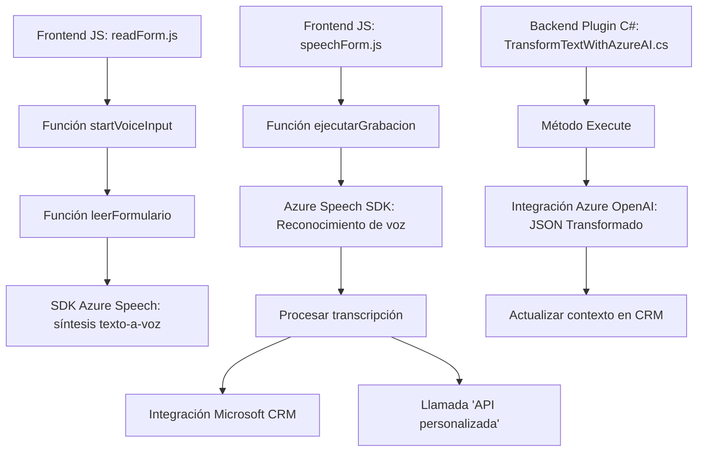

### Breve resumen técnico:
El repositorio implementa una solución híbrida basada en una serie de componentes para realizar reconocimiento de voz, síntesis de voz y procesamiento de datos mediante el uso del Azure Speech SDK y Azure OpenAI. Está diseñado para integrarse con Microsoft Dynamics CRM, permitiendo la interacción con formularios y otras entidades manejadas en el sistema.

### Descripción de arquitectura
La arquitectura es predominantemente modular y se ajusta a un estilo de **hexagonal** o **puertos y adaptadores**. Esto se refleja en la separación clara entre los módulos de negocio (procesamiento de voz, manipulación de formularios) y las dependencias externas (Azure Speech SDK, Azure OpenAI, integración CRM). 

### Tecnologías usadas
1. **Frontend** (JavaScript):
   - Azure Speech SDK.
   - Modulación funcional (event-driven design).
   - Promesas y programación asíncrona.

2. **Backend** (C#, .NET):
   - Microsoft Dynamics CRM Plugin API (`IPlugin`).
   - Azure OpenAI integraciones HTTP (`HttpClient`, `System.Net.Http`).
   - Serialización/deserialización de JSON con `Newtonsoft.Json`.

### Diagrama Mermaid

### Conclusión final
El proyecto se posiciona como una solución integral que combina características de procesamiento de voz, integración con servicios de cloud como Azure Speech SDK y Azure OpenAI, y capacidades extensibles para interfaces como Microsoft Dynamics CRM. La arquitectura modular y hexagonal garantiza una separación de preocupaciones clara entre los componentes en frontend y backend, mientras que la integración con APIs externas permite aprovechar servicios avanzados. Esto lo hace una propuesta robusta para ambientes de negocio con alta interacción basada en datos y voz.