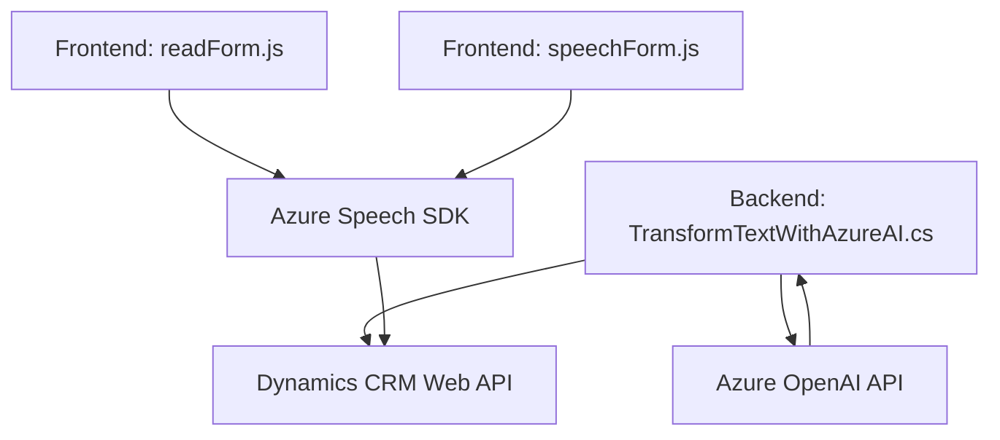

### Breve resumen técnico

La solución presentada en el repositorio integra un conjunto de herramientas y funcionalidades para interactuar con formularios y datos dinámicos en un sistema CRM mediante el uso de tecnologías de reconocimiento de voz, síntesis de voz, y una integración AI moderna con Microsoft Azure. Los artefactos analizados muestran una clara orientación hacia la interacción basada en voz y automatización vinculada a un CRM, empleando tanto un frontend como plugins en el backend.

---

### Descripción de arquitectura

La arquitectura incluye las siguientes capas y componentes:
- **Frontend dinámico (JavaScript)**: Implementa las funcionalidades de interacción con el usuario en el navegador para lectura y entrada de datos en un formulario CRM.
  - Uso de **Azure Speech SDK** para sintetizar voz y reconocer comandos hablados.
  - Alta modularización y uso de funciones orientadas a tareas específicas para captar datos visibles o modificar atributos del formulario.

- **Backend (plugin en C#)**:
  - Procesa datos verbales en la entrada de usuario, los transforma mediante la **Azure OpenAI API**, y los entrega en un formato esperable por el sistema CRM.
  - Implementa un patrón de extensión para Dynamics 365 a través de **IPlugin**, permitiendo la integración de capacidades avanzadas.

- **Arquitectura distribuida basada en servicios**:
  - **Azure Speech SDK** y **Azure OpenAI Service** como dependencias externas clave.

#### Modelos detectados:
1. **N capas**:
   - La solución tiene una separación lógica entre el cliente y el servidor.
   - El servidor contempla módulos como plugins, mientras el cliente administra la UI (formularios dinámicos).
2. **Modularización** en frontend:
   - Organizar el procesamiento de voz y manipulación de datos visibles en funciones independientes.
3. **Integración con servicios externos (APIs)**:
   - Azure Speech SDK y OpenAI alimentan los datos atendidos por la solución.
4. **Extensibilidad CRM (plugin)**:
   - Cumple el estándar de extensibilidad de Dynamics CRM mediante `IPlugin`.

---

### Tecnologías usadas

- **Frontend**:
  - Lenguaje: JavaScript (ES6+).
  - Framework: No se detecta ningún framework explícito, pero claramente aprovecha APIs como `async/await` y funciones Javascript modernas.
  - Dependencia clave: **Azure Speech SDK**.
  - Entorno: Formularios dinámicos CRM (Dynamics 365).

- **Backend**:
  - Lenguajes y dependencias:
    - **C#**: Lenguaje principal del plugin.
    - **Azure OpenAI API**: GPT-like servicios para procesamiento y transformación de texto.
    - **Newtonsoft.Json** y **System.Text.Json**: Para manipulación JSON.
    - **Microsoft.Xrm.Sdk**: Para la integración directa con Dynamics CRM.

- **Infraestructura externa**:
  - **Microsoft Azure**: Gestión de Speech SDK y OpenAI API.

---

### Diagrama Mermaid válido para GitHub

---

### Conclusión final

La solución presentada es una implementación distribuidamente integrada que aprovecha tecnologías modernas de Azure para proporcionar funcionalidades avanzadas a sistemas CRM, principalmente mediante interacción basada en voz y datos dinámicos. Su arquitectura puede considerarse una combinación de **n capas** y extensibilidad para sistemas CRM. La modularidad del frontend junto con la integración sólida del backend garantiza escalabilidad y mantenibilidad en entornos dinámicos y altamente dependientes de servicios externos.