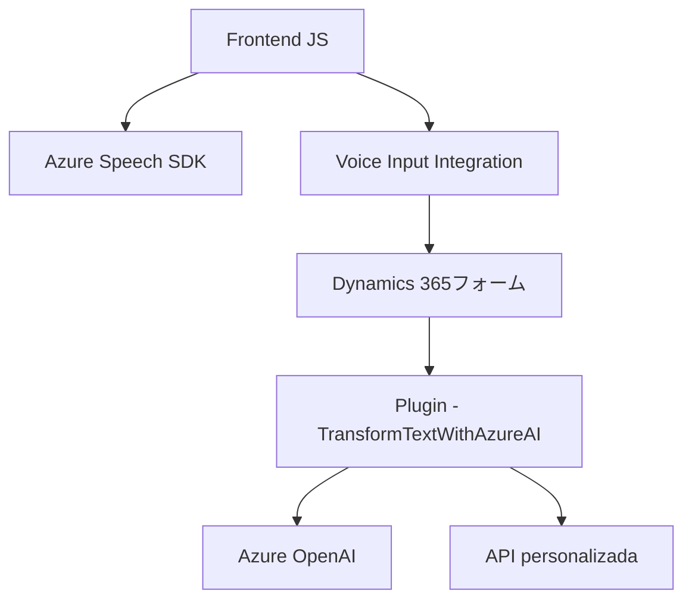

### Breve Resumen Técnico
El repositorio está diseñado para integrar funcionalidades de procesamiento de voz con formularios de **Dynamics 365**, utilizando **Azure Speech SDK** y **Azure OpenAI** para síntesis y reconocimiento de voz, así como procesamiento de texto avanzado con IA. Incluye lógica orientada al frontend (visualización y manejo de formularios), APIs externas y un componente backend como plugin en Dynamics CRM.

---

### Descripción de Arquitectura
La solución implementa una arquitectura **orientada a servicios**, apoyada en:
- **Frontend dinámico** que interactúa con formularios de **Dynamics 365** y Azure Speech SDK para sintetizar y reconocer voz.
- **Backend con plugin** en Dynamics CRM para realizar el procesamiento avanzado de texto con **Azure OpenAI**.
- Comunicación asincrónica basada en eventos y REST para integrar servicios de Azure.

Se observan los siguientes patrones arquitectónicos:
1. **Event-driven**: Procesos están disparados por eventos desde los usuarios (voz) y/o formularios de Dynamics 365.
2. **Modularización**: Cada bloque funcional está dividido en módulos y clases independientes que colaboran mediante mensajes y callbacks.
3. **Service Integration**: Uso extensivo de APIs externas (API de voz de Azure Speech SDK, Azure OpenAI y APIs personalizadas).
4. **Plugin-based architecture**: El backend es una capa con plugins para interactuar con Dynamics CRM.

En términos estructurales:
- Es un modelo híbrido que utiliza **arquitectura n capas** para el frontend y un plugin **event-driven** en el backend de Dynamics 365. La solución depende de servicios componibles externos como **Azure Speech SDK** y **Azure OpenAI**.

---

### Tecnologías y patrones usados
#### **Frontend (JS)**
1. **Tecnología base**: JavaScript para lógica de formularios en Dynamics 365.
2. **Frameworks/SDKs**:
   - **Azure Speech SDK**: Para síntesis de voz y reconocimiento de entrada por voz.
   - **Dynamics 365 SDK**: Para interacciones con formularios y operaciones CRUD (Create, Read, Update, Delete).
3. **Patrones**:
   - Modularidad: Funciones organizadas por responsabilidades claras (`speakText`, `getVisibleFieldData`, etc.).
   - Adaptadores: Transforma datos del formulario en texto legible mediante `getReadableValue`.

---

#### **Backend (C# Plugin)**
1. **Lenguaje y Framework**: C# (.NET Framework), Dynamics 365 SDK.
2. **Servicio externo**: API de **Azure OpenAI** para procesamiento y transformación de texto.
3. **Patrones**:
   - Plugin: Implementación de `IPlugin` de Dynamics CRM.
   - REST Integration: Llamada HTTP directa desde el plugin al servicio de Azure OpenAI.
   - Template Method: Configuración fija para ejecución (`Execute(IServiceProvider)`).

---

### Dependencias o Componentes Externos
1. **Azure Speech SDK**: Utilizado para sintetizar y reconocer voz en el frontend del sistema.
2. **Azure OpenAI Service**: Para transformación avanzada de texto, utilizando modelos como GPT-4.
3. **Dynamics 365 SDK**: Para interactuar con formularios y almacenamiento CRM directamente.
4. **API personalizada**: Implementación de reglas y procesamiento de datos basado en IA (usada en `callCustomApi`).
5. **Frontend dinámico en Dynamics 365**: Para procesamiento en tiempo real y visualización directa en formularios.

---

### Diagrama Mermaid válido para GitHub

---

### Conclusión Final
Esta solución implementa una arquitectura orientada a servicios con capacidades de integrarse perfectamente con el ecosistema **Dynamics 365**. El sistema combina lo mejor del frontend dinámico para manejo de formularios y voz, junto con el rendimiento y escalabilidad del backend basado en plugins. Además, el uso de servicios de **Azure Speech SDK** y **Azure OpenAI** aporta robustez y capacidades avanzadas de IA. Esto la convierte en una arquitectura eficiente para sistemas que requieran procesamiento y entrada de datos mediante voz, con extensibilidad hacia plataformas dinámicas.