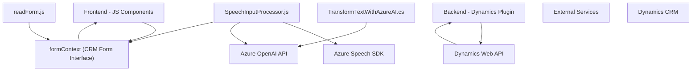

### Resumen técnico
Este repositorio parece conformar una solución integrada para sistemas de CRM (Dynamics 365), con componentes frontend, un plugin de backend y una integración con servicios avanzados de Azure (OpenAI y Azure Speech SDK). Su propósito principal es enriquecer la experiencia del usuario a través de automatización, inteligencia artificial, y reconocimiento de voz.

---

### Descripción de arquitectura
La solución presentada tiene las siguientes características:
- **Tipo de solución**: Módulos frontend intermedios y un backend conectado a Dynamics CRM con integración de microservicios externos (Azure Speech y Azure OpenAI).
- **Arquitectura**: Modular y orientada a microservicios. Los módulos JavaScript son utilizados para gestión y procesamiento de formularios dinámicos (que interactúan con Dynamics 365), mientras que el plugin en C# se encarga de la integración directa con Dynamics CRM y Azure OpenAI. Hay una clara división entre frontend y backend, utilizando APIs externas para procesamiento de texto y síntesis de voz.
- **Interacción entre componentes**: 
  - Frontend (form.js y SpeechInputProcessor.js) manipula el formulario usando APIs de Dynamics CRM a través del objeto `formContext`, ejecuta reconocimientos de voz usando Azure Speech SDK, y envía transcripciones a APIs de Azure OpenAI.
  - Backend (TransformTextWithAzureAI.cs) expone una lógica complementaria que procesa datos del CRM servidos mediante `IPluginExecutionContext` y utiliza la tecnología OpenAI para transformar texto aplicando reglas.

---

### Tecnologías usadas
1. **Frontend**:
   - **JavaScript**: Para la lógica de manipulación de formularios y configuración de servicios externos.
   - **Azure Speech SDK**: Para la síntesis de voz y reconocimiento de voz.
2. **Backend**:
   - **C# (.NET Framework)**: Utiliza plugins de Dynamics CRM para extender funcionalidad.
   - **Azure OpenAI API**: Procesamiento de texto basado en inteligencia artificial.
   - **System.Text.Json y Newtonsoft.Json.Linq (C#)**: Para serialización/deserialización de JSON.
3. **Integración con Dynamics**:
   - Utilización de `Microsoft.Xrm.Sdk` para consultas, manipulación de datos y ejecución de plugins en el CRM.
4. **Servicios externos y APIs**:
   - REST API de Azure Speech y OpenAI para operaciones de voz y análisis de texto.

---

### Dependencias o componentes externos
- **Azure Speech SDK**: Reconocimiento de voz y síntesis de texto.
- **Azure OpenAI API**: Procesamiento de texto basado en IA.
- **Dynamics 365 Web API (`Xrm.WebApi`)**: Consulta y edición de entidades del CRM.
- **Sistema de formularios Dynamics (`formContext`)**: Representación de datos internos del CRM.
- **C# SDK namespaces**: Para ejecutar plugins dentro del entorno CRM.
- **JavaScript SDKs**: Carga dinámica y ejecución de funcionalidades más ligeras en el navegador.

---

### Diagrama Mermaid válido para GitHub

---

### Conclusión final
La solución tiene una arquitectura modular, con una fuerte integración entre frontend, backend y servicios en la nube. El frontend actúa como intermediario entre la entrada verbal o textual del usuario y el sistema CRM. El plugin backend introduce una capa avanzada de procesamiento con IA, actuando como cliente del Azure OpenAI API para normalización de texto. Este enfoque utiliza dependencias modernas y patrones como "Microservicio con interfaces modulares" para la separación de responsabilidades y escalabilidad.