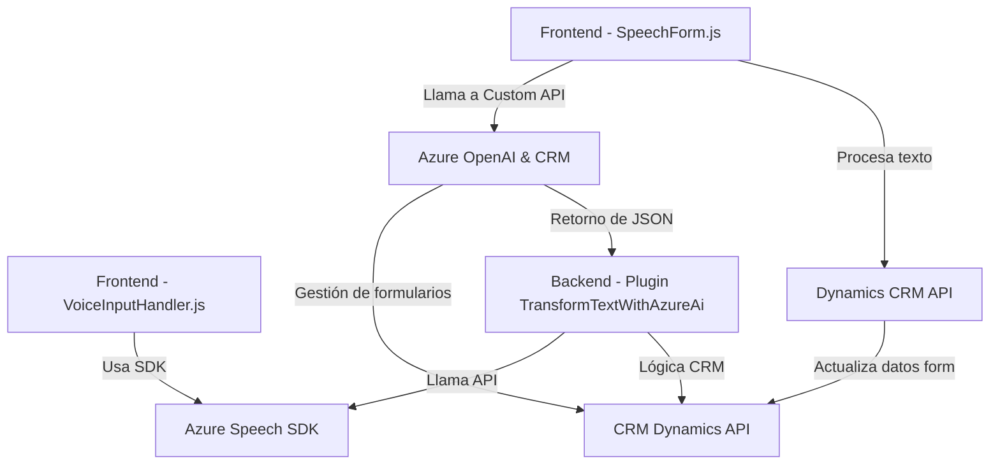

### Breve Resumen Técnico
El repositorio incluye tres archivos principales (`readForm.js`, `speechForm.js`, `TransformTextWithAzureAI.cs`) que juntos implementan una solución centrada en la interacción entre la entrada/salida de voz, el procesamiento de datos de formularios en CRM Dynamics, y el uso de inteligencia artificial (IA) de Azure OpenAI. La solución se divide entre una interfaz frontend que utiliza JavaScript y un backend desarrollado en C# que opera como un Dynamics CRM Plugin.

---

### Descripción de Arquitectura
La arquitectura tiene características de un diseño de **arquitectura multicapa**:
1. **Frontend:** Implementa funciones para la entrada de voz y lectura de formularios con la ayuda de Azure Speech SDK, además de interacción con un backend para el procesamiento de texto transcrito.
2. **API personalizada:** Capaz de recibir y procesar texto transcrito a través del servicio Azure AI (desde el nodo de frontend al backend), encapsulando la lógica del servicio externo y presentando los resultados al usuario.
3. **Backend Plugin:** Un plugin desarrollado en C# que interactúa directamente con Microsoft Dynamics CRM para almacenar y procesar datos estructurados obtenidos del Azure AI.

Es por tanto un híbrido entre una **arquitectura orientada a servicios** (SOA) debido a la interacción con Azure y Dynamics CRM API, y una arquitectura **multicapa** por la división de lógica entre frontend y backend.

---

### Tecnologías Usadas
1. **Frontend (JavaScript):**
   - Azure Speech SDK (procesamiento de voz a texto y síntesis de texto en voz).
   - Dynamics CRM SDK para interacción con el sistema.
   - Javascript para funciones frontend en el navegador.
   
2. **Backend (C#):**
   - Dynamics CRM Plugin Framework (`Microsoft.Xrm.SDK`).
   - Azure OpenAI Service para procesamiento de texto mediante IA.
   - Librerías .NET (`System.Net.Http`, `Newtonsoft.Json.Linq`, etc.).

3. **Servicios Externos:**
   - Azure Speech SDK: Funcionalidad de entrada y salida de voz.
   - Azure OpenAI: Transformación de texto y lógica de IA.
   - Dynamics CRM SDK: Gestión de la base de datos y lógica empresarial.

4. **Patrones de Diseño:**
   - **Callback Workflow:** Gestión de carga asíncrona de dependencias en el frontend.
   - **Service-Oriented Architecture:** Integración entre frontend, backend y servicios de Azure mediante capas.
   - **Layered Architecture:** Separación funcional en los archivos para frontend, backend y CRM.
   - **Dependency Injection:** En C#, el plugin usa el contexto del servicio `IServiceProvider` para obtener dependencias como `IOrganizationService` y datos del CRM.

---

### Diagrama Mermaid

---

### Conclusión Final
La solución es un sistema **integrado y modular** que permite la interacción del usuario con formularios de un CRM mediante entrada y salida de voz, donde el texto es transformado mediante inteligencia artificial para su estructuración y posterior almacenamiento. La arquitectura es predominantemente multicapa con tres áreas funcionales (frontend, API, backend). Aunque es funcional, puede beneficiarse de mejores prácticas de seguridad como el uso de un gestor de secretos para las claves de Azure, así como la implementación de estrategias de resiliencia para evitar caídas ante limitaciones de los servicios API. Además, su diseño orientado a servicios lo hace escalable y apto para integrarse con otras aplicaciones.