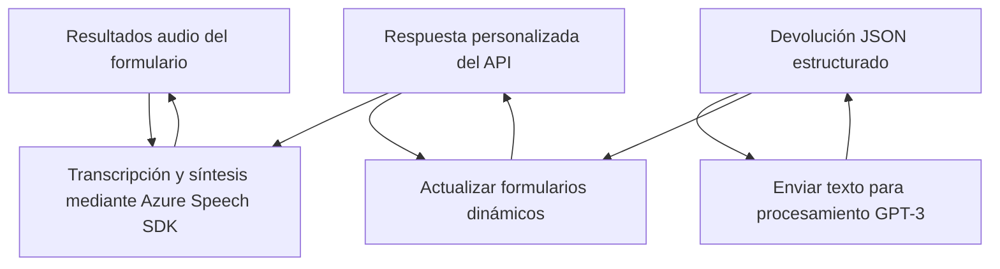

### Breve resumen técnico

El repositorio contiene tres archivos principales que trabajan conjuntamente para integrar servicios de reconocimiento de voz y procesamiento de datos en un contexto de formularios de Dynamics CRM. Utilizan **Azure Speech SDK** para la síntesis y transcripción de voz, junto con un plugin para realizar transformaciones de texto con **Azure OpenAI's GPT**.

---

### Descripción de la arquitectura

La solución sigue una arquitectura de **n capas**, con separación lógica entre el frontend (procesamiento y síntesis de voz mediante SDK de Speech), el backend (plugin para transformación de texto en JSON), y las APIs de Dynamics CRM y Azure OpenAI que proveen servicios externos a la plataforma. 

Los archivos interactúan de manera modular y asíncrona:
1. **Frontend:** Scripts JavaScript manejan eventos de la interfaz, conectándose al SDK de Azure y APIs personalizadas.
2. **Backend:** El archivo C# contiene lógica puntual y manejada por plugins para integrarse con el ciclo de vida de Dynamics CRM.
3. **External API usage:** Strong dependency on Azure resources, including OpenAI APIs for text analysis, Microsoft Dynamics APIs for CRM operations, and asynchronously loaded Azure Speech SDK.

Patrones comunes utilizados incluyen el **Service Locator Pattern** (para resolver dependencias en Dynamics CRM) y **Event-driven architecture** (en los scripts frontend que inician procesos basados en callbacks).

---

### Tecnologías usadas

1. **Frontend**
   - **Languages:** JavaScript.
   - **Framework:** None explicitly mentioned, but DOM APIs are utilized extensively.
   - **Azure Speech SDK:** For voice synthesis and transcription.
   - **API integration:** Interaction with Dynamics CRM custom APIs.

2. **Backend**
   - **Languages:** C#.
   - **Framework:** Dynamics CRM SDK.
   - **Azure OpenAI (GPT-3):** Exploited in plugins to transform text to JSON.
   - **Libraries:** `Newtonsoft.Json`, `System.Net.Http` (HTTP communications), `Microsoft.Xrm.Sdk`.

3. **Common technologies**
   - **Event-driven programming:** Callbacks initiated post SDK load.
   - **Asynchronous operations:** Promises and deferred execution ensure external dependencies are loaded before continuing workflow.
   - **CRM integration:** Heavy reliance on Microsoft Dynamics through `IPlugin` and `IPluginExecutionContext`.

---

### Diagrama Mermaid válido para GitHub

---

### Conclusión final

Esta solución representa una integración avanzada de servicios de reconocimiento de voz y capacidades de IA con la plataforma Dynamics CRM. Utiliza un enfoque **n capas** al separar responsabilidades entre frontend (manejo de eventos y SDK), backend (plugin CRM), y servicios externos (Azure Speech SDK y OpenAI). 

La arquitectura es flexible y modular, lo que permite adaptarse fácilmente a nuevos servicios externos o cambios en la lógica de negocios. Sin embargo, hay detalles sensibles (como claves de API) directamente referenciados en el código que podrían beneficiarse de una configuración centralizada. 

Recomiendo evaluar la seguridad de las bibliotecas externas y optimizar el manejo de configuración para fortalecer la solución ante riesgos.