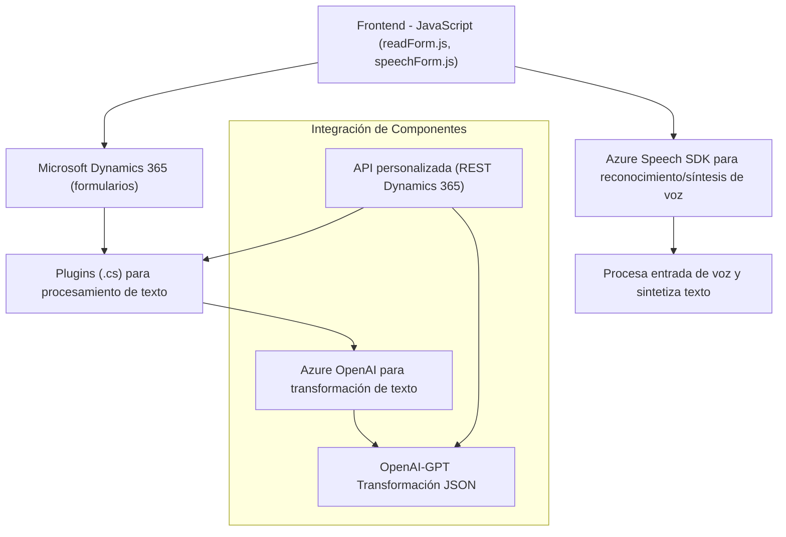

### Análisis técnico del repositorio

---

#### **Breve resumen técnico**
El repositorio parece contener una solución **orientada a un entorno Dynamics 365** con integración de servicios de Microsoft Azure. Combina componentes frontend y backend para capturar, procesar y transformar datos utilizando reconocimiento de voz y sintesis con inteligencia artificial (Azure Speech SDK y Azure OpenAI). 

---

#### **Descripción de arquitectura**
1. **Tipo de solución:**  
    - Principalmente un **integración entre diferentes herramientas**. Incluye funcionalidades frontend para procesamiento de formularios en Dynamics 365, plugins para extender funcionalidades del CRM, y servicios externos para procesar texto basado en IA.
    - El repositorio se presta más a sistemas diseñados como complementos/plug-ins orientados a Dynamics 365 con fuerte interacción en puntos de integración con APIs externas (Azure OpenAI, Azure Speech SDK).

2. **Tipo de arquitectura:**  
    - El backend sigue el **patrón de arquitectura basado en plugins**, clásico del ecosistema de Dynamics 365. La integración con Azure OpenAI se realiza mediante un patrón cliente-servidor.  
    - El frontend muestra una **arquitectura modular** basada en funciones independientes, aprovechando la segmentación para tareas específicas como la captura de voz, síntesis de texto, y actualización de datos en formularios HTML/CRM. Usa enfoques de **event-driven programming** y **bridge pattern** para conectar servicios externos Azure Speech SDK con Dynamics.  
    - La solución global se perfila como una **arquitectura de n capas**, donde las funciones frontend interactúan con el backend mediante la interfaz API del CRM (nivel intermedio).

---

#### **Tecnologías, frameworks y patrones usados**
1. **Frontend:**  
    - Tecnologías principales: JavaScript (con APIs del navegador).  
    - SDK utilizado: **Azure Speech SDK** para reconocimiento de voz y síntesis de texto.  
    - Dominio: Dinámicas de eventos en tiempo real y gestión dinámica de dependencias con CDN.  
    - Patrones: Modular Design para reutilización de funciones; Event-driven programming.  

2. **Backend:**  
    - Lenguaje: C# con el marco **Plugin Framework** de Microsoft Dynamics 365.  
    - Integración con Azure AI: Comunicación cliente-servidor vía API REST al servicio OpenAI.  
    - Librerías:  
        - `System.Net.Http`: Para solicitudes HTTP.  
        - `System.Text.Json` y `Newtonsoft.Json.Linq`: Para serialización y manejo de datos en formato JSON.  
    - Patrones: External Service Integration para la interacción con Azure OpenAI, Plugin Design consistentemente en el contexto de Dynamics 365.  

3. **Dependencias:**  
    - **Externas:** Azure Speech SDK, APIs de Dynamics 365, Azure OpenAI.  
    - **Internas:** Manejo del contexto y esquema del CRM (Dynamics 365); interacción con entidades, atributos y controles del sistema.

---

### **Diagrama Mermaid**
El diagrama representa la interacción y relación de los diferentes componentes del sistema. Aquí se incluyen múltiples nodos de funcionalidad, herramientas externas (APIs) y comunicación en Dynamics 365.

---

#### **Conclusión final**
Este repositorio ofrece una solución híbrida que combina capacidades frontend (interacción directa con usuarios mediante formularios y captura de voz) y backend (procesamiento avanzado de IA con reglas declarativas en un plugin para Dynamics 365). La integración de APIs externas mediante servicios de Azure permite realizar tareas complejas como síntesis de texto en voz y transformación semántica con IA.

La arquitectura, aunque sigue un modelo basado en **n capas**, se complementa con enfoques modernos como la **gestión dinámica de dependencias**, el uso de APIs externas en un modelo de cliente-servidor, y la reutilización modular. Sin embargo, aspectos como rendimiento y posibles dependencias de tiempo de respuesta sobre APIs externas podrían representar puntos de mejora futuros.