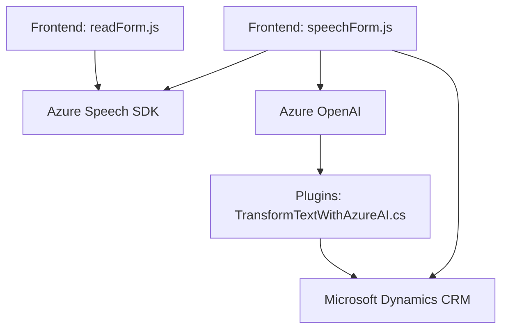

**Breve resumen técnico:**  

Este repositorio abarca un sistema destinado a integrar funcionalidades de reconocimiento de voz, síntesis de texto a voz y transformación avanzada de texto mediante servicios de Azure y Microsoft Dynamics. Combina accesibilidad, procesamiento de texto y manipulación dinámica de formularios y datos.  

---

**Descripción de arquitectura:**  

La arquitectura se presenta como una solución de integración cliente-servidor, basada en las siguientes capas:  
1. **Frontend**: Implementado en JavaScript, con integración directa al SDK de Azure Speech para reconocimiento de voz y conversión de texto a voz.  
2. **Backend**: Un plugin desarrollado en C# (.NET) que opera en Dynamics CRM como capa intermedia para transformar texto mediante Azure OpenAI y gestionar integración de datos en los procesos del sistema.  
3. **APIs externas**: Conexión directa a servicios de Azure (Text-to-Speech, Speech-to-Text y OpenAI) mediante el uso de SDK y llamadas HTTP asíncronas.  

El sistema sigue una arquitectura **n-capas**, donde las responsabilidades del frontend y backend están claramente definidas, y utiliza servicios externos para ejecutar las operaciones principales.  

---

**Tecnologías usadas:**  
1. **Frontend (JavaScript)**:  
   - Azure Speech SDK (`https://aka.ms/csspeech/jsbrowserpackageraw`) para interacción de reconocimiento de voz y síntesis de voz.  
   - Contexto de Dynamics (`executionContext`) para obtener datos de formularios.  
   - JavaScript moderno (Promesas, asincronía).  
2. **Backend (C#)**:  
   - `.NET` (`System`, `System.Linq`, `Newtonsoft.JSON`) para lógica principal.  
   - Microsoft Dynamics CRM SDK (`IPlugin`, `Xrm.WebApi`) para integración directa con el CRM.  
   - Azure REST API para queries OpenAI (uso del modelo GPT-4o).  
3. **Servicios externos**:  
   - Azure Speech Cognitive Services.  
   - Azure OpenAI.  
   - Microsoft Dynamics Web API.  

---

**Diagrama Mermaid:**  
Este diagrama representa los flujos entre sistemas, componentes y dependencias involucradas.

---

**Conclusión final:**  

El repositorio implementa una solución basada en accesibilidad y transformación lingüística, destacándose por integraciones con servicios externos (Azure y Dynamics CRM). La arquitectura en capas, junto con los patrones de delegación y encapsulación clara, permite modularidad y escalabilidad. Este enfoque resulta ideal para sistemas que buscan enriquecer experiencias de usuario mediante procesamiento de voz y texto avanzado. Sin embargo, puede beneficiarse de un refuerzo en la gestión de errores y seguridad en las conexiones externas.