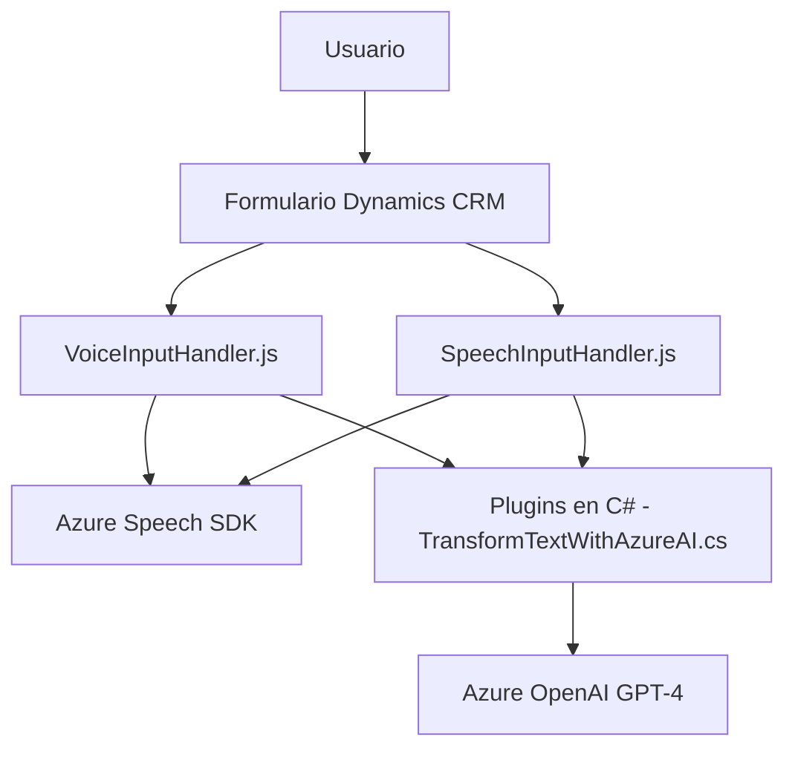

### Breve resumen técnico

El repositorio descrito alberga una solución orientada a la automatización y mejora de interacción en sistemas CRM (Dynamics 365). Integra capacidades de voz y procesamiento de texto mediante servicios avanzados de Microsoft Azure, específicamente Azure Speech SDK y Azure OpenAI GPT-4. Esto le permite llevar a cabo tareas como lectura, síntesis y reconocimiento de voz en formularios del CRM, así como transformación de texto en objetos JSON estructurados.

---

### Descripción de la arquitectura

La solución presenta una arquitectura de tipo **n-capas**, adaptada al entorno de Dynamics CRM y enriquecida con integraciones de servicios externos (Azure Speech SDK y Azure OpenAI). Los diferentes componentes (JavaScript para frontend/formularios y un plugin en C# para el backend) se encargan de la interacción entre los usuarios, los formularios del sistema CRM y las APIs externas.

- **Capa de presentación (Frontend)**: Archivos JavaScript que gestionan la entrada/salida de voz y manipulan los campos visibles de formularios en Dynamics 365.  
- **Capa lógica de negocios (Plugins en C#)**: Implementación de lógica personalizada en el lado del servidor Dynamics CRM, extendiendo su funcionalidad mediante Azure OpenAI GPT-4 para análisis semántico y estructuración de texto.
- **Capa de integración**: Aprovecha APIs externas (Azure Speech, Azure OpenAI y potencialmente Dynamics 365 Web API) para sintetizar o reconocer voz y estructurar datos en JSON.

---

### Tecnologías usadas

#### **Lenguajes de Programación**
- **JavaScript**: Manejo del frontend para interacción por voz en formularios de CRM.
- **C#**: Desarrollo del backend mediante Plugins en Dynamics CRM.

#### **Frameworks y SDK**
- **Microsoft Dynamics CRM SDK**: Para extensiones en el sistema CRM (uso de Plugins e interacción con formularios).
- **Azure Speech SDK**: Para funciones de síntesis y reconocimiento de voz.
- **Azure OpenAI GPT-4 API**: Procesamiento avanzado de texto.

#### **Patrones de diseño aplicados**
- **Modularidad**: Separación de funcionalidad en clases y métodos específicos.
- **Event-Driven Programming**: Uso de callbacks y promesas en JavaScript para manejar eventos asincrónicos.
- **Plugin-Based Architecture**: Lógica personalizada integrada con Dynamics CRM mediante Plugins.
- **Single Responsibility Principle**: Cada función o método está diseñado para cumplir una tarea específica.

---

### Dependencias o componentes externos

1. **Azure Speech SDK**:
   - Sintetización de texto a voz y reconocimiento de voces en tiempo real.
   - Cargado dinámicamente desde `https://aka.ms/csspeech/jsbrowserpackageraw`.

2. **Azure OpenAI GPT-4**:
   - Endpoint API usado para análisis avanzado y generación de objetos JSON estructurados a partir de texto.

3. **Dynamics CRM SDK**:
   - Utilizado tanto en frontend (JavaScript) como en backend (C# plugin) para manipular datos de formularios y registros CRM.

4. **Bibliotecas adicionales** (C#):
   - `Newtonsoft.Json.Linq`: Para manipulación avanzada de datos en formato JSON.
   - `System.Net.Http`: Para integración con servicios HTTP externos.

---

### Diagrama Mermaid

---

### Conclusión final

El repositorio presenta una sólida solución basada en **Microsoft Dynamics 365** complementada con capacidades avanzadas de síntesis, reconocimiento de voz y procesamiento semántico de texto. Se enfoca principalmente en mejorar la interacción usuario-sistema (mediante comandos de voz y transcripción) y en la generación automatizada de datos estructurados para formularios del CRM.

La arquitectura **n-capas** garantiza una adecuada separación de responsabilidades y facilita la integración con servicios externos (Azure Speech, OpenAI GPT-4). Los archivos son altamente modularizados, haciendo uso eficiente de patrones de diseño como la programación orientada a eventos y la arquitectura plugin.