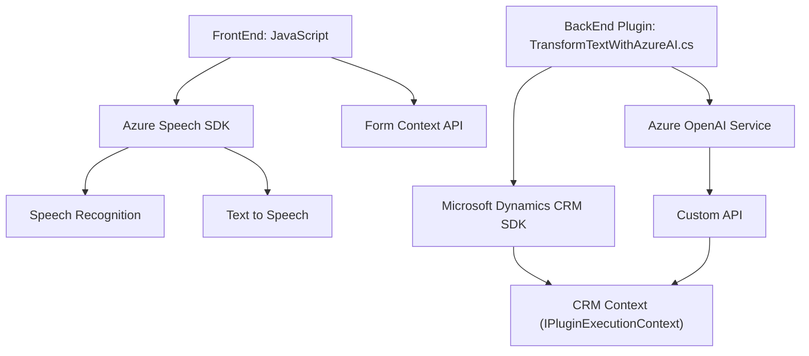

### **Breve resumen técnico**
El repositorio contiene soluciones orientadas a la integración de servicios externos para procesos específicos. Las tecnologías y patrones utilizados sugieren una arquitectura modular con integración directa en contextos CRM y formularios. El núcleo de las funcionalidades se apoya en servicios de Azure (Speech SDK y OpenAI API), lo que indica una fuerte dependencia de la nube para tareas relacionadas con reconocimiento y síntesis de voz, así como análisis y manipulación de texto.

---

### **Descripción de arquitectura**
1. **Arquitectura General:**  
   - El proyecto está diseñado siguiendo principios de Arquitectura por **capas** en el lado código, aplicando **capas de negocio y capa de integración API externa**. Particularmente utiliza una variante de arquitectura **orientada a servicios (SOA)** dado que se consume Azure Speech SDK y Azure OpenAI Service.
   - En el caso del plugin `TransformTextWithAzureAI.cs`, implementa una arquitectura basado en extensibilidad a través de **plugins**. Esto lo asocia con la integración dentro del ecosistema de Dynamics CRM.
   - **Modularidad y desacoplamiento:** Cada archivo presenta un enfoque modular en el que las funciones están desacopladas y especializadas para tareas específicas, facilitando la reutilización y el mantenimiento.

2. **Naturaleza de la solución:**  
   - **Frontend:** Los archivos `readForm.js` y `speechForm.js` definen funcionalidades para interactuar con formularios contenedores, utilizando reconocimiento y síntesis de voz.
   - **Backend:** El plugin en C# (`TransformTextWithAzureAI.cs`) permite el procesamiento avanzado para manejar transcripciones en un entorno CRM.

---

### **Tecnologías usadas**
1. **Azure Speech SDK:**  
   Para reconocimiento y síntesis de voz basado en servicios de Azure.

2. **Azure OpenAI Service:**  
   Procesa y transforma texto en formato JSON personalizado usando modelos de GPT desplegados en Azure.

3. **Microsoft Dynamics CRM SDK:**  
   Utilizado en la parte backend para integrarse en el ecosistema CRM y manejar eventos del plugin.

4. **Javascript:**  
   Lenguaje para las funcionalidades frontend integradas con Azure Speech SDK.

5. **.NET Framework (C#):**  
   Utilizado para el desarrollo de plugins en el entorno de Dynamics CRM.

6. **Web APIs (AJAX y REST):**  
   Consumidas para interactuar con servicios como Azure Speech y Azure OpenAI.

---

### **Diagrama Mermaid válido para GitHub**

---

### **Conclusión final**
La solución está enfocada en integraciones con servicios de Microsoft Azure y plugins para Dynamics CRM, logrando un ecosistema que soporta el reconocimiento y síntesis de voz (frontend) y el procesamiento de texto avanzado para mapeo y establecimiento de normas (backend). La arquitectura implementada está basada en principios de modularidad y orientada a servicios/cloud debido a su fuerte dependencia de APIs externas y SDKs proporcionados por Azure.