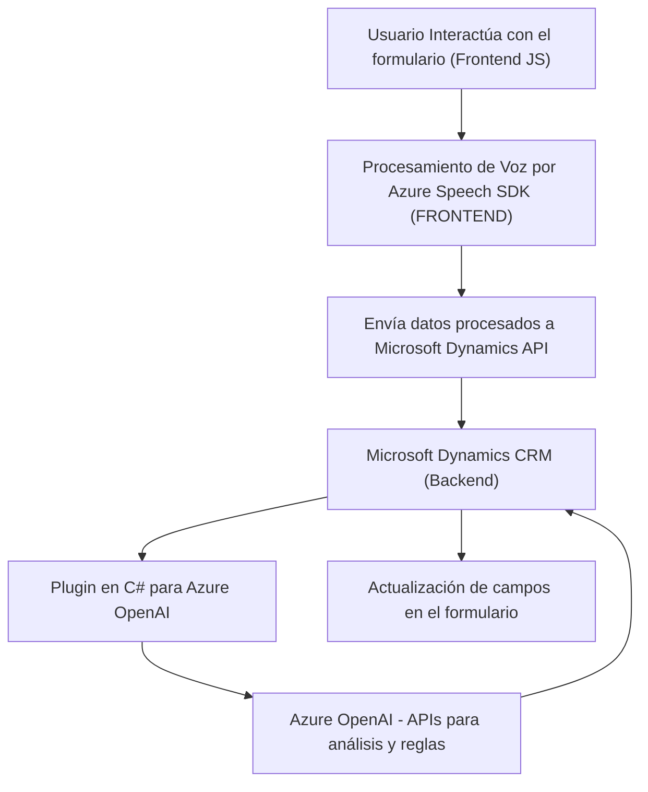

### Breve resumen técnico

El repositorio parece estar diseñado como una solución que integra procesamiento de entrada de voz y voz a texto en el contexto de formularios de un CRM (Microsoft Dynamics). Además, incluye procesamiento avanzado de texto por Azure AI en plugins, haciendo uso extensivo de servicios externos (Azure Speech SDK, OpenAI, Microsoft Dynamics API). La solución es modular, con interacción basada en eventos y procesamiento API, y podría ser parte de un ecosistema más amplio de aplicaciones CRM.

---

### Descripción de arquitectura

La arquitectura general parece ser orientada a microservicios y eventos:
- **Frontend (JavaScript)**: Funciones altamente moduladas manejan reconocimiento de voz, actualización de campos en formularios y síntesis de texto a voz. Se utiliza un patrón de interacción directa con APIs externas y uno basado en eventos.
- **Backend (C# Plugin)**: Usa Dynamics CRM y Azure OpenAI para enriquecer datos procesados en tiempo real por contexto de formulario.

El diseño se basa principalmente en:
1. **N-capas**: Componentes frontend interactúan con APIs externas para obtener datos procesados, mientras el backend utiliza un plugin que sigue la arquitectura pipeline.
2. **Service Integration**: Usando Azure Speech Services y OpenAI como servicios externos.
3. **Event-driven architecture**: Procesos activados por interacción de usuarios o cambio de contexto en CRM.

---

### Tecnologías usadas

- **Frontend**:
  - **JavaScript**: Base de funciones de interacción con formularios.
  - **Azure Speech SDK**: Sincronización para entradas de voz y síntesis de texto.
  - **Microsoft Dynamics API**: Para interactuar con el CRM conectando datos en formulario.
  - **DOM Manipulation**: Carga dinámica de SDK y manejo de atributos HTML.

- **Backend**:
  - **C#**: Lenguaje usado para el plugin.
  - **Microsoft Dynamics SDK**: Extensión de funcionalidades y lógica del CRM.
  - **Azure OpenAI**: Procesamiento avanzado de texto.
  - **HTTP Client (System.Net.Http)**: Para interacción directa con APIs.
  - **JSON Libraries**: Serialización y deserialización avanzada: `Newtonsoft.Json`, `System.Text.Json`.

---

### Diagrama Mermaid válido para GitHub

---

### Conclusión final

Este repositorio forma parte de una solución híbrida para un CRM como Microsoft Dynamics. Utiliza:
1. **Frontend modulado en JavaScript**: Manejo de voz y entrada de datos con Azure Speech SDK, junto con actualización dinámica de formularios.
2. **Backend basado en Plugins de Dynamics CRM (C#)**: Métodos para interactuar con Azure OpenAI y enriquecer la lógica de transformación textual.
3. **Integración con servicios externos**: Haciendo uso de la nube de Azure.

La arquitectura está estructurada principalmente en un diseño **n-capas** con características importantes de **event-driven architecture**, lo cual permite flexibilidad y escalabilidad. Este diseño es apto para CRM empresariales que buscan añadir capas de procesamiento de datos enriquecidos o interacción por voz. Sin embargo, los métodos de autenticación deben ser revisados para asegurar que las claves de API no queden expuestas en el código fuente.