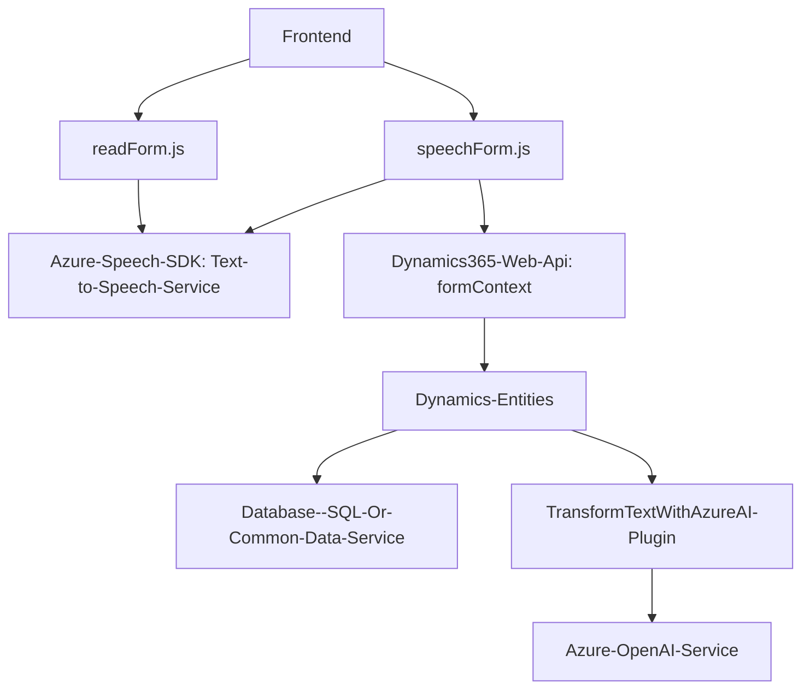

### Breve resumen técnico:
Analizando los archivos mencionados en los diferentes directorios del repositorio (JavaScript para el frontend y un plugin desarrollado en C#), se puede concluir que esta solución tiene el propósito principal de integrar funcionalidades de entrada de voz y procesamiento mediante servicios basados en inteligencia artificial de Microsoft Azure (Speech SDK y OpenAI). Está diseñado para ser una extensión/acoplamiento de Microsoft Dynamics CRM y probablemente está orientado a optimizar la interacción entre usuarios y una aplicación de gestión empresarial.

---

### Descripción de arquitectura:
Esta solución tiene una **arquitectura híbrida**. Utiliza un enfoque **event-driven** en el frontend para la manipulación de datos en formularios, llamadas a servicios externos (API-centric) y procesamiento de datos. Del lado del backend, el archivo `TransformTextWithAzureAI.cs` sigue el **plugin architecture** de Dynamics CRM, con soporte adicional para integrar el servicio de procesamiento de lenguaje natural ofrecido por Azure OpenAI.

La comunicación entre las dos piezas parece estar establecida mediante la **Web API** de Dynamics 365 y llamadas asincrónicas a endpoints de Azure. Esto sugiere un modelo de integración basado en **servicios distribuidos**, donde la aplicación orquesta llamadas entre el cliente (frontend) y servicios externos (como Azure Speech SDK y Azure OpenAI API).

#### Arquitectura predominante:
Se podrían identificar características de un diseño **n capas** aplicado en Dynamics CRM (con capas de presentación, negocio y datos) combinadas con conceptos de diseño **orientados a servicios** por la dependencia de APIs de terceros. El sistema en sí no parece ser puramente microservicios ni hexagonal; más bien, busca extender la funcionalidad de una solución basada en Dynamics CRM.

---

### Tecnologías, frameworks y patrones utilizados:
- **Tecnologías principales**:
  - **Frontend**: JavaScript.
  - **Backend**: C#.
  - **Servicios y API externas**:
    - Azure Speech SDK (para sonido y reconocimiento de voz).
    - Azure OpenAI API (GPT-4, mediante integración con Azure AI).
- **Frameworks y bibliotecas**:
  - **Frontend**:
    - Dom manipulation (básico).
    - Asynchronous programming (Promises y async/await).
  - **Backend**:
    - Dynamics CRM SDK (`Microsoft.Xrm.Sdk`).
    - JSON manipulation: `System.Text.Json`, `Newtonsoft.Json.Linq`.
    - HTTP client (`System.Net.Http`).
- **Patrones:**
  - **Plugin architecture** (Dynamics 365 plugins).
  - **Event-driven** for SDK initialization and voice recognition.
  - **Modular Design** for frontend functionality.
  - **API-centric design** via Azure services.

---

### Dependencias o componentes externos que podrían estar presentes:
1. **Azure Speech Services**:
   - Utilizado para reconocimiento de voz, procesamiento de texto y síntesis de voz en tiempo real.
2. **Azure OpenAI API**:
   - Responsable de transformar datos no estructurados en JSON según reglas establecidas.
3. **Microsoft Dynamics CRM SDK**:
   - Provee los mecanismos para interactuar y ejecutar lógica en plugins asociados a registros dentro del CRM.
4. **Microsoft Dynamics 365 Web API (`Xrm.WebApi`)**:
   - Interacción fluida entre el frontend (actualización de formularios) y los datos almacenados en el CRM.
5. **HTTP endpoints**:
   - Posiblemente se configuran URLs externas para comunicarse con Azure y enviar mensajes JSON.

---

### Diagrama Mermaid (**100% compatible con GitHub Markdown**):

---

### Conclusión final:
La solución es un **componente acoplado para Microsoft Dynamics CRM**, diseñado en una arquitectura híbrida n capas/orientada a servicios. Su objetivo principal es enriquecer la funcionalidad del CRM mediante la integración de entrada por voz y procesamiento de texto avanzado. Utiliza potentes recursos de Microsoft Azure (Speech SDK y OpenAI API), además de la capacidad del CRM de manejar y actualizar datos estructurados dinámicamente. La claridad y modularidad del código es notable, reflejando buenas prácticas arquitectónicas. Sin embargo, podría beneficiarse de documentación adicional para el esquema de interacción global del sistema.