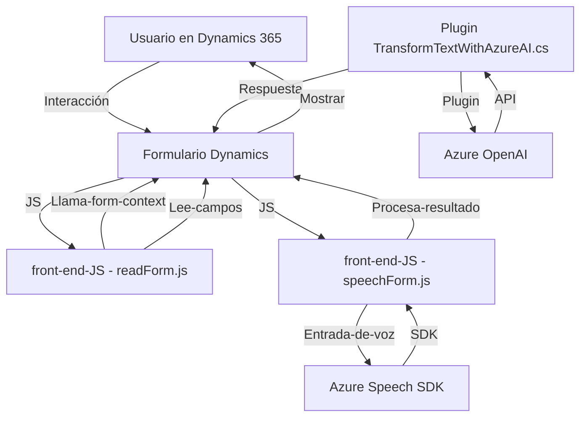

### Breve resumen técnico

El repositorio GitHub parece centrarse en extender las capacidades de Microsoft Dynamics 365 mediante integraciones con **Azure Speech SDK** y **Azure OpenAI API**, ofreciendo soluciones de accesibilidad (lectura por voz) y entrada de voz, además de procesamiento basado en Inteligencia Artificial. Existe una mezcla de arquitectura cliente (JavaScript en Dynamics), servicios externos (Azure), y plugins (.NET para Dynamics CRM).

--- 

### Descripción de arquitectura

La arquitectura combina **microservicios** y características típicas de una solución de **n-capas**:
1. **Frontend**: Utiliza JavaScript para interactuar con la interfaz del usuario en Dynamics 365, permitiendo síntesis de voz y transcripción de entrada de voz.
2. **Backend/plugin**: Programado en C#. Se utiliza como intermediario para conectar Dynamics 365 con Azure OpenAI para el procesamiento de datos por IA.
3. **Servicios externos**:
   - **Azure Speech SDK**: Gestión de voz (Text-to-Speech y Speech-to-Text).
   - **Azure OpenAI**: Procesamiento de texto avanzado.

Los distintos módulos están claramente divididos, con cada uno siguiendo principios de **modularidad** y **integración basada en APIs**.

---

### Tecnologías usadas

Las tecnologías principales detectadas son:
- **Frontend**:
  - JavaScript como lenguaje principal.
  - Integración con Dynamics 365 Form APIs para actualización de campos.
  - **Azure Speech SDK**: para funcionalidades de síntesis y reconocimiento de voz.
- **Backend/plugin**:
  - **C#** con **Microsoft.Xrm.Sdk** para desarrollo de plugins en Dynamics 365.
  - **Azure OpenAI API**: para procesamiento avanzado de texto.
  - **Newtonsoft.Json** y **System.Net.Http**: Para manejar peticiones y respuestas al servicio OpenAI API.
- Frameworks y Servicios ↔ **Dynamics 365**, **Azure**.
- Arquitectura ↔ **Microservicios**, con fragmentos de **MVC** (frontend).

---

### Dependencias externas y componentes presentes

1. **Azure Speech SDK**:
   - `https://aka.ms/csspeech/jsbrowserpackageraw`
   - Manejo de Text-to-Speech, Speech-to-Text integrándose en Dynamics.
2. **Azure OpenAI API**:
   - Procesa texto y genera respuestas utilizando IA.
3. **Dynamics 365 API**:
   - Manejo de formularios, CRUD en entidades.
4. Librerías:
   - **Newtonsoft.Json** y **System.Text.Json**: Para manipulación de estructuras JSON.
   - **System.Net.Http**: Comunicación con APIs externas vía HTTP.
5. Recursos del sistema:
   - Input desde el formulario de Dynamics 365.
   - Conexión a entidades mediante `executionContext`.

---

### Diagrama Mermaid válido para GitHub

---

### Conclusión final

Este repositorio implementa un sistema que amplía las capacidades de Dynamics 365 mediante integraciones profundas con servicios de Azure, específicamente **Speech SDK** y **OpenAI API**. La solución adopta aspectos de microservicios (frontend integrado con backend mediante APIs) y en parte n-capas (desacoplando el procesamiento entre frontend, plugin y API). La modularidad del código y las dependencias externas estratégicas lo convierten en una solución escalable para accesibilidad y automatización basada en IA.