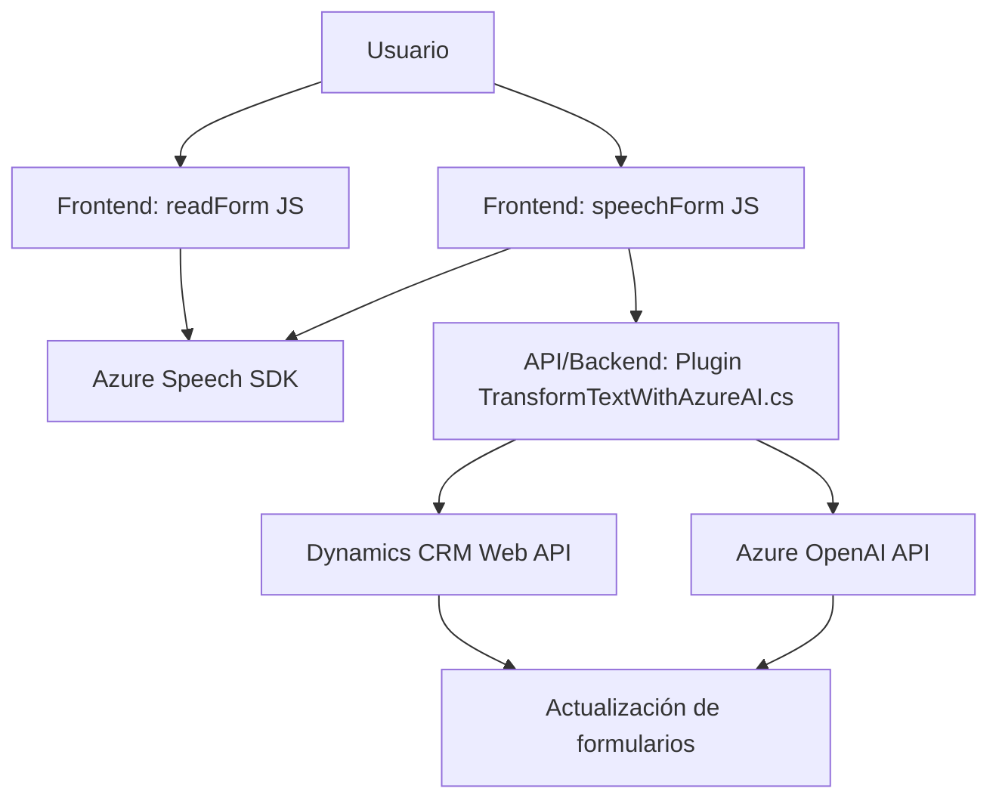

### Breve resumen técnico:
El repositorio está compuesto de archivos que integran funcionalidades de manejo de voz y procesamiento de texto basado en inteligencia artificial mediante Azure Speech SDK y Azure OpenAI. Está diseñado para vincular datos dinámicos de formularios de Microsoft Dynamics CRM con servicios de IA para entrada de voz, lectura, procesamiento y generación de resultados.

---

### Descripción de arquitectura:
La arquitectura se encuentra dividida en **dos capas principales**:
1. **Frontend**: Contiene lógica basada en JavaScript (en los archivos `readForm.js` y `speechForm.js`) para interacción con el usuario, manejo de inputs de voz y síntesis/lectura de datos mediante Azure Speech SDK. Estos implementan patrones como carga condicional y procesamiento en eventos (asincrónicos).
2. **Backend** (`TransformTextWithAzureAI.cs`): Opera como un módulo plugin para Microsoft Dynamics CRM, utilizando la API de Azure OpenAI para transformar texto. Sigue el patrón de plugin específico a Dynamics, expandiendo eventos del sistema CRM.

La solución implementa patrones como:
- Modularidad: Funciones claras que separan responsabilidades como procesamiento de datos del formulario, integración con APIs externas, y ejecución de servicios de voz/AI.
- Integración de servicios (Speech SDK, OpenAI, Dynamics Web API).
- Capa de plugins para extender el manejo de eventos en CRM.

Aunque está diseñado como una solución **n-capas**, la dependencia directa entre las capas lo hace susceptible a límites en escalabilidad. En este caso, la arquitectura podría evolucionar hacia un enfoque desacoplado (hexagonal o microservicios).

---

### Tecnologías usadas:
- **Frontend:**
  - JavaScript.
  - Azure Speech SDK (cargado dinámicamente).
  - Dynamics Web API para manejar formularios (contexto `Xrm.WebApi`).
- **Backend:**
  - Lenguaje de programación: C#.
  - Framework: Microsoft Dynamics SDK (`IPlugin`).
  - Azure OpenAI para procesamiento de texto.
  - Bibliotecas: JSON (Newtonsoft y System.Text.Json), System.Net.Http para solicitudes HTTP.

---

### Dependencias o componentes externos:
1. **Azure Speech SDK**: Favorece el reconocimiento de voz y síntesis de voz.
2. **Azure OpenAI API**: Proporciona procesamiento avanzado de texto basado en inteligencia artificial.
3. **Dynamics Web API (XRM)**: Interactúa con contextos de formularios e integraciones CRM.
4. **JSON Libraries**: Para manejo y serialización de datos (Newtonsoft y System.Text.Json).
5. **Microsoft Dynamics SDK**: Extensión del sistema CRM mediante plugins.

---

### Diagrama Mermaid:  

---

### Conclusión final:
La solución tiene una arquitectura **n-capas** con dos capas principales: el frontend incorporando experiencia de usuario y el backend extendiendo funcionalidades del sistema Dynamics CRM a través de un plugin. Las tecnologías clave como Azure Speech SDK y OpenAI integran capacidades avanzadas para manejo de voz y texto. Si bien la modularidad facilita el mantenimiento, para mayor escalabilidad, podría evolucionar hacia una arquitectura más desacoplada, como microservicios con eventos asincrónicos y colas.