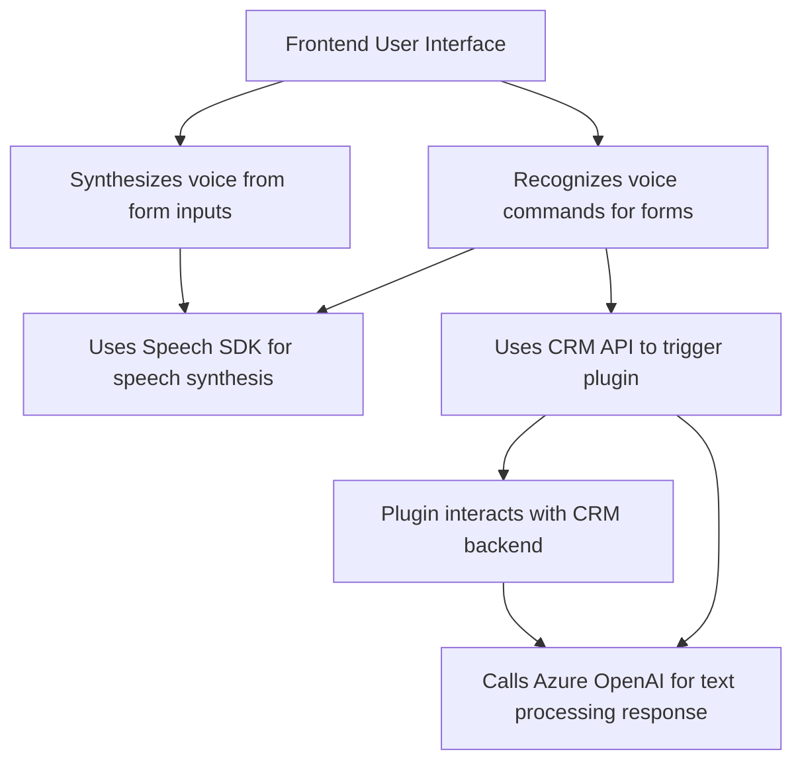

### Resumen técnico:
Este repositorio es una solución de software que utiliza componentes distribuidos para integrar funcionalidad de reconocimiento y síntesis de voz con formularios en un front-end y plug-ins de Dynamics CRM. Además, incluye la interacción directa con servicios externos como **Azure Speech SDK** y **Azure OpenAI** para procesamiento de texto y voz.

---

### Descripción de arquitectura:
El proyecto sigue una **arquitectura desacoplada** con integración de servicios externos. Está compuesto por tres capas principales:
1. **Front-End:** JavaScript y Azure Speech SDK para ejecutar funciones en tiempo de ejecución, incluyendo reconocimiento de voz, síntesis de voz y tratamiento de formularios.
2. **API dinámica:** Extensiones (plug-ins) de Dynamics CRM que interactúan como una capa de negocio, realizando operaciones con datos mediante servicios de inteligencia artificial externos (Azure OpenAI).
3. **Servicios de Azure:** Externalización de inteligencia artificial y síntesis de voz a través de APIs como **Azure OpenAI** y **Azure Speech SDK**.

El código refleja un enfoque **orientado a eventos y modular**, adecuado para entornos relacionados con la **gestión CRM** y aplicaciones empresariales dinámicas.

---

### Tecnologías usadas:
1. **Azure Speech SDK**: Para reconocimiento y síntesis de voz en el front-end.
2. **Azure OpenAI**: Transformación avanzada de textos según reglas definidas, consumida desde los plug-ins.
3. **Dynamics 365 WebApi (Xrm)**: Para interacción con el modelo de datos de CRM, especialmente para operaciones CRUD y lógica de negocio.
4. **Newtonsoft.Json** y **System.Text.Json**: Serialización y manejo eficiente de estructuras JSON.
5. **Javascript** (Vanilla): Para lógica del front-end, integrándose con los servicios de Azure y Dynamics.
6. **C#** (.NET Framework): Para desarrollo de plug-ins configurados como lógica de negocio dentro de Dynamics CRM.

---

### Diagrama Mermaid:
El siguiente diagrama representa las principales interacciones y flujo de datos entre los componentes:

---

### Conclusión final:
El repositorio representa una **modular, n-capas y orientada a servicios** arquitectura que ejecuta funcionalidades complejas relacionadas con la interacción de voz y procesamiento textual para una solución CRM. Se enfoca en delegar tareas al servicio de inteligencia artificial y síntesis de voz de Azure, manteniendo un diseño limpio y ordenado. Se utilizan componentes modernos y especialización en tareas, pero aún se observa una fuerte dependencia de componentes externos como Azure y Dynamics CRM, lo que indica una arquitectura **híbrida**, combinando elementos funcionales locales con servicios remotos escalables.