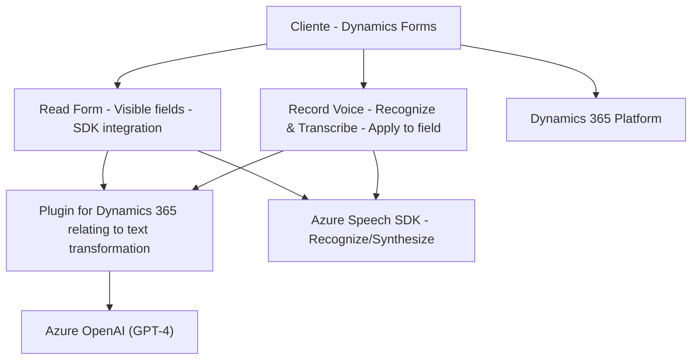

### Breve resumen técnico
El repositorio contiene implementaciones que integran el **Azure Speech SDK** y **Azure OpenAI API** con **Dynamics 365**. Los archivos parecen tener la finalidad de permitir la interacción con formularios mediante voz y procesamiento avanzado de texto. La solución da soporte a reconocer comandos hablados por los usuarios, procesar formularios y aplicar valores mediante integración con APIs externas.

---

### Descripción de la arquitectura
La solución utiliza una arquitectura híbrida basada en **Cliente-Servidor**:
1. **Cliente**: En el directorio `FRONTEND/JS`, los archivos contienen funciones JavaScript que integran operaciones sobre formularios interactivos en el cliente. También gestionan la conexión con Azure API para el reconocimiento y síntesis de voz.
2. **Servidor**: En `Plugins/TransformTextWithAzureAI.cs`, se implementa un **plugin para Dynamics 365** que interactúa con el servicio externo de Azure OpenAI API. Usa una arquitectura conforme a **n capas**:
    - **Capa de presentación**: Dynamics 365 como interfaz de usuario mediante formularios.
    - **Capa de lógica de negocio**: Plugins en el backend que manejan reglas y validación antes de realizar solicitudes al servicio externo.
    - **Capa de datos**: Uso de entidades y atributos de Dynamics CRM que integran los resultados procesados.

El diseño modular de cada archivo sugiere un enfoque orientado a la reutilización y desacoplamiento, con patrones como **Adapter** y **Observer** para la interacción con el SDK y el procesamiento de eventos.

---

### Tecnologías usadas
1. **Frontend (Client-side):**
   - **JavaScript**: Lógica y funciones para manejar reconocimiento y síntesis de voz.
   - **Azure Speech SDK**: ---
     - APIs para reconocimiento de voz y síntesis en tiempo real.
   - **Dynamics 365 Form Context**: Lectura y actualización de atributos de formularios dentro del sistema CRM.
   - **JSON Parsing** (interacción entre cliente y API personalizada).

2. **Backend (Server-side Plugin):**
   - **Microsoft Dynamics CRM SDK (Microsoft.Xrm.Sdk)**: Framework para extensiones dentro de Dynamics 365.
   - **Azure OpenAI API**: Uso de `gpt-4` para procesar texto. Comunicación mediante solicitudes HTTP REST.
   - **Microsoft SQL Server**: Posiblemente en uso para almacenar datos relacionados con el sistema CRM.

3. **General integration**:
   - **REST APIs**.
   - **System.Text.Json** y **Newtonsoft.Json** para JSON serialization/deserialization.
   - **HTTP Client** from .NET for external API calls.

---

### Diagrama Mermaid válido para GitHub 

---

### Conclusión Final
#### **Arquitectural Analysis**:
This repository is a **hybrid solution** combining **Client-side technology (JavaScript)** for form interactions with **server-side plugins for Dynamics 365** that leverage **Azure OpenAI API** for text processing. The architecture follows an **n-layer model leveraged through Dynamics 365**, enabling clear separation between form operations (frontend) and business logic implementation (backend). Additionally, it integrates external services via SDKs and APIs.

#### **Strengths**:
- Strong modularity and separation of functions for better support and extensibility.
- Clear adherence to established Dynamics 365 plugin patterns.
- Resilient error handling for external API calls.
- Leveraging powerful cloud services (Azure Speech SDK, Azure OpenAI API).

#### **Points of improvement**:
1. It may benefit from documenting a more thorough authentication flow, especially regarding the use of sensitive Azure keys.
2. A clearer plan for testing interactions between multi-layer components.
3. Explore potential memory and performance optimization in reading/form interaction elements when handling large forms (e.g., caching field maps).

In conclusion, this repository showcases a well-designed integration solution. Its use of cloud-based intelligent services (Azure Speech SDK and OpenAI) enhances the capabilities of Dynamics 365 forms, positioning it as a solution for next-generation voice and AI-augmented business workflows.