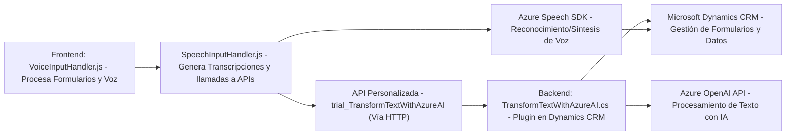

### Breve resumen técnico
El repositorio contiene múltiples archivos implementando funcionalidades relacionadas con el manejo de formularios, entrada/salida de voz, procesamiento mediante IA y síntesis de texto a voz. Integra servicios como el SDK de Azure Speech, APIs personalizadas y Azure OpenAI. Los archivos se enfocan en la interacción con Microsoft Dynamics CRM mediante módulos programables como plugins y JavaScript.

---

### Descripción de arquitectura
La solución posee una **arquitectura híbrida:**  
1. **Backend orientado a complementos (plugins de Dynamics CRM)**: Los módulos como `TransformTextWithAzureAI.cs` funcionan como extensiones que operan sobre Dynamics CRM, integrándose con procesos internos.  
2. **Frontend modular**: Archivos como `readForm.js` y `speechForm.js` se encargan del manejo del DOM, interacción con formularios y servicios externos como Azure Speech SDK.  
3. **Interacción mediante capas**: El sistema aplica patrones propias de "n capas" o "SOA". Las capas incluyen:  
   - Presentación (Gestión de formularios y voz).
   - Servicios API externos (Azure Speech y OpenAI).
   - Business logic (Plugins en Dynamics CRM).

---

### Tecnologías usadas
1. **Frontend**:
   - **JavaScript**: Procesamiento de DOM y lógica.
   - **Azure Speech SDK**: Para síntesis de voz y reconocimiento de transcripciones.
   - **Dynamics CRM API (Xrm.WebApi)**: Para manipulación de formularios y datos.
    
2. **Backend**:
   - **C# (Plugins)**: Modularización en Dynamics CRM mediante `IPlugin`.
   - **Azure OpenAI**: Procesamiento de datos usando IA.
   - **Microsoft.Xrm.Sdk** y **Newtonsoft.Json** para manipulación de datos JSON y contexto del CRM.
   - **HttpClient**: Para realizar solicitudes externas.

3. **Patrones relevantes**:
   - **Modularidad**: División lógica y funcional en métodos y clases específicas.
   - **Arquitectura Cliente-Servidor**: Uso de APIs y servicios externos como Azure y Dynamics CRM.
   - **Procesamiento asincrónico**: Utilización de `async/await` en funciones JavaScript y llamadas HTTP en C#.

---

### Diagrama Mermaid válido para GitHub

---

### Conclusión final
La solución presentada combina **Frontend basado en JavaScript** y **Backend con complementos en Dynamics CRM**. La integración con varios componentes de Azure (Speech SDK y OpenAI) sugiere una arquitectura híbrida orientada a la interacción con APIs y servicios externos. Los patrones empleados, como modularidad y asincronía, garantizan escalabilidad y adaptabilidad, siendo apta para entornos empresariales con necesidades avanzadas de automatización y procesamiento de datos.