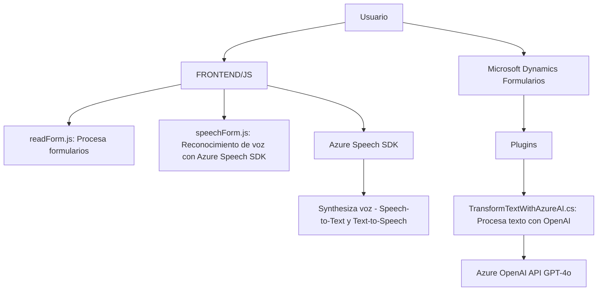

### Breve resumen técnico:

El repositorio en cuestión es una solución orientada principalmente a enriquecer la experiencia del usuario en formularios de un sistema basado en Dynamics 365. Consiste de dos módulos principales: un **frontend** para la interacción directa del usuario y un **backend plugin** para extender funcionalidades en el lado del servidor. Además, se integra extensivamente con servicios cloud como Azure Speech SDK para síntesis y reconocimiento de voz, y Azure OpenAI API para procesamiento avanzado mediante IA.

---

### Descripción de arquitectura:

La solución tiene una arquitectura híbrida que integra componentes **client-side**, **server-side** y **cloud services**. 

1. **Frontend**: Maneja la interacción del usuario con formularios y utiliza el servicio Azure Speech SDK directamente desde el navegador.
2. **Backend plugin**: Implementa la lógica de procesamiento más avanzada en el servidor de Dynamics CRM, aprovechando el modelo de arquitectura de **plugins**.
3. **Cloud services integration**: Tanto el frontend como el backend están acoplados a servicios de nube (Azure Speech SDK y Azure OpenAI API), adoptando un patrón de **Service-Oriented Architecture** (SOA).

El diseño sigue un enfoque de arquitectura por capas:
- **Presentación (Frontend)**: Interacción directa con el usuario a través de formularios HTML y el navegador.
- **Lógica de negocio (Backend)**: Implementada como plugin en Dynamics CRM, adecuado para procesar datos y comunicarse con servicios externos.
- **Servicios externos (Cloud)**: Aprovecha servicios de Azure para síntesis y reconocimiento de voz, y procesamiento IA.

---

### Tecnologías usadas:

#### **Frontend:**
- **JavaScript:** Para la implementación del cliente de voz y procesamiento de formularios.
- **Azure Speech SDK:** Para la síntesis de voz y reconocimiento de voz.
- **Browser APIs:** Para manejar el DOM y cargar dinámicamente librerías.

#### **Backend (Plugin):**
- **C#**: Lenguaje de desarrollo del plugin.
- **Microsoft.Xrm.Sdk**: SDK oficial para la implementación de plugins de Dynamics CRM.
- **Azure OpenAI API:** API para procesamiento y transformación avanzada de texto (GPT-4 model).
- **System.Text.Json & System.Net.Http:** Para manipulación y envío/recepción de datos JSON a servicios externos como Azure OpenAI.

#### **Arquitectura:**  
- **Frontend layer:** Event-driven programming para orquestar la interacción del usuario y manejar la sintaxis de voz.
- **Backend plugin layer:** Dynamics CRM event-driven plugin architecture integrado con Azure OpenAI para llamadas a servicios externos.
- **SOA (Service-Oriented Architecture):** Dependencia intensa a servicios externos (Azure SDK y Azure OpenAI).

---

### Diagrama Mermaid válido para GitHub:

---

### Conclusión Final:

La solución es un sistema híbrido que brinda una experiencia enriquecida para usuarios mediante la integración dinámica de servicios de reconocimiento y síntesis de voz (Azure Speech SDK) y el procesamiento avanzado de texto con IA (Azure OpenAI API). Está diseñado para trabajar en conjunto con Dynamics 365, aprovechando tanto la arquitectura de plugins en el servidor como la flexibilidad de un frontend basado en JavaScript. Aunque funcional y modular en algunas áreas, existen oportunidades para mejoras en la seguridad del manejo de credenciales, refactorización en componentes reutilizables, y diseño modular en el frontend para mayor legibilidad y separación de preocupaciones.