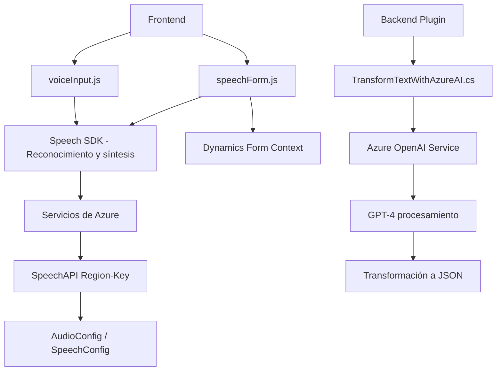

### Breve Resumen Técnico
El repositorio provee funcionalidades para integrar inteligencia artificial, reconocimiento y síntesis de voz en formularios, principalmente en aplicaciones relacionadas con **Dynamics 365 CRM**. Utiliza servicios externos como **Azure Speech SDK** y **Azure OpenAI Service**, y está diseñado para procesamiento dinámico de datos, interacción con APIs y formulación de respuestas generadas por servicios externos.

---

### Descripción de Arquitectura
1. **Tipo de solución**:  
   - Combina componentes **frontend** (JavaScript) y **backend** (C# Plugin).  
   - Diseñado para interactuar con formularios de Dynamics 365, sintetizar voz y realizar procesamiento avanzado de texto mediante inteligencias artificiales de Azure.

2. **Arquitectura**:  
   - La solución presenta una **arquitectura modular**, donde cada componente tiene responsabilidades claras.  
   - En el backend, el Plugin implementa un patrón monolítico y extendible mediante la interfaz `IPlugin`.
   - En el frontend, se aplica una arquitectura basada en **n capas** (Modularización por lógica funcional).

3. **Patrones destacados**:  
   - Carga dinámica de dependencias (SDK).  
   - Procesamiento modular de datos (funciones independientes).  
   - Comunicación asincrónica con servicios externos (Azure Speech SDK/OpenAI).  
   - Validación y transformación de entrada/salida en el Plugin de Dynamics.

---

### Tecnologías Usadas
1. **Lenguajes**:  
   - **JavaScript** para el frontend.  
   - **C#** para el Plugin de Dynamics CRM.

2. **Frameworks y Servicios**:  
   - **Azure Speech SDK**: Para reconocimiento y síntesis de voz.  
   - **Azure OpenAI Service**: Procesamiento avanzado de texto.  
   - **Dynamics 365 SDK**: Integración directa con entidades y contexto del CRM.

3. **Formatos y Librerías Adicionales**:  
   - JSON: Comunicación de datos estructurados.  
   - `System.Net.Http` y `System.Text.Json` para manipulaciones en API.  
   - `Microsoft.Xrm.Sdk` para lógica de Dynamics CRM.

---

### Diagrama Mermaid Válido para GitHub

---

### Conclusión Final
El repositorio está diseñado para ampliar las capacidades de **Dynamics 365**, utilizando tecnologías avanzadas de reconocimiento de voz y procesamiento inteligente de texto. Usa una arquitectura modular, facilitando la integración de **servicios externos en la nube (Azure)**. Los patrones como **Single Responsibility** y la carga dinámica de dependencias aseguran un comportamiento flexible y adaptable a diferentes contextos. Se recomienda mejorar la gestión de errores en la comunicación con servicios de Azure para garantizar robustez operativa en entornos productivos.