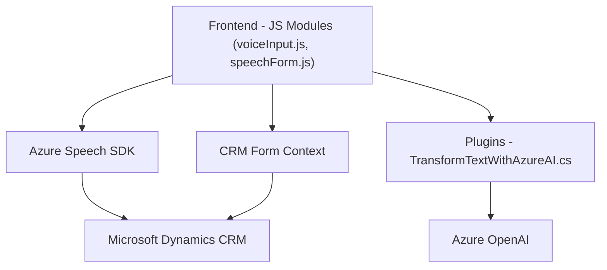

### Breve Resumen Técnico

El repositorio está orientado a desarrollar una solución integrada que utiliza tecnologías de Azure (Speech SDK y OpenAI) para implementar procesamiento de voz e inteligencia artificial en un entorno CRM (Dynamics 365). La solución incluye integración con APIs externas, manipulación de datos en formularios y procesamiento de texto mediante Azure Cognitive Services.

### Descripción de Arquitectura

La arquitectura del sistema es predominantemente **n capas**. Se articula en tres niveles principales:
1. **Frontend (interfaz y lógica cliente):** basado en JavaScript, centrado en Azure Speech SDK para captura de voz, síntesis y actualización de formularios CRM.
2. **Backend (plugins del CRM):** construido sobre la plataforma Dynamics CRM, implementando lógica empresarial personalizada mediante plugins.
3. **Servicios externos:** integración con APIs de Azure Speech SDK y Azure OpenAI para añadir capacidades cognitivas y de voz al sistema.

Esto sugiere una **arquitectura orientada a servicios (SOA)**, la cual aprovecha los patrones de integración con sistemas externos para realizar cálculos o procesos intensivos independientemente del CRM.

### Tecnologías Usadas

#### **Frontend**
- **Azure Speech SDK:** lectura y síntesis de voz.
- **JavaScript:** lógica para manejo de formularios y datos en el navegador CRM.
- CRM Dynamics: ejecución de funciones en el contexto de formularios.

#### **Backend**
- **Microsoft Dynamics CRM SDK:** integración con lógica empresarial del CRM.
- **Azure OpenAI:** procesamiento avanzado de texto y generación de JSON con GPT models.
- Dependencias: `Newtonsoft.Json`, `System.Net.Http`, etc.

#### **Patrones**
- **Modularización:** funciones claramente separadas por responsabilidad.
- **Callback Patterns:** uso de callbacks para ejecutar lógica dependiente de recursos externos.
- **Plugin Architecture:** uso de `IPlugin` de Dynamics para extender su funcionalidad.

### Dependencias o Componentes Externos

- *Azure Speech SDK:* Gestión de voz y síntesis.
- *Azure OpenAI:* Procesamiento avanzado de texto.
- *CRM Dynamics SDK:* Manipulación de datos y eventos del sistema CRM.
- *HTTP Client Libraries:* Comunicación con APIs externas.
- *Newtonsoft.Json:* Manejo de JSON en plugins.

### Diagrama Mermaid

### Conclusión Final

Este repositorio contiene una solución basada en **n capas** cuyo objetivo es enriquecer un sistema CRM existente (Dynamics) con capacidades de sintesis y reconocimiento por voz mediante **Azure Speech SDK**, procesamiento textual con **Azure OpenAI**, y lógica personalizada en plugins .NET. Utiliza integraciones con servicios en la nube, patrones distintivos de arquitectura modular y orientación a servicios, siendo un sistema muy apropiado para empresas que buscan automatización e inteligencia en sus procesos comerciales.