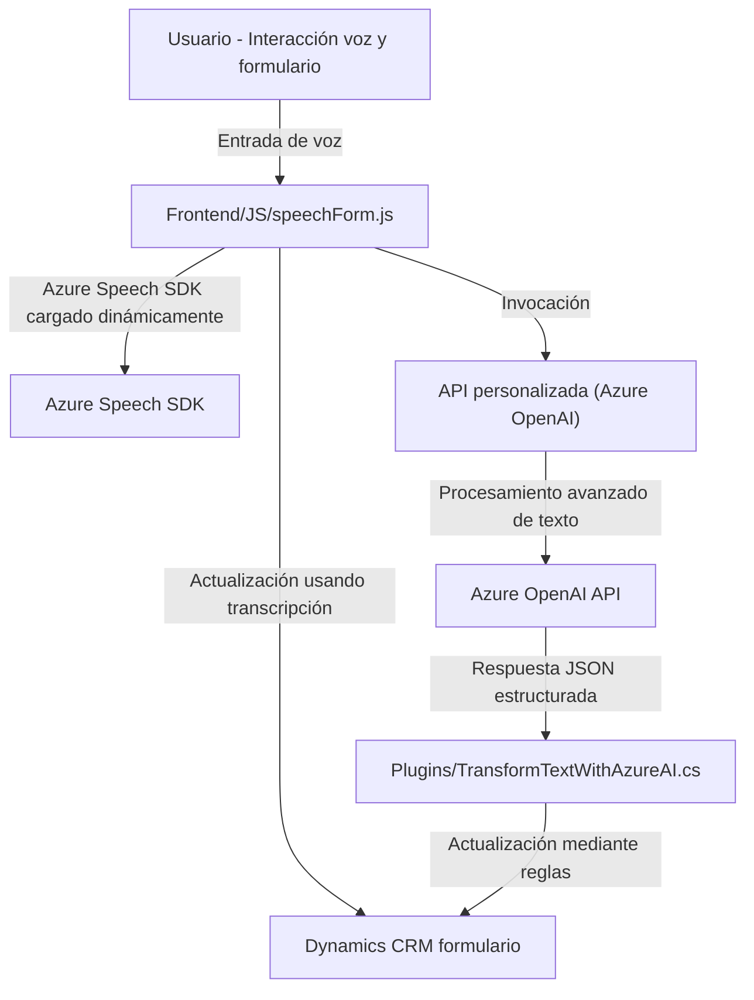

### Breve resumen técnico

Este repositorio implementa una solución híbrida que combina capacidades de procesamiento de voz, integración con APIs, y automatización sobre formularios en Dynamics CRM. El sistema utiliza el **Azure Speech SDK** y **Azure OpenAI API** para realizar tareas relacionadas con comandos de voz, síntesis y procesamiento de texto. Tiene componentes frontend en JavaScript para interfaces de usuario basadas en navegador y un backend basado en plugins de Dynamics CRM.

### Descripción de arquitectura

- **Estructura general:**
  - La arquitectura es **modular**, con responsabilidades distribuidas entre scripts frontend y un backend en Microsoft Dynamics CRM. 
  - El frontend utiliza funciones en JavaScript para interacción directa con el usuario, como lectura de formularios, captura de voz, y síntesis de texto.
  - El backend está diseñado utilizando **plugins** para Dynamics CRM que delegan tareas avanzadas de procesamiento de texto al servicio **Azure OpenAI API**.

- **Patrones identificados**:
  - **Event-driven**: Para el reconocimiento de voz y transcripciones.
  - **Plugin-based architecture**: En el backend mediante `IPlugin` para Dynamics CRM.
  - **Adaptador**: Mapeo de datos entre formularios y sus correspondientes representaciones internas en Dynamics CRM.
  - **Gestión de servicios externos**: Integración desacoplada con Azure Speech SDK y OpenAI API siguiendo principios de bajo acoplamiento.

- **Arquitectura global**: **N-capas** con módulos distribuidos:
  - **Frontend JS**: Interacción directa con usuarios, captura de entrada de voz, llamada a APIs externas.
  - **Backend**: Automatización mediante plugins en Dynamics CRM.

### Tecnologías usadas

1. **Frontend**:
   - **JavaScript**:
     - Scripts para síntesis y procesamiento de voz con **Azure Speech SDK**.
     - Llamadas asíncronas a APIs externas.
   - **Azure Speech SDK**: Servicios TTS (text-to-speech) y STT (speech-to-text).
   - Dinámica importación de librerías desde URL (Azure Speech SDK).

2. **Backend**:
   - **Microsoft Dynamics CRM**:
     - Plugins diseñados con **Microsoft.Xrm.Sdk** para ejecución dinámicamente vinculada.
   - **Azure OpenAI API**: Realiza transformaciones avanzadas de texto.
   - **.NET Framework**:
     - Usos específicos de `System.Net.Http`, `Newtonsoft.Json`, y serialización/deserialización JSON.

3. **Integración**:
   - APIs personalizadas conectadas con frontend y backend.
   - Comunicación RESTful (API externa).

### Dependencias externas potenciales

- **Azure Speech SDK**: Procesamiento de voz (ejecutado desde frontend).
- **Azure OpenAI API**: Transformación avanzada de texto (ejecutado en backend).
- **Xrm.WebApi**: API interna de Dynamics CRM para manipular datos.
- **Newtonsoft.Json**: Manipulación de datos estructurados en JSON.
- **System.Net.Http**: Envío de solicitudes HTTP desde .NET.

### Diagram Mermaid compatible con GitHub Markdown

### Conclusión final

Este repositorio implementa una solución bien estructurada que aprovecha capacidades de **procesamiento de voz** y **automatización inteligente de texto** en **Dynamics CRM**. Utiliza una arquitectura modular n-capas que separa responsabilidades entre frontend y backend. El uso de **Azure Speech SDK** y **Azure OpenAI API** muestra un enfoque moderno hacia accesibilidad y automatización inteligente en aplicaciones empresariales. Potenciales puntos de mejora incluyen manejo de errores en servicios externos (reintentos y tolerancia a fallos) y optimización de los flujos de datos entre los componentes frontend y backend.