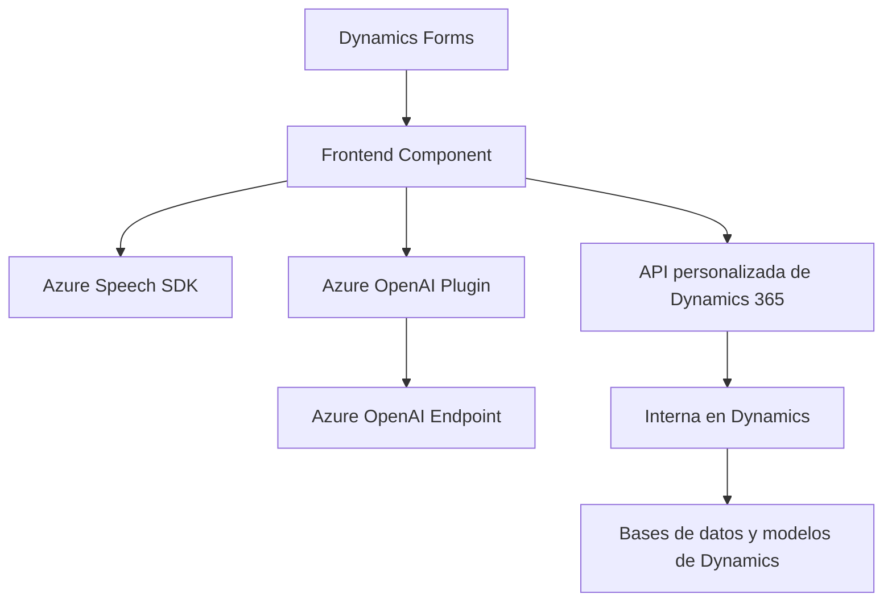

### Breve resumen técnico:

El repositorio está formado por tres componentes principales dentro de dos categorías:
1. **Frontend**: Archivos JavaScript que interactúan con formularios de Dynamics 365, aprovechando funcionalidades como síntesis y reconocimiento de voz mediante Azure Speech SDK.
2. **Backend/Plugin**: Código C# dentro de Dynamics CRM, que integra Microsoft Azure OpenAI para transformar texto mediante lógica basada en IA.

El enfoque principal de la solución es enriquecer los formularios y datos de Dynamics 365 con capacidades de reconocimiento de voz, síntesis de voz y procesamiento texto mediante IA, integrando servicios de Azure.

---

### Descripción de arquitectura:

La solución utiliza una **arquitectura de n capas**, dividiéndose en:
1. **Capa de presentación**: Archivos de JavaScript en el frontend, que interactúan directamente con los formularios de Dynamics 365.
2. **Capa de negocio**: Plugins personalizados en C# que gestionan la lógica de transformación de texto y llamadas a servicios externos mediante Azure OpenAI.
3. **Capa de integración**: Uso de SDKs externos como Azure Speech SDK y Azure OpenAI API para síntesis de voz, reconocimiento de voz y procesamiento de texto.

No es una arquitectura monolítica, ya que cada componente está modularizado y la integración con Azure potencia el desacoplamiento, especialmente en el consumo de servicios externos (SDKs y API).

---

### Tecnologías usadas:
- **Frontend (JavaScript)**:
  - Azure Speech SDK para síntesis y reconocimiento de voz.
  - Dynamics 365 WebAPI para interactuar con los formularios del sistema.
  - Event-driven callbacks para cargar dinámicamente SDKs y manejar estados.
  
- **Backend (C#)**:
  - Microsoft Dynamics SDK (`Microsoft.Xrm.Sdk`) para integrar lógica de plugins.
  - Azure OpenAI API para transformación de texto según reglas predefinidas.
  - Manipulación JSON (`System.Text.Json`, `Newtonsoft.Json.Linq`) para estructuración y manejo de datos en formato JSON.

- **Patrones**:
  - Single Responsibility Principle para modularización funcional.
  - Pipeline de procesamiento de datos en el plugin (`TransformTextWithAzureAI.cs`).
  - Integración API para comunicación con servicios externos.
  - Gestión dinámica de dependencias (`ensureSpeechSDKLoaded`).

---

### Diagrama **Mermaid**:

---

### Conclusión final:

La solución presentada en este repositorio claramente implementa un ecosistema modular para enriquecer las capacidades de formulación y procesamiento de datos en Dynamics 365. Su beneficio principal reside en la integración de reconocimiento y síntesis de voz mediante Azure Speech SDK, combinado con el procesamiento avanzado de texto con Azure OpenAI.

Al combinar n capas y servicios cloud (Azure), la arquitectura permite una escalabilidad adecuada y un nivel saludable de desacoplamiento. Esto facilita actualizaciones, pruebas unitarias y depuración sin afectar otros aspectos del sistema.