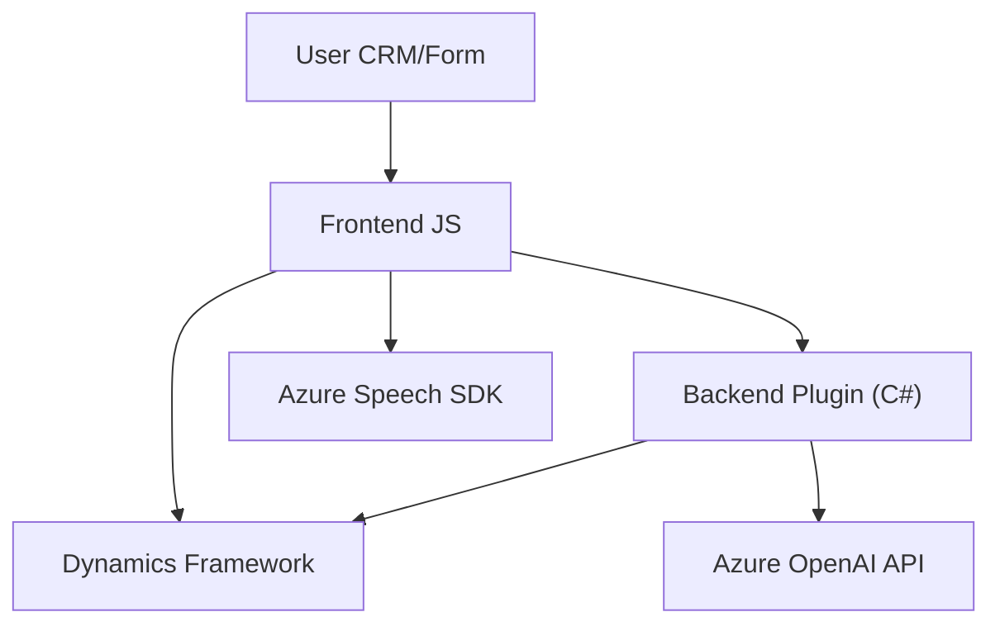

### Breve Resumen Técnico
El repositorio presenta múltiples archivos orientados a procesar datos y voz, integrando servicios como **Azure Speech SDK**, **Azure OpenAI**, y **Microsoft Dynamics CRM**.

- Los archivos `readForm.js` y `speechForm.js` son frontend scripts en JavaScript diseñados para interactuar con formularios de Dynamics CRM y realizar tareas relacionadas con voz (sintetizar o transformar voz en texto).
- `TransformTextWithAzureAI.cs` es un plugin backend escrito en C# que integra y comunica con Azure OpenAI para transformar texto basado en reglas.

### Descripción de Arquitectura
- **Tipo de solución**: La solución es un servicio híbrido que integra:
  1. **Frontend**: Scripts en JavaScript para interacción directa con formularios CRM y entrada/salida de voz.
  2. **Backend Plugin**: Extensión en el ecosistema de Microsoft Dynamics CRM que conecta al servicio Azure OpenAI para transformación específica de texto.

- **Arquitectura**: 
  1. **Multicapa**:
     - Presentación (Frontend) mediante scripts que interactúan con el usuario.
     - Capa medio/servicios mediante el plugin CRM (Backend que ejecuta lógica personalizada).
     - Integración con APIs externas como Azure Speech y Azure OpenAI, utilizando un enfoque **Service-Oriented Architecture (SOA)**.
  2. **Modularidad**: Cada componente (frontend/JS y backend/CS) cumple una función única y clara; se observan principios SOLID aplicados en el plugin.

### Tecnologías Usadas
1. **Frontend**:
   - **JavaScript**: Lenguaje base para los scripts.
   - **Azure Speech SDK**: Utilizado para sintetizar texto a voz y procesar voz a texto.
   - **Microsoft Dynamics CRM Framework**: Contextos y APIs para manipular formularios del CRM.
2. **Backend**:
   - **C#**: Lenguaje utilizado para el plugin.
   - **Microsoft Dynamics SDK (`IPlugin` y otros)**: Interacciones backend con Dynamics CRM.
   - **Azure OpenAI API**: Servicio para transformar texto con inteligencia artificial.
3. **Dependencias Externas**:
   - HTTP Client: En general para comunicación con APIs REST.
   - JSON Manipulation: `JsonDocument`/`JsonSerializer`.

### Diagrama Mermaid
El diagrama representa funcionalidad clave y dependencias entre componentes.

### Conclusión Final
Esta solución implementa una arquitectura orientada a servicios con enfoque modular, donde el frontend interactúa directamente con formularios y los usuarios, y el backend extiende las capacidades de Dynamics CRM mediante integración con APIs externas. La combinación de **Azure Speech** y **OpenAI** demuestra un moderno enfoque computacional basado en servicios de inteligencia artificial para mejora de la interacción entre humanos y sistemas digitales.