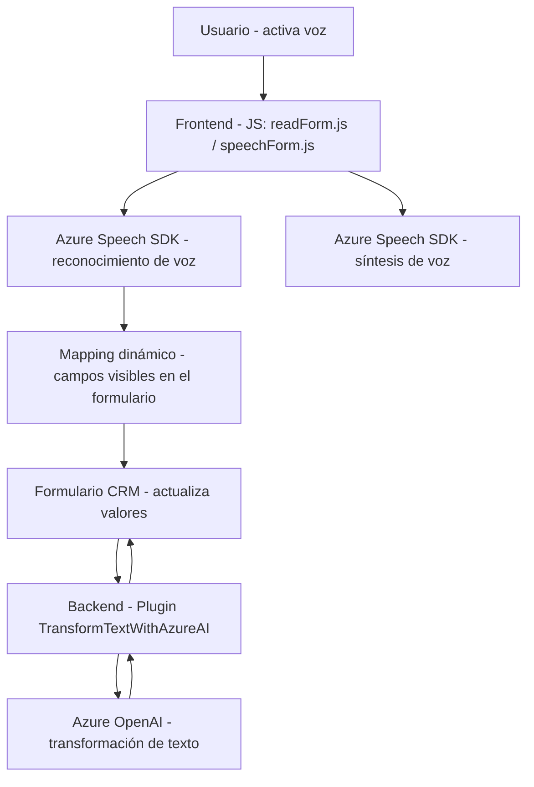

### Breve resumen técnico
El repositorio define una solución multi-capa que integra servicios externos (Azure Speech SDK y Azure OpenAI API) con las APIs de Microsoft Dynamics CRM. La funcionalidad principal gira en torno al procesamiento de formularios y entrada de voz, utilizando reconocimiento y síntesis de voz, mapas dinámicos de campos, y procesamiento de texto a través de IA para transformar datos.

---

### Descripción de arquitectura
#### Tipo de solución:
La solución es una **API extendida combinada con SDKs y servicios de inteligencia artificial**. El frontend (JavaScript) y los plugins (.NET) interactúan entre sí para proporcionar una experiencia de entrada por voz, procesamiento de texto, y actualización dinámica de formularios en Microsoft Dynamics CRM.

#### Arquitectura:
La arquitectura se puede clasificar como **multi-capa (n-capas)**, distribuyendo responsabilidades de la siguiente manera:
1. **Capa de presentación:** Implementada con archivos JS que proporcionan la interfaz para interacción por voz e integración con el formulario.
2. **Capa de lógica:** Centralizada en el código del plugin que aprovecha Microsoft Dynamics CRM y la API de Azure OpenAI para procesar entradas.
3. **Capa exterior:** Integración directa con servicios de terceros como Azure Speech SDK y Azure OpenAI API.

#### Patrones aplicados:
1. **Modularidad:** Cada funcionalidad es encapsulada en métodos específicos, facilitando el mantenimiento y la reutilización.
2. **Cargador dinámico:** Los SDKs para Azure Speech se cargan condicionalmente en tiempo de ejecución.
3. **Gestión de eventos:** Los datos se procesan en respuesta a eventos de usuario.
4. **Integración de servicios:** Llamadas directas a APIs externas (Speech SDK, OpenAI API) para procesamiento de datos específicos.

---

### Tecnologías usadas
1. **Frontend (JavaScript):**
   - Azure Speech SDK para síntesis y reconocimiento de voz.
   - API de Microsoft Dynamics CRM (`Xrm.WebApi.online`).
  
2. **Backend (C#):**
   - Microsoft Dynamics CRM SDK para plugins.
   - Azure OpenAI API para transformación de texto con modelos de inteligencia artificial.
   - Serialización con `System.Text.Json`.

3. **Dependencias externas:**
   - `SpeechSDK` para Azure Speech en frontend.
   - `System.Net.Http` y `Newtonsoft.Json.Linq` en backend.

---

### Diagrama Mermaid compatible con GitHub Markdown
Este diagrama representa la interacción entre las capas de la solución y los servicios externos.

---

### Conclusión final
La solución combina tecnologías modernas de reconocimiento de voz y procesamiento de texto con la integración en Microsoft Dynamics CRM. La arquitectura **n capas** permite modularidad, escalabilidad, e interacción directa con servicios externos. Sin embargo, se identifican mejoras necesarias, como manejo centralizado de configuraciones sensibles.