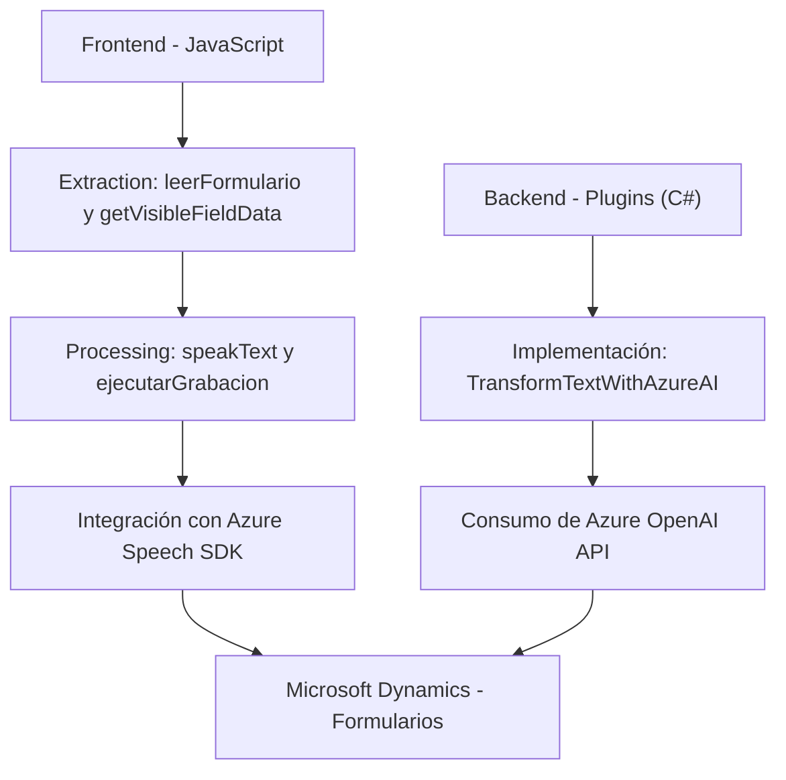

# Análisis de la solución

### Breve resumen técnico
La solución consiste esencialmente en un sistema basado en el trabajo sobre formularios dinámicos (muy probablemente relacionados con **Microsoft Dynamics CRM**) que integra procesamiento de datos mediante servicios de Azure, como **Azure Speech SDK** y **Azure OpenAI API**. Está conformado por varios componentes que desarrollan funcionalidades de reconocimiento de voz, síntesis de voz y transformación avanzada de texto mediante inteligencia artificial.

---

### Descripción de arquitectura
La solución presenta una arquitectura **modular de 3 capas**:
1. **Capa de presentación**: Implementada con archivos JavaScript en el directorio `FRONTEND/JS`, que manejan la extracción y mapeo de datos de formularios y las experiencias de usuario relacionadas con reconocimiento de voz.
2. **Capa de negocio/lógica**: Representada por las funciones de procesamiento implementadas en los archivos JavaScript y el plugin (`Plugins/TransformTextWithAzureAI.cs`) que utiliza la API de OpenAI para transformar mensajes.
3. **Capa de integración**: Dependencias externas, como **Azure Speech SDK**, **Azure OpenAI API** y las interfaces del SDK de Dynamics.

El diseño modular y la utilización de servicios externos sugieren principios orientados a **SOA (Arquitectura Orientada a Servicios)** y fuerte desacoplamiento de responsabilidades específicas.

---

### Tecnologías usadas
1. **Frontend**:
   - Lenguaje: **JavaScript**.
   - Framework externo: **Azure Speech SDK**.
   - Integración dinámica con formularios de Dynamics CRM usando el objeto `formContext` (propio del SDK de Dynamics).

2. **Backend/Plugins**:
   - Lenguaje: **C#**.
   - Framework: **Microsoft Dynamics CRM SDK**.
   - API externamente consumida: **Azure OpenAI API (GPT)**.
   - Biblioteca para JSON: **Newtonsoft.Json.Linq** / **System.Text.Json**.

3. **Patrones arquitectónicos**:
   - Principio de responsabilidad única (SRP).
   - Modularidad orientada a servicios.
   - Desacoplamiento (uso de dependencias externas).
   - Capas claras (3 capas: presentación, lógica y servicio).

---

### Diagrama Mermaid válido para GitHub

---

### Conclusión final
Este sistema es una solución híbrida centrada en la **integración del reconocimiento y generación de voz con procesamiento de datos de formularios en Microsoft Dynamics**. La arquitectura de 3 capas y el uso de servicios orientados a API garantizan modularidad y adaptabilidad, permitiendo que la solución sea escalable para diferentes aplicaciones dentro de una infraestructura basada en Dynamics CRM.

Los componentes clave que destacan son:
1. **Reconocimiento de voz inteligente** que interactúa con formularios dinámicos.
2. **Transformación avanzada de texto** mediante Azure OpenAI y sus normas personalizadas.

Por último, el enfoque hacia servicios externos, desacoplamiento y la modularidad del diseño hacen que esta solución sea un ejemplo claro de buenas prácticas en integración y escalabilidad.