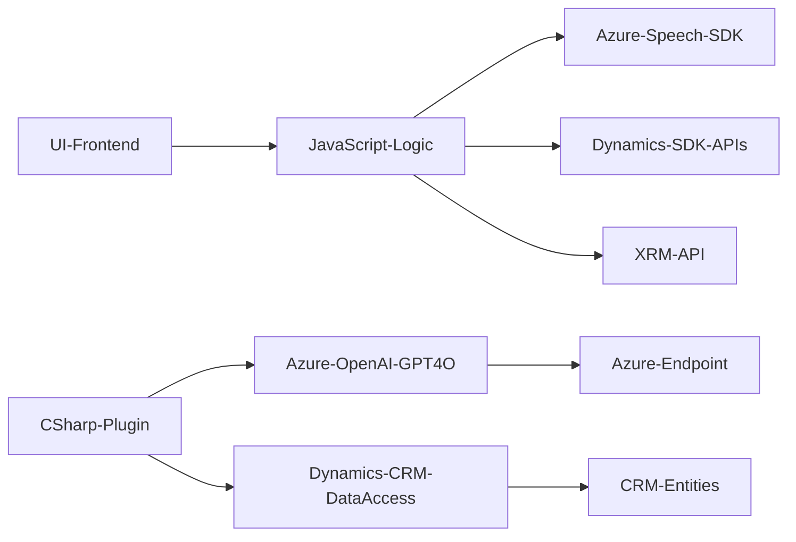

### Breve resumen técnico

El repositorio es una integración ligera entre tecnologías de reconocimiento de voz y síntesis de voz con sistemas CRM/Dynamics, además de un plugin que utiliza un servicio de Azure OpenAI para realizar transformaciones avanzadas en los datos de entrada. Combina múltiples capas de la tecnología de Microsoft, como Azure Speech SDK y Dynamics CRM APIs, para extender funcionalidad relacionada con formularios y textos procesados con IA. 

### Descripción de arquitectura

La solución adopta una **arquitectura de capas** con responsabilidades distribuidas en tres principales capas:
1. **Capa de presentación (Frontend/JavaScript)**: Gestiona la interacción con el usuario, el reconocimiento de voz y la síntesis de voz (integración con el Azure Speech SDK). Las funciones están orientadas hacia la captura, procesamiento y asignación de datos en formularios CRM visibles en el cliente.
2. **Capa lógica de negocio (Plugins en C#)**: Encargada de la integración con Azure OpenAI GPT-4O para el procesamiento avanzado de textos y generación dinámica de objetos JSON.
3. **Capa de acceso a datos (Microsoft Dynamics APIs)**: Realiza consultas y actualizaciones en las entidades de Microsoft Dynamics CRM utilizando APIs nativas.

### Tecnologías usadas
1. **Mediante Frontend (JavaScript)**
   - **Azure Speech SDK**: Para reconocimiento y síntesis de voz (URL: https://aka.ms/csspeech/jsbrowserpackageraw).
   - Datos procesados con APIs de Dynamics CRM para leer/escribir campos en el formulario.
   - Promesas y asíncronía: función fundamental para integrar SDKs y APIs como los de Azure Speech y Dynamics.

2. **Mediante Backend (C# Plugin)**
   - **Microsoft Dynamics SDK**: Para desarrollar plugins con integración nativa en Dynamics.
   - **Azure OpenAI GPT-4O API**:
     - Endpoint: https://openai-netcore.openai.azure.com/
     - Permite procesamiento avanzado de texto con reglas predefinidas en formato JSON y normas específicas.
   - Frameworks auxiliares:
     - `System.Text.Json` y `Newtonsoft.Json.Linq` para operaciones estructuradas con JSON.
     - `HttpClient` para enviar y recibir solicitudes HTTP.
   
3. **Patrones de diseño**
   - **Adapter**: Integración de servicios como Azure Speech SDK dentro de la lógica de negocios y presentación en el frontend.
   - **Carga dinámica de dependencias**: Uso de mecanismos para cargar recursos externos solo cuando son necesarios (p.ej., Azure Speech SDK).
   - **N Capas**: Separación clara de responsabilidades entre frontend, lógica de negocio (C# plugins), y consumo de datos en las APIs de Dynamics CRM.

### Dependencias o componentes externos
Al utilizar tecnologías de Microsoft, estas dependencias externas son fundamentales:
1. **Azure Speech SDK**: Para síntesis y reconocimiento de voz.
2. **Azure OpenAI (GPT-4O)**: Para transformación de texto inteligente y generación de JSON estructurado.
3. **Microsoft Dynamics SDK**: Facilita la interacción con entidades del modelo de datos de CRM a través de plugins y APIs.
4. **JavaScript y librerías auxiliares**:
   - Promesas de JavaScript para controlar la ejecución de procesos asíncronos.
5. **C# Frameworks para Dynamics y HTTP**:
   - `Newtonsoft.Json.Linq` y `System.Text.Json` para procesar datos JSON.
   - `System.Net.Http` para realizar solicitudes hacia servicios remotos.

---

### Diagrama Mermaid válido para GitHub

### Conclusión final

La solución descrita combina tecnologías modernas de Microsoft junto con servicios avanzados de Azure para la síntesis, reconocimiento de voz, y procesamiento de datos con IA. La arquitectura de **N Capas** hace que las responsabilidades estén bien separadas, maximizando la modularidad y escalabilidad. El diseño es basado en integraciones horizontales que unen componentes externos (Azure Speech SDK y Azure OpenAI) con sistemas internos como Dynamics CRM. Esto permite extender las capacidades de CRM relacionadas con la experiencia del usuario (voz) y el procesamiento inteligente de datos, manteniendo una estructura robusta y ampliamente adaptable a otras necesidades.