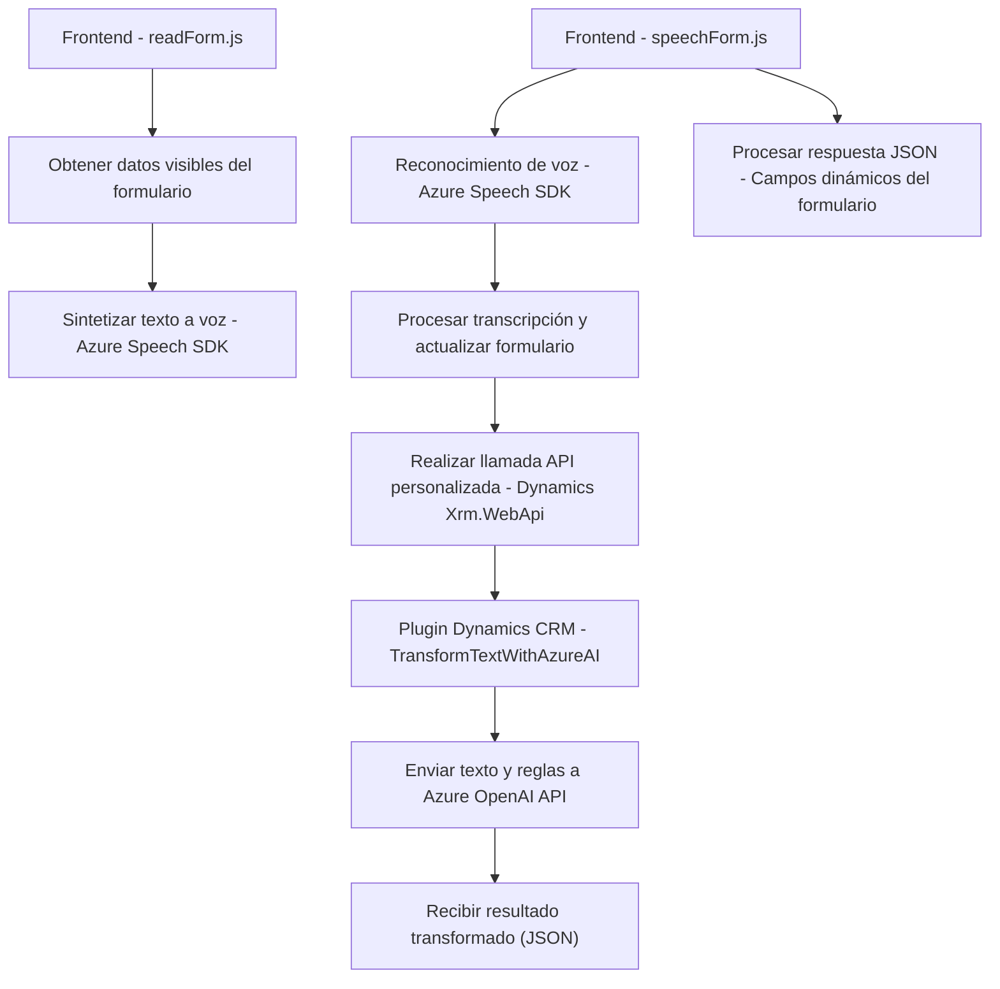

### Breve resumen técnico

El repositorio muestra una solución que integra funcionalidades de síntesis de voz, reconocimiento de voz y transformación de texto utilizando tecnologías asociadas a Microsoft Dynamics CRM y Azure Cognitive Services. Está dividido en tres componentes principales: frontend en JavaScript para gestión de voz, formulación de datos y procesamiento en Dynamics 365, y un plugin en C# para interacción con servicios de Azure OpenAI.

---

### Descripción de arquitectura

La solución sigue una arquitectura de **microservicios desacoplados** pero organizados en capas funcionales. Cada script y módulo cumple roles específicos dentro de un sistema mayor, conectando varias tecnologías (Dynamics CRM, Azure Services) para habilitar funcionalidades avanzadas relacionadas con voz y texto en los formularios.

Principales características arquitectónicas:
1. **Frontend en capas:** Existe una clara separación entre la interfase de usuario, lógica de negocio y las funciones dedicadas al consumo de servicios externos. 
2. **Integración dinámica de SDKs externos:** La carga dinámica del Azure Speech SDK refleja la gestión eficiente de dependencias.
3. **Interoperabilidad vía API:** El sistema incluye un plugin en C# que actúa como un microservicio conectado a Dynamics CRM y al servicio Azure OpenAI para el procesamiento de texto.
4. **Uso extensivo de asincronía:** Api en JavaScript y C# hacen uso de métodos asíncronos/promesas para manejar datos dinámicos en tiempo real.

---

### Tecnologías usadas

#### Frontend:
- **JavaScript:** Scripts integrados en el frontend con lógica bien organizada.
- **Azure Speech SDK:** Para reconocimiento de voz y síntesis de texto a voz.
- **APIs de navegador:** Utilización de `document` y objetos nativos para manipulación de DOM y datos.
- **Dynamics 365 Framework:** Interacción con formularios de Dynamics mediante `Xrm` API.

#### Backend:
- **C#:** Archivo `TransformTextWithAzureAI.cs`
- **Azure OpenAI API:** Para transformación de texto con un modelo GPT de Azure.
- **Dynamics CRM plugin framework:** Implementación de la interfaz `IPlugin` para integrar lógica personalizada con Dynamics CRM.

---

### Dependencias o componentes externos

1. **Azure Cognitive Services**:
   - Speech SDK para reconocimiento y síntesis de voz.
   - Azure OpenAI para transformación avanzada de texto.
2. **Framework Dynamics 365**:
   - Lógica de interacción con formularios y entidades CRM.
   - Utilización de Xrm.WebApi para llamadas y manipulación de datos.
3. **Librerías C#**:
   - `Newtonsoft.Json.Linq` para manipulación de JSON.
   - `System.Net.Http` para interacción HTTP con servicios de Azure.

---

### Diagrama Mermaid

---

### Conclusión final

El repositorio implementa una solución avanzada para gestión de formularios en Dynamics CRM mediante tecnologías modernas como Azure Cognitive Services y OpenAI. Se adopta una **arquitectura de microservicios**, donde el frontend (JavaScript) realiza la captura y procesamiento de voz, y un backend en C# se encarga de la interconexión del sistema CRM con modelos avanzados de IA. 

La infraestructura se caracteriza por su modularidad, reutilización, y uso estratégico de SDKs externos, ofreciendo una solución eficiente y adaptable a diferentes necesidades basadas en el reconocimiento y síntesis de voz, así como transformación de texto con IA.