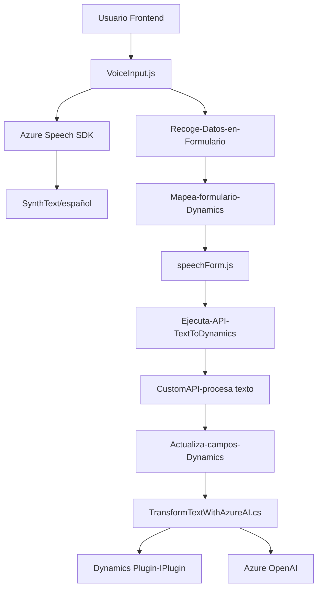

### Breve Resumen Técnico
El repositorio contiene dos archivos de JavaScript (en la carpeta **FRONTEND/JS**) y un archivo de .NET C# (en la carpeta **Plugins**). Análisis sugiere que la solución combina habilidades de **procesamiento de lenguaje natural y reconocimiento de voz** mediante el SDK de **Azure Speech**, integrándose tanto en un frontend dinámico como en la plataforma CRM de Dynamics 365. También utiliza **Azure OpenAI** como un servicio backend para transformar datos a través de un plugin.

---

### Descripción de Arquitectura
La arquitectura es de tipo **n-capas** que combina el siguiente enfoque:
1. **Frontend**: Funcionalidades que interactúan directamente con el usuario (ej., entrada de voz, síntesis de texto, y mapeo dinámico de campos).
2. **Backend y Plugins**: Usa servicios de Azure para procesar voz y datos mediante **APIs externas** y el plugin de Dynamics, que actúan como intermediarios entre el cliente y las transformaciones en OpenAI.

El diseño modular y las integraciones con **Azure** evidencian un **cliente-servidor orientado a servicios**, con elementos **callback-driven** en el frontend y **SOA (Service-Oriented Architecture)** en el backend.

---

### Tecnologías Usadas
1. **Azure Cognitive Services**:
   - Azure Speech SDK (Frontend): Para reconocimiento y síntesis de voz.
   - Azure OpenAI API (Backend): Para transformar texto mediante aprendizaje profundo.

2. **Frontend**:
   - Dinámico basado en JavaScript.
   - Integración con formularios de **Dynamics 365**.

3. **Backend**:
   - C# Plugin en **Dynamics 365 CRM** que utiliza `IPlugin` para extender eventos.
   - APIs para interactuar con servicios de Azure y Dynamics (`Microsoft.Xrm.Sdk`, `System.Net.Http`).

4. **Gestión de datos**:
   - JSON para manejar respuestas de servicios en ambos contextos (frontend y backend).
   - Técnicas avanzadas de procesamiento dinámico de DOM.

---

### Diagrama **Mermaid**

---

### Conclusión Final
La solución combina un diseño **extensible y modular** que integra servicios avanzados para accesibilidad (voz-texto, texto-voz) en el frontend y lógica avanzada en el backend, utilizando plugins y APIs en Dynamics CRM. Su arquitectura logra desacoplar la lógica del frontend y backend mediante principios SOA, mientras interactúa con servicios de **Azure** y mantiene una estructura robusta para aplicaciones empresariales ampliables.