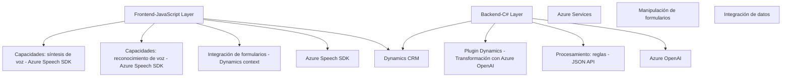

### Breve resumen técnico
El repositorio contiene múltiples archivos que implementan capacidades de accesibilidad y procesamiento inteligente utilizando servicios de **Azure**, en especial el **Azure Speech SDK** para síntesis y reconocimiento de voz y **Azure OpenAI** para transformación de texto.

---

### Descripción de arquitectura
La solución está compuesta de tres capas principales:
1. **Frontend (JavaScript)**:
   - Implementa funcionalidad de lectura de voz y procesamiento de entrada por voz para formularios dinámicos.
   - Se orienta a la experiencia del usuario y facilidad de uso en formularios empresariales.
2. **Backend (C#, Dynamics Plugin)**:
   - Implementa lógica de transformación avanzada al integrar texto con el servicio **Azure OpenAI**.
   - Ejecuta procesos dentro del ecosistema **Dynamics 365** mediante plugins.
3. **Integración con servicios externos (Azure)**:
   - Utiliza APIs y SDK para trabajar con herramientas avanzadas de procesamiento de voz y texto.  
   - Alta dependencia de servicios externos como `Azure Speech SDK` y `Azure OpenAI`.

Este patrón sigue una **arquitectura de n capas**, donde la lógica de negocio, presentación y acceso a servicios externos están claramente delimitadas. La integración con terceros (Azure) sugiere un enfoque de **servicios desacoplados**, pero no alcanza un nivel de microservicios.

---

### Tecnologías usadas
- **Frontend (JavaScript)**:
  - JavaScript ES6+.
  - **Azure Speech SDK**: Para síntesis y reconocimiento de voz.
  - Integración con **Dynamics CRM** (`executionContext`) para manipular formularios.
- **Backend (C#)**:
  - Microsoft Dynamics 365 SDK para desarrollo de plugins.
  - **Azure OpenAI** (GPT) para procesamiento de texto avanzado.
  - HTTP integrations (`System.Net.Http`) para la comunicación con APIs externas.
- **Dependencias generales**:
  - `Newtonsoft.Json` y otros paquetes de procesamiento JSON.
  - Servicios de codificación y manejo de texto.

---

### Diagrama Mermaid

---

### Conclusión final
Este repositorio implementa una solución **n capas** orientada a mejorar la accesibilidad y procesamiento de datos en formularios empresariales, con fuerte integración a los servicios de **Azure Speech SDK** y **Azure OpenAI**. La utilización de tecnologías modernas en el frontend y prácticas estándar para plugins en el backend garantiza una integración eficaz con **Microsoft Dynamics 365**. Además, su enfoque modular y desacoplado brinda flexibilidad, aunque no se clasifica como arquitectura de microservicios.