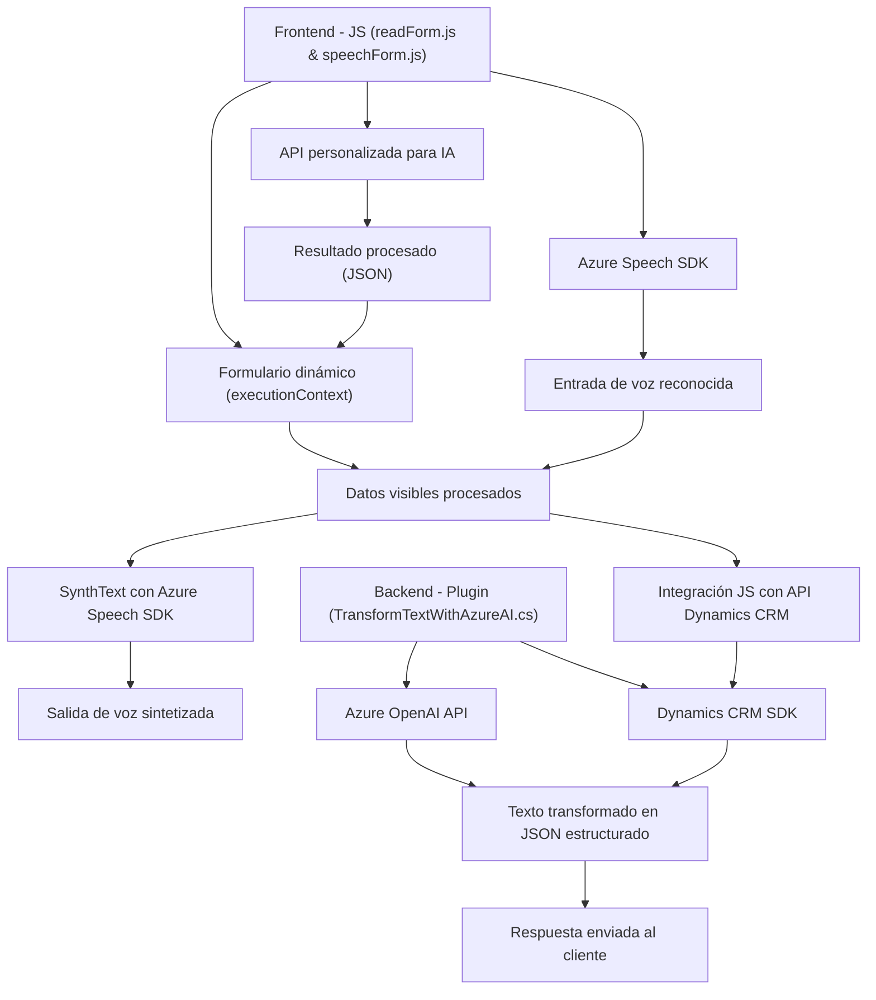

### Breve resumen técnico:

El repositorio contiene múltiples archivos con funcionalidades relacionadas con la integración de servicios de voz y procesamiento de texto mediante APIs avanzadas, como Azure Speech SDK y Azure OpenAI. Estas funcionalidades se aplican en contextos de formularios dinámicos y sistemas empresariales como Dynamics CRM. Es una solución que combina un frontend (para interacción con el usuario) y una lógica backend (plugins para Dynamics CRM).

---

### Descripción de arquitectura:

1. **Tipo de solución**: 
   - La solución es híbrida, conformada por un frontend desarrollado en JavaScript que interactúa con formularios e integra servicios externos como Azure Speech SDK, y un backend de plugins Dynamics CRM en C# que realiza procesamiento avanzado de datos utilizando Azure OpenAI.

2. **Arquitectura**: 
   - La solución emplea una **arquitectura cliente-servidor** con una separación entre frontend (interacción del usuario, servicios de voz y datos del formulario) y backend (procesamiento de datos integrados a Dynamics CRM con Azure OpenAI). 
   - Además, los plugins en C# implementan el patrón de **plugin** propio de Dynamics CRM. En el frontend se identifican patrones de modularidad y flujo basado en eventos (con callbacks y promesas).

3. **Tecnologías, frameworks y patrones usados**:
   - **Frontend**:
     - Lenguaje: JavaScript.
     - SDK: Azure Speech SDK.
     - Patrones: Modularidad, flujo basado en eventos (callbacks), y integración de APIs externas.
   - **Backend**:
     - Lenguaje: C#.
     - Frameworks: Microsoft Dynamics CRM SDK.
     - Dependencias: Azure OpenAI, System.Net.Http, System.Text.Json.
     - Patrones: Plugin pattern, API Gateway para comunicación con servicios externos, SRP (Single Responsibility Principle).
   - Servicios externos: Azure Speech SDK para síntesis y reconocimiento de voz, Azure OpenAI para procesamiento NLP.

4. **Dependencias externas**:
   - **Frontend**:
     - Azure Speech SDK: utilizado para síntesis y reconocimiento de voz en el navegador.
     - API personalizada (probablemente con AI): usada para procesar transcripciones en tiempo real.
   - **Backend**:
     - Azure OpenAI: endpoint que procesa texto y ejecuta transformaciones según reglas predefinidas.
     - Microsoft Dynamics CRM SDK: para manejar contexto de plugin y operar en la base de datos CRM.
     - Paquetes estándar C#: System.Net.Http, System.Text.Json.
   
---

### Diagrama Mermaid:

---

### Conclusión final:

Esta solución combina un frontend interactivo con servicios avanzados de voz y procesamiento de datos, integrando Azure Speech SDK y APIs basadas en inteligencia artificial (Azure OpenAI). Utiliza una arquitectura cliente-servidor con separación entre el procesado lógico en el backend (mediante plugins de Dynamics CRM) y la interfase de usuario en el frontend. Los archivos están bien estructurados en módulos que cumplen roles específicos. El diseño es eficaz para aplicaciones empresariales que funcionan sobre la plataforma Dynamics CRM con alto grado de interacción y automatización avanzada.