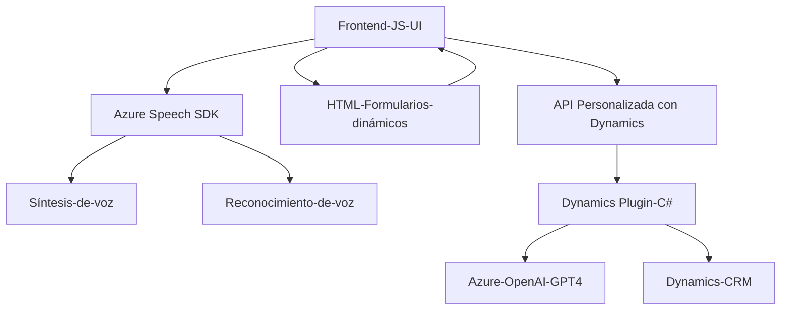

### Breve resumen técnico
El repositorio contiene tres componentes principales orientados al manejo de formularios dinámicos y a la integración con el Azure Speech SDK y Azure OpenAI. La solución está diseñada para entornos que combinan interacciones con la interfaz de usuario, reconocimiento de voz y generación/transcripción de texto, con un backend basado en plugins de Dynamics CRM.

---

### Descripción de la arquitectura

1. **Tipo de solución**: Es una solución híbrida que incluye un componente **frontend** (JavaScript) para la interacción con usuarios por voz en formularios, y un **backend** (C#) que funciona como un **plugin** en **Dynamics CRM**. También utiliza APIs externas de Azure (OpenAI y Speech).
2. **Arquitectura**: La solución combina elementos de:
   - **Arquitectura de n capas**: Claramente dividida entre capas:
     - **Capa de presentación** (escrita en JavaScript): Se encarga de la interacción con el usuario y la transformación de datos desde el formulario.
     - **Capa de lógica de negocio** (plugin en C#): Procesa los datos recibidos y delega la transformación al servicio Azure OpenAI.
   - **Arquitectura Plugin-Based**, dado que el backend está integrado como plugin en Dynamics CRM.
   - **Microservicio externo**, ya que opta por usar servicios de Azure como parte de la funcionalidad principal en el backend.
3. **Principales patrones de diseño**:
   - **Observer Pattern** (callbacks para la carga del Speech SDK).
   - **Gateway Pattern** para el consumo de servicios externos.
   - **Modular Design**, dividiendo la lógica en funciones y clases según su propósito.

---

### Tecnologías usadas
1. **Frontend**:
   - **JavaScript**.
   - SDK de **Azure Speech** (reconocimiento y síntesis de voz).
   - Manipulación del DOM para iterar sobre formularios dinámicos.
2. **Backend**:
   - **C#**: Para desarrollo del plugin en Dynamics CRM.
   - **Dynamics CRM Plugin Architecture**: Integra la lógica de negocio con Dynamics 365.
   - **Azure OpenAI API**: Para transformar texto en JSON estructurado usando GPT-4.
   - **Newtonsoft.Json** y **System.Text.Json**: Serialización/Deserialización JSON.
   - **System.Net.Http**: Gestión de consultas HTTP hacia Azure.
3. **Dependencias externas**:
   - **Azure Speech SDK** y **Azure OpenAI API**.
   - Dynamics CRM SDK (interacción con el sistema).

---

### Diagrama Mermaid

---

### Conclusión final
Este repositorio representa una solución avanzada que utiliza el poder del reconocimiento de voz en tiempo real y síntesis con Azure Speech SDK en el frontend, combinado con procesamiento de datos estructurados mediante IA en el backend con Azure OpenAI. La arquitectura se apoya en n capas, dividiendo la funcionalidad entre diferentes módulos con roles bien definidos. El plugin en C# actúa como un conector que interactúa con Dynamics CRM y la API de OpenAI para garantizar la generación y manipulación de datos estructurados, y el frontend facilita la interacción del usuario con formularios dinámicos de manera accesible. Las dependencias externas como Azure Speech y OpenAI habilitan características dinámicas que extienden las capacidades del sistema, haciéndolo ideal para aplicaciones corporativas y CRM.