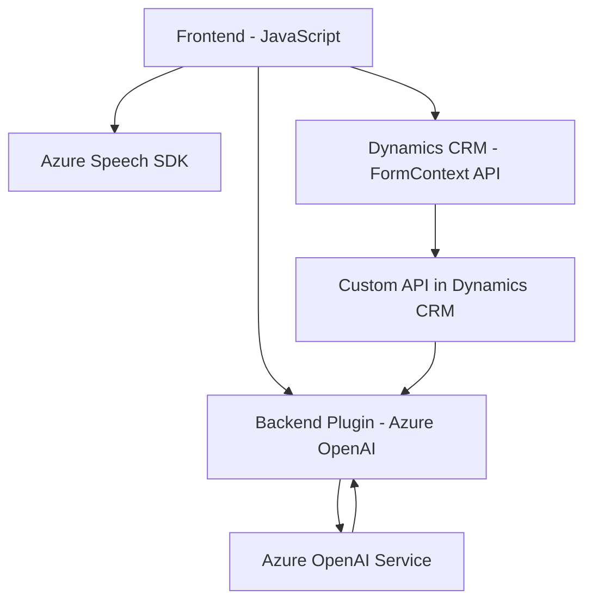

### Breve Resumen Técnico

El repositorio contiene múltiples componentes diseñados para la interacción entre sistemas de reconocimiento de voz (Azure Speech SDK), procesamiento avanzado de textos (Azure OpenAI) y la plataforma Microsoft Dynamics CRM. Se integran funcionalidades frontend en JavaScript, scripts para manejar formularios y plugins en C# que procesan textos y realizan transformaciones mediante APIs externas.

---

### Descripción de Arquitectura

#### Tipo de Solución
La solución es una mezcla de **frontend** y **backend**, y está altamente integrada a plataformas externas. Se incluyen las siguientes capas:
1. **Frontend (JavaScript)**: Procesa reconocimiento de voz y manipulación de datos de usuario desde formularios interactivos en Dynamics CRM, sintetizando texto en voz y enviando peticiones a APIs externas.
2. **Backend (Plugins en C#)**: Extiende la funcionalidad de Dynamics CRM al transformar y procesar datos utilizando el servicio Azure OpenAI.

#### Arquitectura
La solución cuenta con elementos de arquitectura **modular** y sigue algunos principios de **arquitectura de microservicios** porque se apoya en APIs externas como la de Azure Speech SDK y Azure OpenAI para realizar tareas especializadas. Sin embargo, no está completamente desacoplada, dado que los elementos están ligados al entorno de Dynamics CRM y no presentan una separación estricta entre servicios.

Principales características arquitectónicas:
- **Modularización funcional**: Los componentes de frontend separan las responsabilidades (extractor de campos visibles, síntesis de voz, reconocimiento de voz, etc.), junto con los métodos del plugin que aislan la transformación de texto.
- **Integración de servicios externos**: Las funcionalidades críticas dependen de Azure Speech SDK y Azure OpenAI, adoptando esquemas de comunicación con APIs externas desde múltiples puntos en el código.
- **Interfaz dinámica entre capas**: El frontend actúa como interfaz de entrada para usuarios, mientras que el backend procesa los datos mediante plugins y APIs.

---

### Tecnologías Usadas

1. **Frontend:**
   - Lenguaje: JavaScript.
   - Frameworks y Libs:
     - Azure Speech SDK: Reconocimiento y síntesis de voz.
     - Xrm.WebApi: API nativa de Dynamics CRM para manejar formularios y atributos.
   - Patrones:
     - Modularización.
     - Callback Pattern.
     - Asynchronous Programming (`async/await`).

2. **Backend:**
   - Lenguaje: C#.
   - Frameworks y Libs:
     - Microsoft Dynamics CRM SDK: Soporte para la interfaz de plugins.
     - Azure OpenAI Service API: Interacción con sistemas de IA para la transformación de textos.
     - Newtonsoft.Json: Serialización JSON.
     - System.Text.Json: Manejo de estructuras JSON.
     - System.Net.Http: Realización de llamadas API.
   - Patrones:
     - Command Plugin (Dynamics CRM).
     - Integración de APIs externas.

---

### Dependencias o Componentes Externos

1. **Azure Speech SDK**:
   - Reconocimientos y síntesis de voz en tiempo real.
   - Cargado dinámicamente desde `https://aka.ms/csspeech/jsbrowserpackageraw`.

2. **Azure OpenAI**:
   - Procesamiento de datos mediante modelos de texto generativo.
   - Utilizado en el backend para realizar transformaciones textuales avanzadas.

3. **Dynamics CRM SDK**:
   - Manipulación de formularios y datos en un entorno CRM.

---

### Diagrama Mermaid

El siguiente diagrama explica la interacción entre los componentes principales:

---

### Conclusión Final

Esta solución combina módulos frontend y backend para interactuar con herramientas avanzadas como Azure Speech y OpenAI, junto con Dynamics CRM. Aunque existe una integración funcional entre los dos lados, la arquitectura está parcialmente desacoplada y se depende de servicios externos para ejecutar las tareas críticas. En términos generales, es una solución orientada a la interacción dinámica entre el usuario y sistemas de procesamiento de datos complejos a través de múltiples capas. Esto la hace adecuada para escenarios empresariales que demanden procesamiento de voz y texto combinados con plataformas CRM.