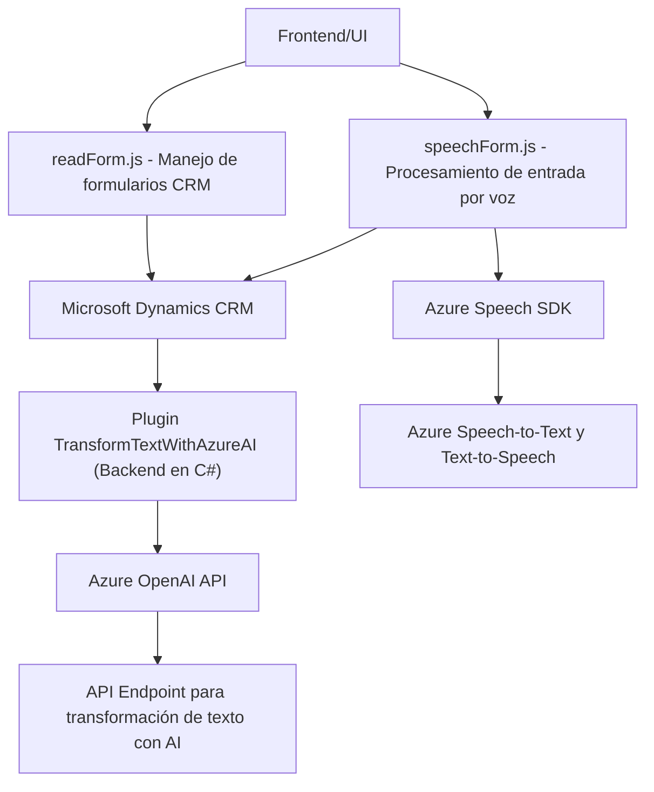

### Breve Resumen Técnico
El repositorio parece estar diseñado para proporcionar funcionalidades que integran procesamiento de voz utilizando el **Azure Speech SDK** y dinámica de formularios de **Microsoft Dynamics CRM**. Hay una combinación de frontend basado en JavaScript, lógica de integración y un backend proporcionado por un plugin desarrollado en C#. El sistema sirve para convertir datos de texto en audio, interpretar instrucciones a partir de voz, y transformar datos de texto usando servicios de **Azure OpenAI**.

---

### Descripción de la Arquitectura

La solución implementada se divide en tres módulos clave:
1. **Frontend (readForm.js & speechForm.js)**: Procesa la UI del CRM y utiliza el Azure Speech SDK para realizar envío y recepción de datos a través de entrada de voz, así como para leer formularios existentes. La arquitectura sigue un modelo modular basado en funciones independientes.
   
2. **Backend de Dynamics CRM**: Implementa la lógica personalizada mediante un Plugin que envía solicitudes a un endpoint externo de Azure OpenAI para transformar datos y devolver resultados estructurados en formato JSON.

3. **Servicios Externos (Azure)**:
   - **Azure Speech SDK**: Se utiliza para el procesamiento de entrada por voz y síntesis de texto a voz.
   - **Azure OpenAI API**: Se utiliza para la interpretación y trasformación de textos según reglas específicas.

La arquitectura puede clasificarse dentro del modelo **monolítico distribuido**:
- Parte frontend y backend trabajan estrechamente integrados con Microsoft Dynamics CRM. Aunque el plugin actúa como un backend modular, está acoplado al contexto de Dynamics CRM.
- La integración de los servicios externos confirma un enfoque de **arquitectura centrada en servicios**.

### Tecnologías Usadas
1. **Frontend**:
    - **Plain JavaScript**: Manejo de interactividad en CRM.
    - **Azure Speech SDK**: Para convertir datos de texto a voz y viceversa.
    - **CRM Xrm Web API**: Para interacción con formularios, datos y extensiones de Dynamics CRM.

2. **Backend**:
    - **C#, .NET Framework**: Desarrollo del plugin de Dynamics CRM.
    - **System.Net.Http**: Para enviar solicitudes HTTP al servicio de Azure OpenAI.
    - **System.Text.Json / Newtonsoft.Json**: Procesamiento de JSON en el backend.
    - **Microsoft Dynamics SDK**: Manejo de eventos y contexto en el sistema CRM.

3. **Servicios Externos**:
    - **Azure Speech SDK**: Procesamiento de voz (speech-to-text y text-to-speech).
    - **Azure OpenAI API**: Interpretación y transformación de texto.

### Dependencias o Componentes Externos
1. **Microsoft Dynamics CRM**:
   - Gestión de formularios.
   - Exposición de datos y servicios para interacción con Xrm Web API.
2. **Azure Speech SDK**: Para síntesis de voz y reconocimiento.
3. **Azure OpenAI API**: Para interpretación AI de texto.
4. **Librerías estándar .NET**:
   - **System.Net.Http**: Comunicación HTTP.
   - **System.Text.Json / Newtonsoft.Json.Linq**: Manejo de JSON para interactuar con Azure API.
   - **System.Linq** y **System.Text.RegularExpressions**: Utilidades de manipulación de texto.
5. **JS Runtime integrado**: Operación en el entorno de ejecución del navegador CRM.
6. **Infraestructura de Azure**: Hosting y procesamiento de API de OpenAI.

---

### Diagrama Mermaid válido para GitHub

---

### Conclusión Final
La solución es un ejemplo de integración de servicios externos con herramientas del ecosistema **Microsoft Dynamics CRM**. Su arquitectura utiliza módulos y funciones bien estructuradas, favorece el enfoque de **servicios distribuidos**, y aprovecha la capacidad de **Azure Speech SDK** y **Azure OpenAI API** como dependencias externas. Aunque se clasifica como una arquitectura **monolítica**, está diseñada para ser ampliable mediante plugins y llamadas dinámicas a APIs externas, facilitando su evolución hacia una solución más descentralizada.