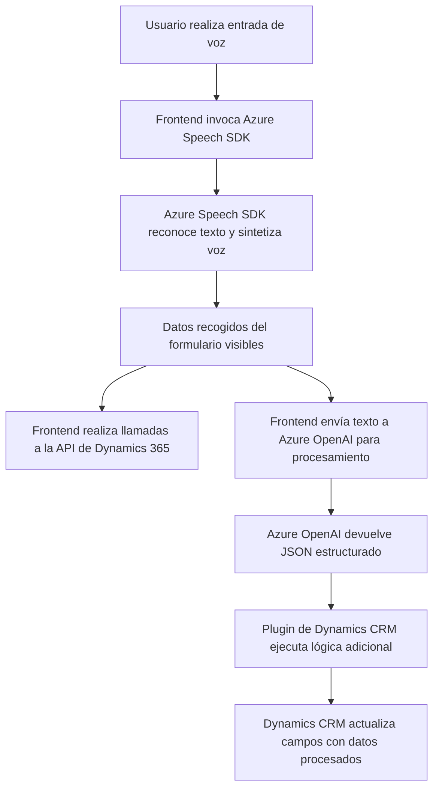

## Análisis técnico de la solución

### Breve resumen técnico:
El repositorio es parte de una solución que integra un sistema de entrada y procesamiento de datos basado en reconocimiento y síntesis de voz utilizando **Azure Speech SDK** y **Azure OpenAI API**. La solución incluye:
- **FRONTEND:** JavaScript para procesar datos del usuario mediante voz e invocar APIs.
- **Plugins:** Código backend en C# para procesamiento de texto con Azure OpenAI, integrado con el ecosistema de Dynamics CRM.

### Descripción de arquitectura:
La arquitectura utilizada parece estar enfocada a **n-capas**:
1. **Presentación (frontend):** Código en JavaScript que maneja entrada de voz y actualiza formularios de usuario.
2. **Lógica de negocio (plugins):** Procesamiento de texto con Azure OpenAI.
3. **Acceso a datos (Dynamics 365 Web API):** Mapeo y actualización de datos en el sistema CRM.

También incorpora elementos de **event-driven architecture** por el uso de callbacks en el frontend para controlar flujos relacionados con reconocimiento y síntesis de voz. Por último, la solución utiliza **servicios externos (Azure)** como parte de su operación.

### Tecnologías usadas:
- **Frontend:**
  - Lenguaje: JavaScript.
  - Servicio externo: Azure Speech SDK.
  - Tecnologías complementarias: Dynamics CRM Web API.
  
- **Backend:**
  - Lenguaje: C#.
  - SDKs: Microsoft.Xrm.SDK, Newtonsoft.Json para manipulación de JSON, y `System.Net.Http` para hacer peticiones HTTP.
  - Servicio externo: Azure OpenAI API.

### Dependencias y componentes externos:
1. **Azure Speech SDK:**
   - Reconocimiento y síntesis de voz.
   - Claves y región de acceso colocadas de forma estática en los scripts.
   
2. **Azure OpenAI API:**
   - Transformación de texto aplicando reglas (normas) definidas.
   
3. **Dynamics CRM Web API:**
   - Para interactuar con formularios (e.g., lectura y modificación de campos de datos).
   
4. **Bibliotecas del backend:**
   - `System.Text.Json` y `Newtonsoft.Json.Linq` para serialización y manipulación JSON.
   - `System.Net.Http` para integración con APIs externas de Azure.

### Diagrama Mermaid válido para GitHub:

### Conclusión final:
Este repositorio implementa una solución orientada a la entrada de datos mediante voz, que interactúa con formularios, transforma texto usando inteligencia artificial de Azure OpenAI y vincula los resultados a una plataforma de gestión empresarial (Dynamics CRM). Es una arquitectura de **n-capas** apoyada en servicios de nube que facilita modularidad, escalabilidad y flexibilidad. Sin embargo, los puntos donde las configuraciones (como claves de Azure y región) están estáticamente escritas en el código representan un área de mejora en términos de seguridad y manejo dinámico de la configuración.