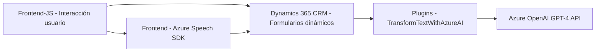

### Breve resumen técnico

El repositorio describe una solución que integra **procesamiento de voz**, **sistemas de formularios dinámicos** y **IA** en entornos empresariales utilizando **Microsoft Dynamics 365**. Los archivos analizados incluyen funcionalidades para:
- Procesar datos de formularios mediante síntesis de voz (frontend/JavaScript).
- Generar transcripciones y manipular datos utilizando APIs externas.
- Transformar texto desde una entrada de voz utilizando el **Azure OpenAI GPT-4 API**.

Esta solución está basada en una arquitectura distribuida que conecta un frontend (JavaScript) con Microsoft Dynamics 365 y varias APIs externas, incluyendo el **Azure Speech SDK** y el **Azure OpenAI GPT-4 API**.

---

### Descripción de arquitectura

La arquitectura sigue un diseño **cliente-servidor**, donde los archivos de frontend (`readForm.js`, `speechForm.js`) actúan como clientes que desarrollan la capa de interacción con los usuarios y servicios externos, combinándose con un **plugin basado en Dynamics CRM** (`TransformTextWithAzureAI.cs`) que extiende las capacidades del backend mediante la integración con APIs externas.

El diseño también refleja aspectos de una **arquitectura hexagonal** debido al alto grado de desacoplamiento entre los elementos internos del sistema y los servicios externos. Los servicios de Azure (Speech SDK y OpenAI) están claramente encapsulados en componentes modulares que se comunican mediante patrones API RESTful.

---

### Tecnologías usadas

**Frontend (JavaScript)**:
1. **Azure Speech SDK**:
   - Sintetización y reconocimiento de voz.
2. **Microsoft Dynamics 365 SDK**:
   - Manejo de atributos y datos en formularios dinámicos.

**Backend (C# Plugin)**:
1. **Microsoft Dynamics CRM SDK**:
   - Extensión del backend con lógica empresarial específica.
2. **Azure OpenAI GPT-4 API**:
   - Procesamiento y transformación de texto basado en IA.
3. **NET Core Framework**:
   - Manejo de peticiones HTTP y procesamiento de JSON usando `System.Text.Json` y `Newtonsoft.Json`.

**Patrones utilizados**:
- **Separación de responsabilidades**: Módulos para diferentes flujos de voz y datos.
- **Modularidad**: Funciones específicas para lógica de entrada, salida y transformación.
- **Desacoplamiento**: Uso de APIs externas y plugins para extender funcionalidad sin alterar el core de Dynamics 365.
- **Repository pattern**: Interacción controlada con entidades de datos mediante funciones API en el backend.

---

### Diagrama Mermaid válido para GitHub

---

### Conclusión final

El repositorio representa una solución empresarial avanzada orientada a accesibilidad e interacción por voz, implementada en un entorno **Microsoft Dynamics 365**. La solución se apoya en APIs externas (Azure Speech SDK, OpenAI GPT-4) y utiliza arquitectura modular con componentes distribuidos que integran servicios de voz, IA y manipulación dinámica de formularios. Esto la convierte en una solución robusta y extensible para aplicaciones empresariales avanzadas.

Sin embargo, queda pendiente mejorar ciertos aspectos como la **gestión de seguridad de credenciales** y el manejo exhaustivo de errores en las implementaciones. La arquitectura empleada demuestra compatibilidad con patrones modernos como **hexagonal** y modularidad en servicios distribuidos.