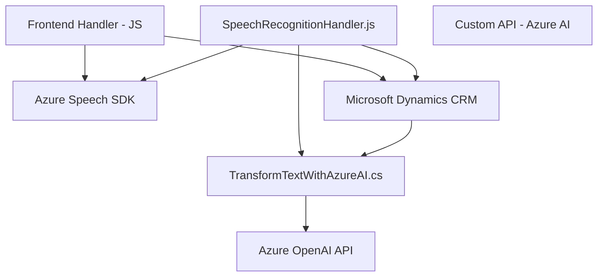

### Resumen técnico

El repositorio contiene componentes de un sistema enfocado en la interacción con formularios a través de reconocimiento de voz, síntesis de texto a voz y transformación de texto utilizando inteligencia artificial. Se integra principalmente con servicios de Azure como **Azure Speech SDK** y **Azure OpenAI** para funcionalidades avanzadas como reconocimiento de voz, síntesis de voz y procesamiento de texto.

---

### Descripción de arquitectura

- **Tipo de solución:** La solución es híbrida, compuesta por:
  - Una herramienta de frontend en **JavaScript** que se ejecuta en el navegador y conecta con APIs externas (microservicios).
  - Un plugin para **Dynamics CRM**, que sirve como middleware, ejecutando lógica de negocio en eventos del sistema CRM.
- **Arquitectura:** Microservicios:
  - Componentes desacoplados que interactúan con servicios externos (Azure Speech SDK y OpenAI).
  - La lógica del plugin actúa de forma modular interpretando entrada y salida de datos CRM.
  - Capas funcionales identificadas (frontend, procesamiento en el plugin y APIs externas), pero no se trata de arquitectura de N capas estricta.

---

### Tecnologías y patrones usados

- **Tecnologías:**
  - **Front-end:**
    - **JavaScript** para lectura de formularios y síntesis de voz.
    - Azure Speech SDK como principal dependencia para reconocimiento y síntesis de voz.
    - API personalizada integrada para lógica avanzada de procesamiento (Azure AI).
  - **Plugin de backend:**
    - **C# (.NET)** para transformar texto a JSON usando integraciones con Azure OpenAI.
    - Integración directa con **Dynamics CRM**.

- **Patrones:**
  - **Data Mapper:** En el procesamiento de transcripciones y mapeo a campos del formulario en Dynamics CRM.
  - **Event-driven architecture:** Callbacks y asincronismo para procesamiento de voz y formularios, especialmente en el frontend.
  - **Microservicio externo desacoplado:** Integrando APIs como Azure Speech y OpenAI.
  - **Modularidad:** Cada flujo funcional está desacoplado y enfocado en tareas específicas (lectura, síntesis, transformación).

---

### Dependencias o componentes externos

1. **Azure Speech SDK:** Utilizado para sintetizar texto a voz y realizar reconocimiento de voz.
2. **Azure OpenAI API:** Para transformar texto en JSON con reglas específicas mediante modelos GPT.
3. **Microsoft Dynamics CRM API:** Para manipular formularios y realizar interacciones con datos CRM.
4. **System.Net.Http** y **Newtonsoft.Json:** Librerías para manejar solicitudes HTTP y objetos JSON.
5. **JavaScript SDK**: Cargado dinámicamente para optimizar el rendimiento en el frontend.

---

### Diagrama en **Mermaid**

---

### Conclusión final

Este repositorio implementa una solución orientada a la interacción por voz y procesamiento de texto a datos estructurados, siendo útil en escenarios de automatización dentro de un sistema CRM. La arquitectura híbrida utiliza componentes desacoplados y microservicios externos para garantizar modularidad, escalabilidad y fácil mantenimiento. La integración con herramientas avanzadas como **Azure Speech SDK** y **Azure OpenAI API**, junto con la lógica contenida en plugins de Dynamics CRM, asegura una experiencia fluida para el usuario final al trabajar con formularios y datos estructurados en un entorno CRM.