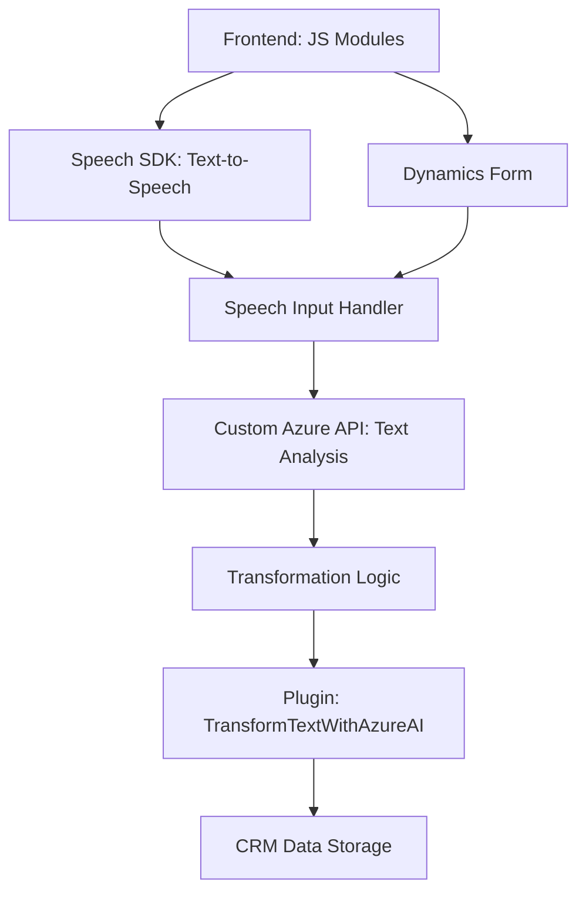

### Breve resumen técnico
El repositorio parece ser parte de una solución destinada a la captura, procesamiento y transformación de datos desde formularios interactivos en aplicaciones web y sistemas CRM. Combina reconocimiento de voz (Azure Speech SDK), inteligencia artificial (Azure OpenAI) y manipulación de datos en entornos Dynamics CRM.

---

### Descripción de arquitectura
La arquitectura corresponde a una combinación de enfoques estructurados:
1. **N-capas**: Se observa una separación entre capa de presentación (frontend con procesamiento de formularios y voz), capa de negocio (plugins y comunicación con APIs como Azure OpenAI), y capa de integración (comunicación con Azure Speech y Dynamics CRM).
2. **Hexagonal**: En el plugin `TransformTextWithAzureAI.cs`, se aplica un enfoque hexagonal al interactuar con servicios externos, encapsulando funcionalidades mediante adaptadores (Azure SDKs).
3. **Microservicios/API externas**: Uso de APIs externas (Azure OpenAI y Speech SDK) para delegar capacidades avanzadas de procesamiento.

---

### Tecnologías usadas
1. **Frontend:**
   - JavaScript.
   - Azure Speech SDK.
   - Microsoft Dynamics CRM SDK para interacción con formularios.
   - Manejo dinámico y modular.

2. **Backend:**
   - C# (implementación en Dynamics CRM mediante plugins).
   - Microsoft Azure OpenAI.

3. **Patrones detectados:**
   - **Observer**: Carga dinámica del SDK de Azure Speech.
   - **Modularidad**: Funciones específicas para cada tarea.
   - **Delegación a APIs externas**: Uso de servicios como Azure Speech y OpenAI para tareas complejas.
   - **ETL (Extract-Transform-Load)**: Procesamiento de datos entre formularios y APIs.

---

### Dependencias o componentes externos
1. **Azure Speech SDK**: Para text-to-speech y reconocimiento de voz.
2. **Azure OpenAI API**: Para transformación avanzada de texto.
3. **Microsoft Dynamics CRM SDK**: Servicios para manipular datos CRM.
4. **HTTP Client Libraries**: Para consumo de APIs.
5. **Text Handling Libraries**:
   - Newtonsoft.Json.
   - System.Text.Json.

---

### Diagrama Mermaid

---

### Conclusión final
Este repositorio representa una solución híbrida que distribuye funcionalidad entre frontend, APIs externas y plugins dentro de Microsoft Dynamics CRM. Las principales características incluyen reconocimiento y síntesis de voz con Azure Speech SDK, procesamiento de texto con AI (OpenAI), y manipulación de datos para formularios CRM. El enfoque modular y basado en servicios externos permite una integración escalable, aunque depende fuertemente de la disponibilidad de los servicios Azure. El diseño es adecuado para sistemas que necesitan adaptarse rápidamente a flujos de datos dinámicos.