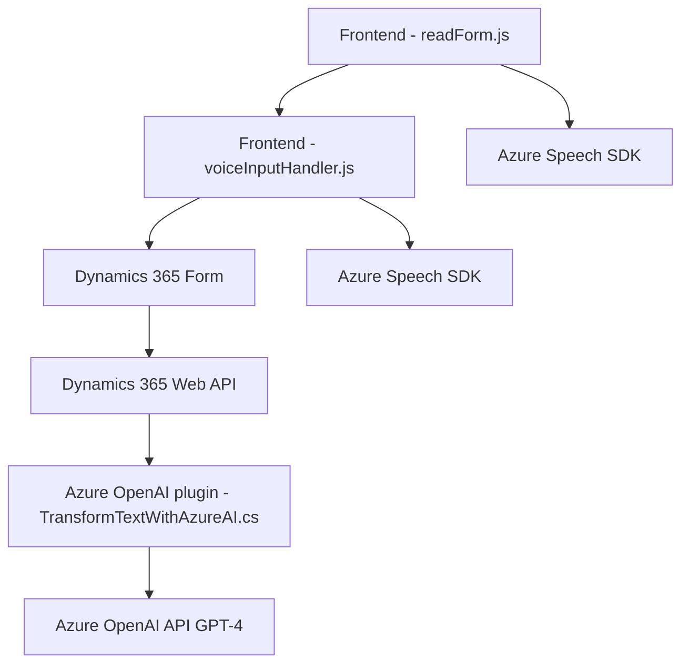

### Breve resumen técnico
El conjunto de archivos presentados sugiere que la solución implementada es una integración avanzada entre un sistema de reconocimiento de voz (Azure Speech SDK), Dynamics 365 como un sistema principal (front-end y CRM), y elementos de IA proporcionados por Azure OpenAI. Esto está diseñado para interactuar con formularios de Dynamics 365, procesar datos mediante entrada de voz, y estructurar información textual en base a reglas predefinidas.

---

### Descripción de arquitectura
La solución presentada es una arquitectura **orientada a servicios (SOA)**, donde diferentes módulos se integran para cumplir tareas específicas. Usa un modelo híbrido que mezcla características de una arquitectura de **n capas** y microservicios. 

- **N capas**: Los módulos del front-end (JavaScript) actúan como una capa externa integrándose dinámicamente con el SDK de Azure Speech y la API del CRM para manipular datos de los formularios. 
- **Microservicios y plugins**: La lógica de negocio se organiza en servicios específicos que interactúan con APIs externas (Azure OpenAI) y extensiones de Dynamics CRM (plugins como "TransformTextWithAzureAI.cs").

---

### Tecnologías usadas
1. **Azure Speech SDK**:
   - Reconocimiento y síntesis de voz.
   - Integración dinámica en el navegador.
2. **Dynamics 365 SDK**:
   - Manipulación de datos en formularios y lógica de negocio.
   - Plugins personalizados para extender capacidades del CRM.
3. **Azure OpenAI**:
   - Transformación de texto mediante inteligencia artificial, utilizando modelos GPT-4.
4. **Framework .NET (en plugins)**:
   - Implementación del plugin en Dynamics CRM con C#.
5. **JavaScript**:
   - Lógica del front-end para gestionar voz y datos en el navegador.
6. **APIs externas**:
   - Llamadas HTTP para interactuar con servicios de Azure OpenAI.

---

### Dependencias o componentes externos
1. **Azure Speech SDK**:
   - Requiere una suscripción activa a Azure, con una clave y región configuradas.
2. **Azure OpenAI API**:
   - Necesita un endpoint activo para realizar transformaciones de texto.
3. **Dynamics CRM Web API**:
   - Para efectuar operaciones en los formularios de Dynamics (lectura, escritura, consulta).
4. **Bibliotecas adicionales en el plugin**:
   - `Microsoft.Xrm.Sdk`
   - `Newtonsoft.Json`
   - `System.Net.Http`

---

### Diagrama Mermaid

---

### Conclusión final
La solución presentada es una implementación robusta que combina reconocimiento de voz, manipulación de datos en formularios, y procesamiento de texto mediante inteligencia artificial. Está enfocada en mejorar la usabilidad y eficiencia de formularios de Dynamics 365, manejando entradas complejas de voz y proporcionando respuestas estructuradas. Utiliza una arquitectura orientada a servicios dependiendo de APIs externas, y mezcla características de n-capas y microservicios, basada en interoperabilidad y extensibilidad.