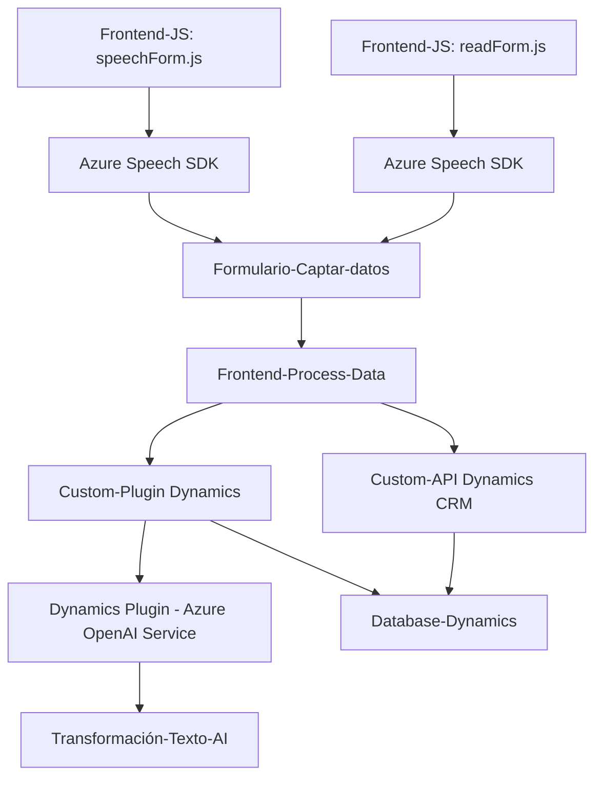

### Breve resumen técnico

Los archivos proporcionados pertenecen a una solución basada en la integración entre un frontend y un backend orientados a la captación y conversión de datos por comandos de voz o texto utilizando Azure Speech SDK y Azure OpenAI. En resumen:

1. **Frontend/JS**: Contiene dos scripts para convertir datos del formulario en voz o texto, procesarlos e interactuar con el modelo CRM/Dynamics.
2. **Plugins/TransformTextWithAzureAI.cs**: Implementa un plugin de Dynamics CRM para transformar contenido textual mediante Azure OpenAI y devolver respuestas estructuradas basadas en datos de negocio.

---

### **Descripción de arquitectura**

La arquitectura tiene las siguientes características:
1. **Frontend** (Javascript):
   - Modelo basado en la interacción de cliente con navegador para tomar voz, convertirla en texto y manipular formularios.
   - Uso modular de funciones separadas por responsabilidad.
   - Comunicación con APIs externas (Azure Speech y APIs personalizadas).
   - Complementado con llamadas asincrónicas para maximizar su eficiencia.

2. **Backend** (Microsoft Dynamics Plugins):
   - El plugin utiliza un patrón de arquitectura **n capas** dentro del ecosistema de **Dynamics CRM** para asociar recursos computacionales de Azure OpenAI con transcripciones y procesos del sistema.
   - Aplicación de un patrón de **plugin facade**: núcleo encapsulado que extiende la funcionalidad definida por Microsoft Dynamics.
   - Encadenamiento lógico entre frontend y lógica del plugin para asegurar que las interacciones entre sistemas (Azure, Dynamics y el cliente) sean coherentes y que los datos procesados cumplan con reglas de negocio.

---

### Tecnologías usadas

1. **Frontend**:
   - Lenguaje: **JavaScript**.
   - Framework: Integración con Dynamics CRM mediante `formContext` para manipulación de formularios.
   - SDK externo:
     - **Azure Speech SDK**: Para síntesis y reconocimiento de voz (TTS y STT).
     - API de Dynamics CRM (XRM) para ejecución de funciones internas.
   - Manejo del DOM y eventos para carga dinámica de SDK.

2. **Backend**:
   - Lenguaje: **C#**.
   - Framework: **Microsoft Dynamics CRM SDK** (nativo para integrar plugins que ejecuten lógica en las entidades).
   - SDK/servicios externos:
     - **Azure OpenAI** para procesamiento inteligente de texto.

Patrones identificados:
   - **Modularidad**: División clara de responsabilidades en módulos (frontend, backend y diseño API).
   - **Event-driven**: Operación basada en eventos del sistema y callbacks.
   - **Facade y DTO**: Interacción entre APIs con mensajes JSON estructurados.
   - **Cliente-Servidor**: Integración desde frontend hacia backend y servicios.

---

### Diagrama Mermaid válido para GitHub

---

### Conclusión final

La solución presentada sigue una arquitectura orientada a la integración entre frontend y backend, basada en servicios de Microsoft Dynamics CRM y capacidades de Azure. Combina el uso de reconocimiento/oración por voz con funcionalidades de transformación de texto inteligente. El diseño es modular y aprovecha patrones modernos, como **integración API/SDK**, **asimetría cliente-servidor**, y **composición de servicios externos**. Sin embargo, se deberían mejorar aspectos como el manejo seguro de la configuración sensible y la robustez en validación de errores.