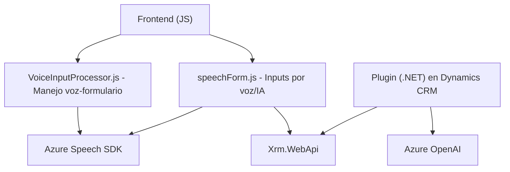
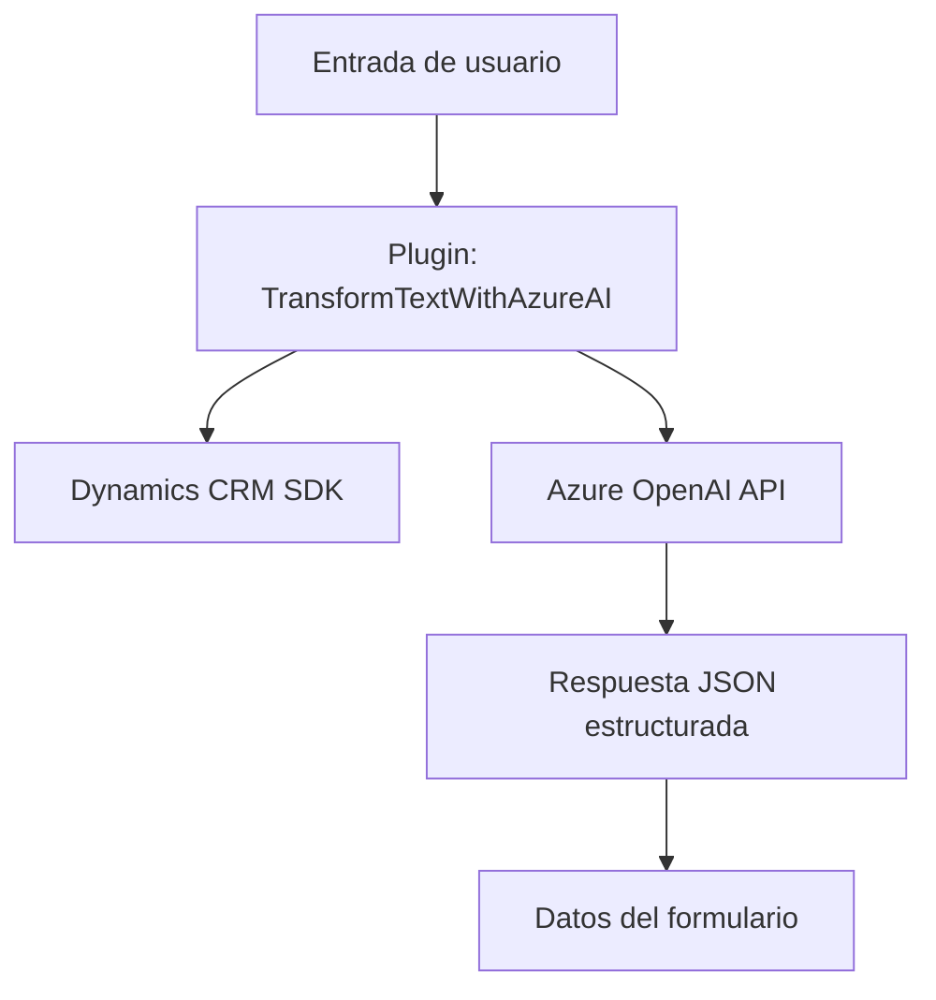
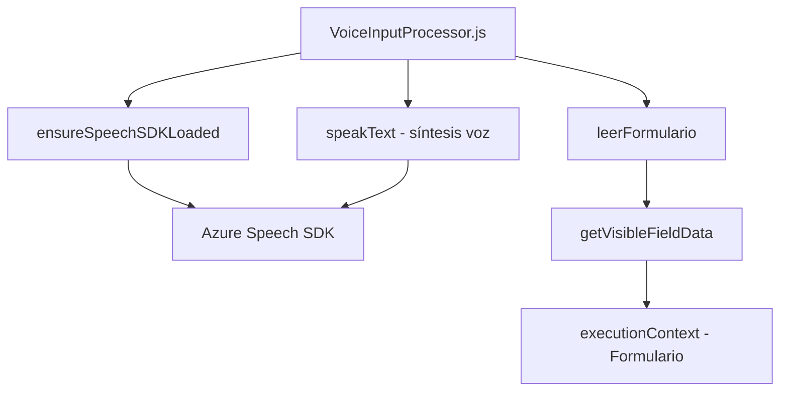

### Breve resumen técnico

El repositorio analizado contiene diferentes archivos relacionados con la integración de tecnologías basadas en **Azure Speech SDK** y **Azure OpenAI API** para formularios dinámicos y plug-ins en Dynamics CRM. Está diseñado para habilitar interacción de voz, procesamiento de datos dinámico y automatización avanzada basada en inteligencia artificial.

---

### Descripción de arquitectura

1. **Tipo de solución**: 
   - Es una solución híbrida que integra **frontend**, **lógica de negocio (plugins)** y **servicios externos (APIs)**:
     - El frontend proporciona entrada de voz y sincronización dinámica con formularios.
     - Los plugins amplían funcionalidad de **Dynamics CRM** con procesamiento de texto mediante **Azure OpenAI**.

2. **Arquitectura**: 
   - **N capas distribuida**:
     - **Frontend**: Interfaz de usuario para interacción directa y entrada de voz.
     - **Backend (Plugins)**: Lógica empresarial procesada en Dynamics CRM con extensiones.
     - **Servicios externos**: Integración de SDKs y APIs de Azure (Speech SDK y OpenAI GPT).

---

### Tecnologías usadas

- **Azure Speech SDK**: Entrada de voz, síntesis de texto en voz y reconocimiento de voz.
- **Dynamics CRM SDK**: Uso del sistema de extensibilidad con `IPlugin`.
- **Azure OpenAI API**: Transformación de texto en JSON y procesamiento avanzado de datos.
- **JavaScript**, **HTTP client libraries (e.g., System.Net.Http)**: Manejo de asincronía, manipulación DOM y llamadas a servicios.
- **Newtonsoft.Json** y **System.Text.Json**: Parser y generador de objetos JSON.
- **Acceso al Xrm.WebApi**: Modificación y consulta de formularios.

---

### Diagramas Mermaid

#### Diagrama general de interacción de componentes

---

#### Diagrama para archivo **TransformTextWithAzureAI.cs**

---

#### Diagrama para archivo **VoiceInputProcessor.js**

---

### Conclusión final

La solución presentada combina tecnologías modernas con un diseño orientado a modularidad y escalabilidad. **Azure Speech SDK** potencia la interacción automatizada por voz, mientras que **Azure OpenAI API** extiende las capacidades de procesamiento avanzado dentro de Dynamics CRM. Esto permite crear interfaces dinámicas y ampliar las funcionalidades del CRM hacia automatización basada en inteligencia artificial. 

La arquitectura adoptada de **n capas distribuida** posiciona correctamente los componentes internos y externos para garantizar interoperabilidad y robustez en infraestructura empresarial.