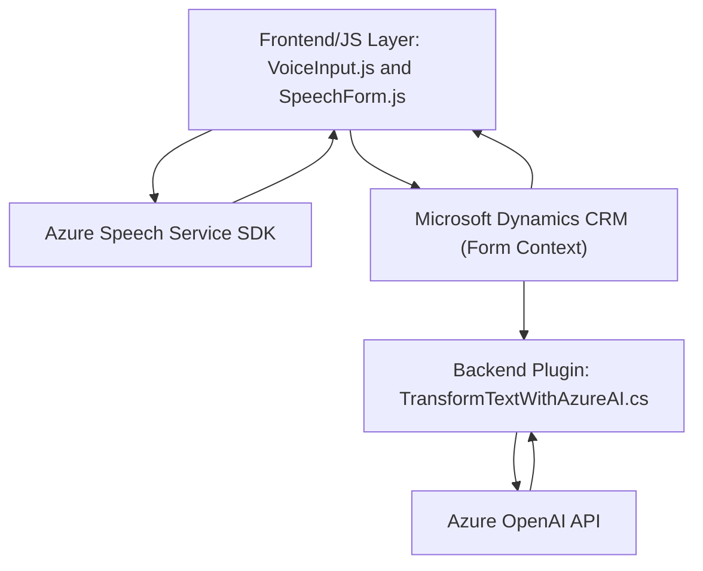

## Breve resumen técnico:
El repositorio integra funcionalidad avanzada de reconocimiento y síntesis de voz, junto con inteligencia artificial para usuarios de formularios en CRM Dynamics, utilizando el servicio Azure Speech SDK y Azure OpenAI API. Sus módulos gestionan tanto la modificación dinámica de formularios en frontend como el procesamiento del texto desde plugins en un contexto CRM. Combina programación en JavaScript (frontend) y C# (backend), siguiendo paradigmas de eventos y modularidad.

## Descripción de arquitectura:
La arquitectura es híbrida:
1. **Frontend**: Seguramente parte de un sistema CRM personalizable, diseñado como solución de integración en una capa JS (Dynamics CRM). Esta capa permite la interacción directa con la sesión del formulario (asignación de valores, generación de campos dinámicos).
   - Utiliza SDKs y servicios web como base de interacción con servicios externos.
2. **Backend**: Compuesto por plugins en Dynamics CRM desarrollados en C#, que proveen lógica empresarial personalizada y conectan al servicio Azure OpenAI mediante una integración de microservicio HTTP.
3. **Arquitectura general**: El conjunto se asemeja a una **arquitectura n-capas** (frontend, backend y servicio externo). Se emplean patrones asociados a la **integración de servicios API/cloud** y **plugin-based architecture**.

## Tecnologías usadas:
1. **Frontend**:
   - **Azure Speech SDK**: Reconocimiento y síntesis de voz en tiempo real, cargado dinámicamente.
   - **JavaScript**: Procesamiento de formularios mediante interacción con la API de Dynamics CRM.
   - **HTML/DOM API**: Inserción y manipulación de elementos en formularios.
   
2. **Backend**:
   - **C# Plugins para Dynamics CRM**:
     - Manejo de lógica empresarial personalizada.
     - Uso de `IPlugin` como interfaz principal para extender Dynamics CRM.
   - **Microsoft Xrm SDK**: Interacción directa con la API de Dynamics CRM.
   - **JSON Libraries** (`Newtonsoft.Json`, `System.Text.Json`): Validación, serialización/deserialización de datos.
   - **HttpClient**: Para las solicitudes web hacia Azure OpenAI.

3. **Servicios externos**:
   - **Azure Speech SDK (synthesis/recognition)**.
   - **Azure OpenAI API**: Servicio para transformación avanzada de texto basado en inteligencia artificial.

## Diagrama Mermaid:

## Conclusión final:
La solución se presenta como una funcional e innovadora arquitectura n-capas con integración entre una forma de trabajo plugin (backend) y frontend basado en JavaScript. El enfoque central del código está en mejorar la accesibilidad y la funcionalidad de un sistema CRM mediante el uso de tecnologías de voz y procesamiento de texto basadas en inteligencia artificial, conectadas a servicios de nube (Azure). Sin embargo, es recomendable validar las prácticas de seguridad frente a posibles vulnerabilidades, por ejemplo, el manejo de claves de API y las dependencias no usadas.