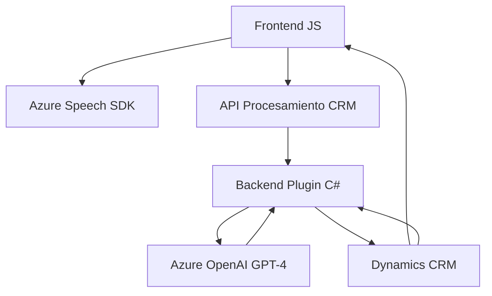

# Análisis Técnico y Arquitectura Detallada del Repositorio

## Resumen Técnico
El repositorio parece orientarse hacia una solución híbrida que habilita captura de voz (entrada y salida) y procesamiento avanzado de datos mediante servicios de IA. Es apto para integrarse con sistemas como Dynamics CRM. Incluye:
1. **Frontend basado en JavaScript**: Para realizar interacciones con el usuario como entrada y salida de voz.
2. **Plugins de Dynamics CRM (.NET)**: Para realizar transformaciones de datos hacia JSON con Azure OpenAI.
3. Integraciones con SDKs externos como **Azure Speech SDK** y **Azure OpenAI GPT Models**, respaldadas por comunicación HTTP y JSON.

---

## Descripción de Arquitectura
1. **Tipo de solución**: 
   - Incluye un **frontend** que gestiona UI y voz para formularios.
   - Integra una **Custom API** para Dynamics CRM.
   - Adopta el **Plugin pattern** para lógica backend en Dynamics CRM.

2. **Arquitectura**:
   - **Multicapa (N capas):** La solución se divide en capas funcionales:
     1. **Presentación** (Frontend con JavaScript): Captura y sintetización de voz, manipulación de formularios UI.
     2. **Servicio/Integración**: Comunicación con Azure Speech SDK y transmisión a APIs de Dynamics CRM.
     3. **Lógica del Negocio** (Plugins): Procesamiento del texto mediante Azure OpenAI y manipulación de datos CRM.
   - También muestra características de **arquitectura orientada a eventos** y **arquitectura orientada a servicios (SOA)** mediante los SDK y uso de APIs externas.

3. **Tecnologías Usadas**:
   - **Frontend**:
     - **Lenguaje**: JavaScript / ES6.
     - **SDK**: Azure Speech SDK (lectura/síntesis de voz).
     - **CRM Integration**: Dynamics CRM API (Xrm.WebApi).
   - **Backend**:
     - **Lenguaje**: .NET C#.
     - **Frameworks**:
       - Dynamics CRM SDK (`Microsoft.Xrm.Sdk`).
       - Integración con Azure OpenAI Model (GPT).
     - **APIs**: Llamadas HTTP a Azure OpenAI API para el procesamiento del texto.
   - **Gestión de Datos**:
     - Serialización JSON (Newtonsoft.Json).
     - Lógica para transformar texto en objetos estructurados aplicables en CRM.

4. **Patrones Utilizados**:
   - **Plugin Pattern**: Base para la integración de Dynamics CRM.
   - **Modularidad**: División funcional clara (lectura, procesamiento, síntesis).
   - **Integración con servicios externos**: Uso de SDKs y APIs como Azure Speech y OpenAI.

5. **Dependencias**:
   - **Frontend**:
     - **Azure Speech SDK** (`https://aka.ms/csspeech/jsbrowserpackageraw`).
     - Bibliotecas nativas del navegador para manejar DOM y formularios.
   - **Backend**:
     - **Dynamics CRM SDK**.
     - **System.Text.Json**, **System.Net.Http**, **Newtonsoft.Json**.
     - **Azure OpenAI API**:
       - Autenticación mediante API Key.
       - Servicios de GPT (gpt-4o o modelos equivalentes).
   - **Potenciales componentes adicionales**:
     - API para personalización de Dynamics CRM procesos basados en IA.
     - Sistema de alertas basadas en proceso.

---

## Diagrama Mermaid

---

## Conclusión Final
El repositorio implementa una solución orientada a voz e interacción con usuarios bajo un **modelo híbrido multicapa**. Aprovecha tecnologías modernas como el Azure Speech SDK y Azure OpenAI para ofrecer capacidades avanzadas, eficientemente integradas con Dynamics CRM mediante APIs y plugins. Su diseño muestra una fuerte separación de roles por capas y modularidad, permitiendo escalabilidad y extensibilidad. Es adecuado para sistemas empresariales que necesiten integrar procesamiento de voz e inteligencia artificial en formularios o entradas dinámicas del cliente.