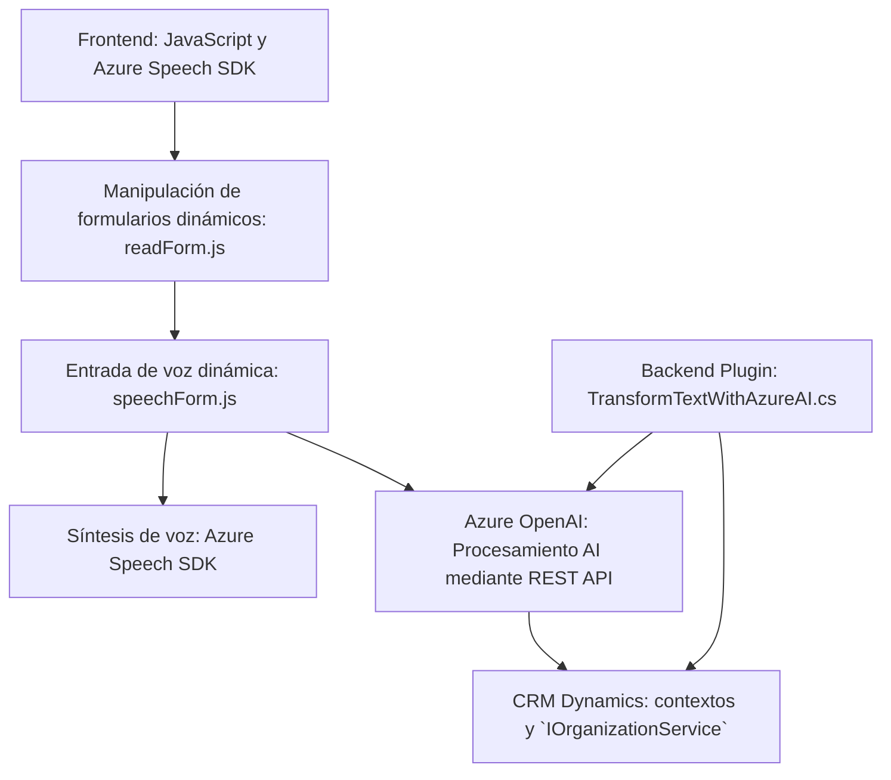

### Breve Resumen Técnico

Este repositorio implementa un sistema orientado a la integración entre formularios dinámicos y capacidades avanzadas de entrada y salida de voz. Se emplea ampliamente Azure Speech SDK y Azure OpenAI para síntesis de voz, reconocimiento de voz y procesamiento de texto. Compatible con entornos Dynamics 365.

---

### Descripción de la Arquitectura

1. **Tipo de solución:**  
   - Sistema híbrido compuesto por:
     - **Frontend**: Para interacción de usuarios mediante formularios dinámicos y voz.
     - **Backend Plugin**: Integrado con Dynamics 365, que actúa como controlador para transformar textos e interactuar con APIs externas como Azure OpenAI.  
   - La solución se orienta a desarrollar un sistema extendido para formularios accesibles e interactivos.

2. **Modelo arquitectónico:**  
   - **N Capas:** Componentes diferenciados para manejo de datos (entorno Dynamics 365), presentación (JavaScript con Azure Speech SDK), y lógica de negocio (plugin en C#).  
   - Aunque no es una arquitectura puramente basada en microservicios, tiene los siguientes elementos:
     - **Frontend modular** en JavaScript para entrada y salida por voz.
     - **Backends conectados mediante APIs externas** para procesamiento de datos.  

3. **Dependencias o Componentes Externos:**
   - **Azure Speech SDK:** Para síntesis y reconocimiento de voz.
   - **Dynamics CRM SDK:** Para operar en entornos CRM.
   - **Azure OpenAI Services:** Para procesamiento avanzado de lenguaje natural.
   - **Newtonsoft.Json y System.Net.Http:** Para serialización y comunicación HTTP en el plugin.

4. **Patrones usados:**  
   - **Delegación:** Uso extensivo de callbacks para carga de SDK y respuestas de APIs.
   - **Integración API REST:** Con Azure OpenAI para procesamiento de texto.
   - **Carga dinámica de dependencias:** Descarga el SDK de Azure según disponibilidad.
   - **Extensión CRM con Plugins:** Diseño plug-and-play para integrar lógicas propias al flujo del sistema Dynamics.

---

### Tecnologías Usadas

#### **Frontend:**
- JavaScript (ES6+).
- Azure Speech SDK (con soporte a servicios como TTS y STT).
- HTML y DOM para integración de scripts dinámicos y mapeo de formularios.

#### **Backend Plugin:**
- C# con .NET Framework compatible con Dynamics CRM.
- Integración directa con Azure API (OpenAI).
- Uso de Newtonsoft.Json y System.Net.Http para manejo de datos JSON y solicitudes HTTP.

#### **Servicios Externos:**
- Azure Speech.
- Azure OpenAI.
- Dynamics CRM API.

---

### Diagrama Mermaid para GitHub Markdown

---

### Conclusión Final

Esta solución representa una arquitectura extensible y modular diseñada para integrarse con entornos CRM como Dynamics 365. El uso de Azure Speech SDK y OpenAI permite aprovechar procesamiento avanzado de voz y texto, contribuyendo a accesibilidad, entradas dinámicas y transformación de datos. La segmentación entre frontend y plugin facilita el mantenimiento y escalabilidad, aunque no puede considerarse una arquitectura puramente de microservicios.