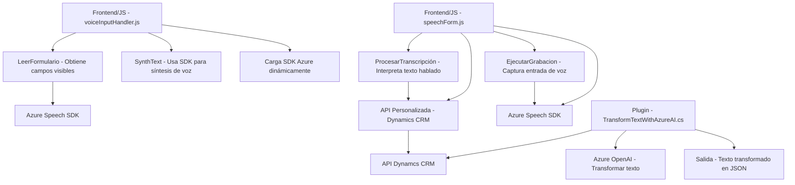

# Análisis técnico del repositorio

## Breve resumen técnico
El repositorio parece formar parte de una solución orientada a la integración de servicios de terceros (Azure Speech SDK y Azure OpenAI Service) en Microsoft Dynamics CRM, enfocándose en mejorar la interacción del usuario con los formularios a través de tecnologías como la síntesis y reconocimiento de voz, así como el procesamiento avanzado mediante inteligencia artificial.

---

## Descripción de arquitectura
La solución adopta una arquitectura híbrida basada en **cliente-servidor**, donde:
1. La interfaz de usuario (frontend) es implementada en JavaScript y opera en el navegador del usuario mediante Dynamics CRM.
2. Los plugins (`TransformTextWithAzureAI.cs`) que interactúan con servicios externos se ejecutan como lógica del servidor CRM utilizando la extensión de la API de Dynamics CRM y Azure OpenAI.
   
Aunque la solución no se presenta como una arquitectura de microservicios, utiliza **componentes modulares distribuidos** mediante integraciones con servicios de terceros en la nube, siguiendo principios de separación de responsabilidades específicos.

Se observan algunas prácticas relacionadas con la **arquitectura hexagonal** en el plugin, como la dependencia inversa para servicios externos (llamadas HTTP a APIs), aunque la solución general no está construida exclusivamente bajo este paradigma.

---

## Tecnologías y frameworks usados
### En el frontend:
1. **JavaScript**:
   - Lenguaje principal, utilizado para el manejo de formularios y la comunicación con APIs.
2. **Framework de Dynamics CRM**:
   - Integración directa de funciones que interactúan con el contexto del formulario (`executionContext`, `formContext`).
3. **Azure Speech SDK**:
   - Tecnología para la síntesis y el reconocimiento de voz, utilizando servicios de Azure Cloud.
4. **Promises y Async/Await**:
   - Uso extensivo de programación asincrónica.

### En el backend:
1. **Microsoft Dynamics CRM SDK**:
   - Utilizado para manipular datos del sistema y contextos en el modelo de plugins.
2. **Azure OpenAI Service**:
   - Integración con el servicio de AI de Azure para procesamiento avanzado de texto.
3. **.NET Framework**:
   - Base tecnológica utilizada para implementar los plugins (`TransformTextWithAzureAI.cs`).
4. **HttpClient y JSON**:
   - Comunicación REST con servicios externos.

---

## Dependencias externas y componentes presentes
### Dependencias externas:
1. **Azure Speech SDK y Azure OpenAI Service**:
   - Servicios de nube para reconocimiento de voz y procesamiento avanzado de texto.
2. **Dynamics CRM Web API (via Xrm.WebApi.online)**:
   - API REST interna del CRM para operaciones CRUD y comunicación entre componentes del sistema.
3. **Newtonsoft.Json**:
   - Librería para trabajar con JSON en el lado del backend.

### Dependencias internas:
1. **Form Context en Dynamics CRM**:
   - Contexto utilizado para manipular formularios y sus campos en tiempo de ejecución.

---

## Diagrama **Mermaid** válido para **GitHub Markdown**

---

## Conclusión final
El repositorio representa un sistema integrado entre frontend (JavaScript) y backend (.NET) dentro de Dynamics CRM, con extensiones hacia servicios externos como **Azure Speech SDK** y **Azure OpenAI Service**. La solución es modular en cada una de sus capas, con cada componente claramente orientado a funciones específicas:

- El **frontend** gestiona la interacción del usuario, delegando tareas como reconocimiento de voz, lectura/síntesis, y envía información a una API para el procesamiento.
- El **backend** complementa estas funcionalidades automatizando tareas específicas dentro del sistema CRM mediante plugins que integran servicios de IA.

La arquitectura se alinea con el modelo de **n capas**, en combinación con un esquema híbrido cliente-servidor y algunas prácticas de arquitectura hexagonal. Sin embargo, no llegaría a considerarse una arquitectura de microservicios ni completamente hexagonal debido a su dependencia del contexto específico de Dynamics CRM.