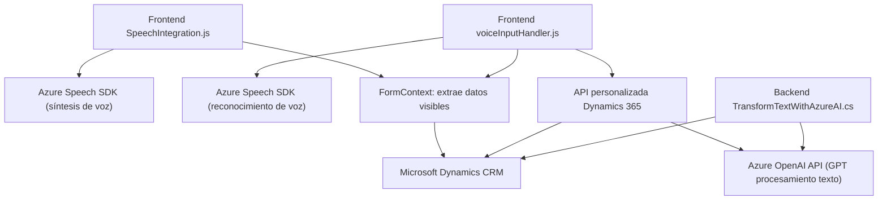

### Breve resumen técnico
El repositorio abarca tres archivos principales que integran servicios de Azure para funcionalidades avanzadas de reconocimiento de voz, síntesis de voz y transformación de texto usando inteligencia artificial. Estas implementaciones están orientadas al contexto de formularios en aplicaciones empresariales como Microsoft Dynamics CRM.

---

### Descripción de arquitectura
El sistema utiliza una **arquitectura de microservicios**, caracterizada por modularización y conexiones con servicios externos. Cada archivo implementa una funcionalidad específica:

1. **SpeechIntegration.js:** Sirve para sintetizar datos visibles de formularios en voz (Azure Speech SDK).
2. **voiceInputHandler.js:** Procesa la entrada de voz con reconocimiento de texto, mapeo de campos del formulario y asignación de valores.
3. **TransformTextWithAzureAI.cs:** Plugin que transforma texto aplicando normas precisas a través de un modelo GPT de Azure OpenAI.

La arquitectura general muestra **separación de responsabilidades** y **acoplamiento a servicios externos**. El código se organiza modulares basados en funciones de interacción con APIs y SDKs.

---

### Tecnologías usadas
1. **Lado cliente (frontend)**:
   - **Azure Speech SDK**: Para síntesis de voz y procesamiento de entradas de voz.
   - **Dynamics 365 SDK**: Para gestionar datos en formularios CRM.
   - JavaScript moderno: Modularidad y uso de promesas.

2. **Lado servidor (backend)**:
   - **Microsoft Dynamics CRM Plugin (IPlugin)**: Extensibilidad sobre CRM.
   - **Azure OpenAI API**: Modelo GPT para enriquecimiento de datos mediante IA.
   - Librerías: `Newtonsoft.Json` (JSON), `System.Net.Http` (HTTP), y `System.Text`.

3. **Patrones y principios**:
   - Modularidad.
   - Cliente-Servidor.
   - Externalización de servicios.
   - Uso de SDKs y APIs.

---

### Diagrama Mermaid válido para GitHub:

---

### Conclusión final
La solución presentada utiliza un enfoque de arquitectura basada en **microservicios** para integrar diferentes servicios externos que enriquecen la funcionalidad de una aplicación CRM. Los procesos de voz y AI están bien desacoplados y trabajan eficientemente con SDKs y APIs de Azure, demostrando una alta interoperabilidad. Aunque cada archivo complementa una funcionalidad específica, el uso de servicios de terceros implica dependencia directa de capacidades de Azure. En términos de diseño, la modularidad y separación de responsabilidades permiten escalabilidad y mantenibilidad en proyectos similares.