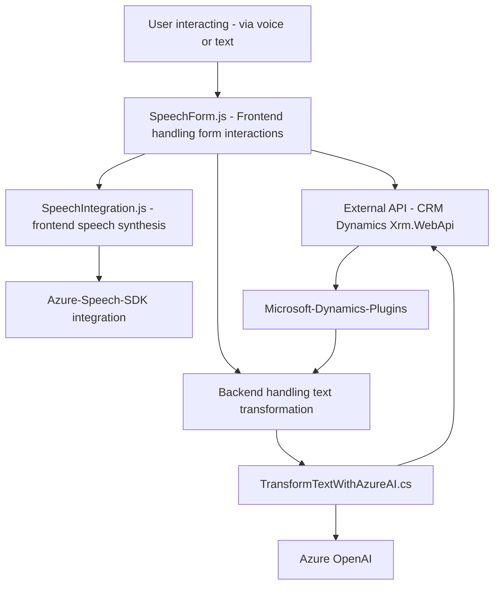

### Breve resumen técnico

El repositorio implementa una solución que integra **Microsoft Dynamics CRM**, formularios dinámicos y el **Azure Speech SDK**, con soporte para reconocimiento y generación de voz y texto. Además, utiliza un **plugin para Dynamics CRM** que transforma texto mediante **Azure OpenAI**, creando estructuras JSON automáticas de entrada procesada.

### Descripción de arquitectura

**1. Tipo de Solución:**  
Este es un sistema híbrido que combina componentes de backend (plugins para Dynamics CRM), frontend interacciones en formularios (JS scripts) y APIs de terceros (e.g., Azure Speech y OpenAI). Aunque no cumple completamente los criterios para microservicios, implementa un **plugin-based architecture** en el backend y más tradicionalmente una arquitectura de integración de SDK para el frontend.   

**2. Arquitectura:**  
La arquitectura global es **modular** con separación de responsabilidades. En el backend, utiliza **event-driven architecture** al implementar un plugin que responde a eventos en Dynamics CRM. En el frontend, sigue el patrón de **gestión de datos** con interacción cliente-servidor y procesamiento local de datos del formulario. El modelo puede clasificarse como una combinación de **arquitectura de n capas** y **composición de integraciones**.

---

### Tecnologías usadas

**Frontend**
1. **JavaScript**:
   - Uso en funciones individuales para manipulación y lectura de formularios dinámicos.
   - Integración de SDK externos.
2. **Azure Speech SDK**:
   - Sintetiza voz y realiza el reconocimiento de comandos de voz.
3. **Microsoft Dynamics (Xrm.js)**:
   - API de Dynamics CRM para actualización de formularios.
4. **Custom API (Azure OpenAI)**:
   - Integración con IA generativa para transformación de texto.

**Backend**
1. **C# y Dynamics CRM Plugins**:
   - Personalización avanzada mediante plugins.
2. **Microsoft.Xrm.Sdk**:
   - Para interactuar con la entidad CRM.
3. **System.Net.Http**:
   - Comunicación vía HTTP con servicios externos (Azure OpenAI).
4. **Newtonsoft.Json.Linq**:
   - Gestión de estructuras JSON retornadas por la API de OpenAI.

---

### Dependencias o componentes externos utilizados

1. **Azure Speech SDK**: Se emplea para la síntesis y reconocimiento de voz en los navegadores, esencial para interactuar con los formularios mediante comandos de voz.
2. **Azure OpenAI API**: Utilizada para la transformación de textos en JSON según normas predefinidas.
3. **Dynamics CRM API via Plugins**: Interactúa directamente con los datos y reglas de negocio de Dynamics CRM.
4. **Xrm.WebApi**: Realiza operaciones CRUD sobre entidades en la base de datos CRM desde el front.
5. **Microsoft JavaScript Libraries**: Integración de Dynamics CRM con archivos JavaScript vía DOM API para manipular formularios.

---

### Diagrama Mermaid válido para GitHub

---

### Conclusión

La solución presentada abarca múltiples capas de arquitectura que integran la interacción del usuario mediante formularios en Dynamics CRM, soporte de reconocimiento/síntesis de voz de Azure, y la potencia de procesamiento de texto por IA. La solución utiliza una arquitectura modular y basada en eventos que conecta sistemas distribuidos y servicios en la nube, como APIs ya establecidas. Aunque distribuida, se puede clasificar como híbrida debido a la mezcla de expansión del monolito de Dynamics CRM con complementos externos. Como mejoras, se podría considerar un mayor desacople para funciones más reusables y escalables, como la creación de un microservicio independiente para el manejo de IA y la integración de voz.