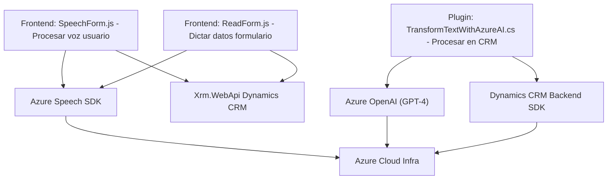

### Breve resumen técnico
El repositorio presenta funcionalidades para integrar tecnologías de reconocimiento de voz y procesamiento de lenguaje natural (Azure Speech SDK y Azure OpenAI) con un sistema basado en **Microsoft Dynamics CRM**, permitiendo interacción directa con formularios y datos del sistema. Las principales capacidades abarcan síntesis de voz desde datos de formularios, reconocimiento de voz para transcribir audio/voz a texto aplicable en un sistema de CRM, y un plugin para el procesamiento avanzado de texto mediante IA.

---

### **Descripción de arquitectura**
El sistema parece estar diseñado bajo una arquitectura **mixta**, que combina elementos **n-capas** y **microservicios**. 

1. **Frontend**: Implementado en **JavaScript**, empleando SDKs externos y APIs del navegador para eventos y dinámicas con el usuario. Los archivos (`readForm.js` y `speechForm.js`) utilizan una estructura funcional clara para interactuar con datos y servicios.
   
2. **Backend plugins**: Los plugins de Dynamics CRM (`TransformTextWithAzureAI.cs`) usan una estructura basada en eventos del CRM, lo que sigue el patrón de `IPlugin` de Dynamics. Estos se integran con Azure OpenAI para tareas específicas de procesamiento avanzado.

3. **Servicios externos**: La arquitectura se apoya en APIs externas, como **Azure Speech SDK** y **Azure OpenAI**, configurados como microservicios accesibles desde el sistema.

4. **Patrones utilizados**: Modularización, dependencia dinámica (para cargar Azure Speech SDK), delegación de lógica hacia servicios remotos (por ejemplo, Azure OpenAI) y separación de responsabilidades (cada archivo/plugin aborda una funcionalidad distinta).

---

### **Tecnologías usadas**
1. **Frontend**:
   - **JavaScript** para interacción con formularios y SDKs.
   - **Azure Speech SDK** para síntesis de voz desde texto y reconocimiento de voz.

2. **Backend**:
   - **C#**, específicamente para plugins de Dynamics CRM.
   - **Dynamics CRM SDK** para la gestión y manipulación de datos.
   - Comunicación con **Azure OpenAI** para procesamiento IA.

3. **Dependencias externas**:
   - **Azure Speech SDK**: Reconocimiento y síntesis de voz.
   - **Azure OpenAI**: Procesamiento avanzado de lenguaje natural.
   - **Microsoft Dynamics CRM API (`Xrm.WebApi`)**: Interacción con formularios y servicios personalizados del CRM.

4. **Frameworks del Backend**:
   - Dynamics CRM SDK y .NET para plugins.

---

### **Diagrama Mermaid**

---

### **Conclusión final**
El repositorio representa una integración accesible y avanzada entre tecnologías de reconocimiento de voz, procesamiento de lenguaje y CRM. Utiliza patrones sólidos como modularización y delegación para interactuar con múltiples capas y servicios remotos. Además, combina tecnologías como Azure Speech SDK y OpenAI para IA avanzada y síntesis de voz. La arquitectura permite escalabilidad y soporte para servicios modernos en entornos corporativos mediante plugins y APIs externos, orientados a mejorar la interactuación usuario-sistema.