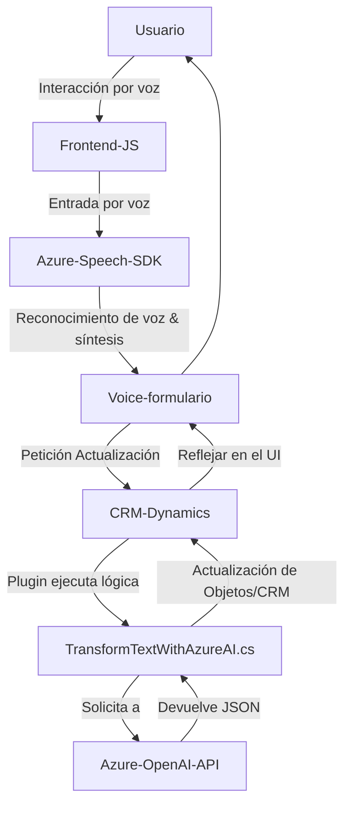

### Breve resumen técnico

El análisis de los archivos del repositorio describe una solución híbrida que integra múltiples tecnologías para crear una capa de interacción avanzada entre usuarios y un sistema CRM (Dynamics CRM). Los diferentes componentes analizados (JavaScript frontend y un plugin backend) trabajan en conjunto para permitir el procesamiento de voz y texto, integrándose con servicios como Azure Speech SDK y Azure OpenAI API. Este sistema implementa patrones de diseño como modularidad y gestión de dependencias mientras emplea tecnologías relevantes para API y SDKs.

---

### Descripción de arquitectura

La solución parece ser una arquitectura basada en **n capas** con enfoque híbrido. Incluye los siguientes componentes:
1. **Frontend (JavaScript)**: Capacidad de interactuar con el usuario por entrada/salida de voz (synthesizer y speech recognition). Se enfoca en los datos del formulario y cómo se transforman antes de ser enviados al backend.
2. **Integración externa (Azure Speech SDK)**: Se utiliza para la entrada (reconocimiento de voz) y salida (synthesizer) de datos de voz.
3. **Backend (Plugin en C#)**: Implementa lógica de negocio personalizada en Dynamics CRM, procesando transformaciones de texto mediante Azure OpenAI API.

Se adopta una arquitectura conectada con servicios externos para delegar el procesamiento a sistemas especializados (por ejemplo, Azure Speech y Azure OpenAI). Tiene algunas características propias de **arquitectura cliente-servidor**, donde los elementos frontend y backend se comunican a través de API, lo que lo hace extensible para integraciones futuras.

---

### Tecnologías usadas

1. **Frontend**:
   - **Lenguaje**: JavaScript.
   - **Azure Speech SDK**: Uso de reconocimiento y sintetización de voz.
   - Gestión del DOM para cargar dependencias dinámicamente (`window.SpeechSDK`).

2. **Backend**:
   - **Lenguajes**: C# (Microsoft Dynamics plugins).
   - **Microsoft Dynamics CRM SDK**: Contexto del plugin y operación con objetos CRM.
   - **Azure OpenAI API**: Procesamiento avanzado mediante modelos OpenAI.
   - **Librerías de JSON**: Serialización de datos (`System.Text.Json` y Newtonsoft).

3. **Patrones y enfoques arquitectónicos**:
   - Modularidad: Funciones y métodos con tareas bien delimitadas.
   - Gestión dinámica de dependencias: Validación y carga condicional de SDKs externos.
   - Encapsulación: Métodos para manejo de datos aislados dentro del código.
   - Delegación: Lógica dividida entre componentes específicos.
   - Integración con APIs: Uso de servicios de terceros (Azure Speech y Azure OpenAI).

---

### Diagrama **Mermaid**

A continuación, se presenta un diagrama en formato **Mermaid** que describe la interacción entre las partes del sistema (frontend, backend y servicios externos) y cómo funcionan juntos.

---

### Conclusión final

Esta solución combina un sistema de interacción por voz en el frontend desarrollado en **JavaScript** (Azure Speech SDK) con un plugin backend en **C#** vinculado a **Microsoft Dynamics CRM** para realizar acciones en formularios comerciales. Además, utiliza la **Azure OpenAI API** para hacer procesamiento avanzado de lenguaje natural y obtener transcripciones estructuradas.

**Fortalezas**:
- Modularidad de funciones que facilita escalabilidad y mantenimiento.
- Uso eficiente de servicios en la nube para reducir costos de procesamiento local.
- Interacción avanzada mediante síntesis y reconocimiento de voz.

**Debilidades**:
- La implementación de la clave API podría presentar problemas de seguridad al estar expuesta en el código.
- Dependencia directa de servicios externos, como Azure Speech y OpenAI, lo que puede implicar costos adicionales y fallas en caso de problemas con los servicios.

**Arquitectura recomendada**:
Aunque está diseñado en torno a **n capas**, podría evolucionar hacia una **arquitectura hexagonal** o basada en microservicios, donde se separen los módulos relacionados con el procesamiento inteligente en contenedores independientes para mejorar el desacoplamiento y posibilitar la reutilización en otras aplicaciones futuras.