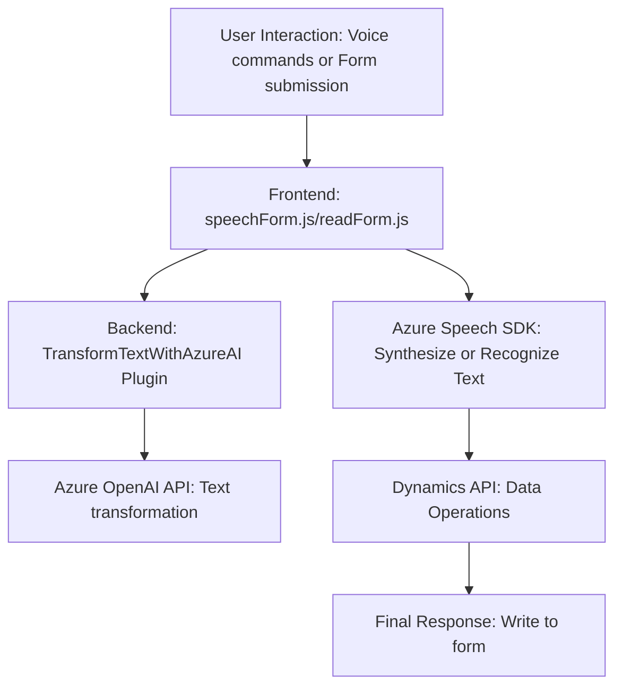

### Breve resumen técnico
El repositorio presenta la implementación de un sistema integrado en Dynamics CRM específico para:
1. **Conversión de formularios a texto sintetizado** mediante Azure Speech SDK (`readForm.js`).
2. **Reconocimiento y procesamiento de voz** en formularios, con interacción dinámica entre API personalizadas y Azure Speech (`speechForm.js`).
3. **Transformación avanzada de texto con IA** a través de plugins en Dynamics CRM utilizando Azure OpenAI (`TransformTextWithAzureAI.cs`).

La solución está orientada hacia la automatización de tareas en formularios, utilizando inteligencia artificial (reconocimiento de voz y procesamiento de texto).

---

### Descripción de arquitectura
La arquitectura es **modular de tres capas**, adaptada a los principios de:
1. **Capas n**:
   - **Frontend (JavaScript)**: Scripts cliente que interactúan con formularios y SDK externos (Azure Speech).
   - **Middleware/API (Dynamics Plugins)**: Plugins que procesan las transcripciones y textos con servicios AI.
   - **Servicios externos (Azure Speech/OpenAI)**: Interacción con las API de Microsoft para síntesis/reconocimiento de voz y transformación de texto.

2. **Integración de API externa**:
   - Los scripts realizan cargas dinámicas, llamadas a métodos HTTP y SDK externos (Azure Speech/OpenAI), combinando lógica personalizada con herramientas de Microsoft Dynamics CRM.

3. **Distribución tipo cliente-servidor**:
   - **Cliente (Frontend)**: Gestión directa de SDK y transcripciones.
   - **Servidor (Plugin)**: Rutas para procesamiento avanzado y comunicación con Azure OpenAI.

---

### Tecnologías usadas
1. **Frontend:**
   - Lenguaje: JavaScript.
   - SDK externo: Azure Speech SDK (aka.ms/csspeech).
   - Runtime: Navegador.
   - Framework: Dynamics CRM Web Resource scripts.

2. **Backend:**
   - Lenguaje: C#.
   - Framework: Dynamics CRM Plugin SDK (`Microsoft.Xrm.Sdk`).
   - Serialización: `System.Text.Json`, `Newtonsoft.Json`.

3. **Servicios externos:**
   - Azure OpenAI API (GPT-based).
   - Azure Speech SDK.

4. **Patrones:**
   - N-capas (Frontend, Plugins, Servicios externos).
   - **Adapter Pattern**: Uso de métodos intermediarios para convertir datos entre cliente y SDK externo.
   - **Observer Pattern**: Integración personalizada de eventos del CRM mediante `IPlugin`.

---

### Diagrama Mermaid válido para GitHub

---

### Conclusión final
La solución es un sistema de **automatización basado en voz e IA** que interactúa con formularios de Dynamics CRM. Utiliza una **arquitectura de capas n** distribuida entre frontend (JavaScript, Azure Speech) y backend (C#, Dynamics CRM Plugin). La integración con servicios de Azure (Speech/OpenAI) revela un enfoque moderno centrado en la interacción natural y la transformación de datos en tiempo real.

Este diseño es modular, extensible y compatible con futuras actualizaciones, lo cual es ideal para implementaciones que requieren mejoras continuas en productividad a través de IA. Sin embargo, depender de cargas dinámicas de SDK podría implicar limitaciones bajo entornos corporativos con restricciones de red.